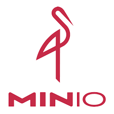
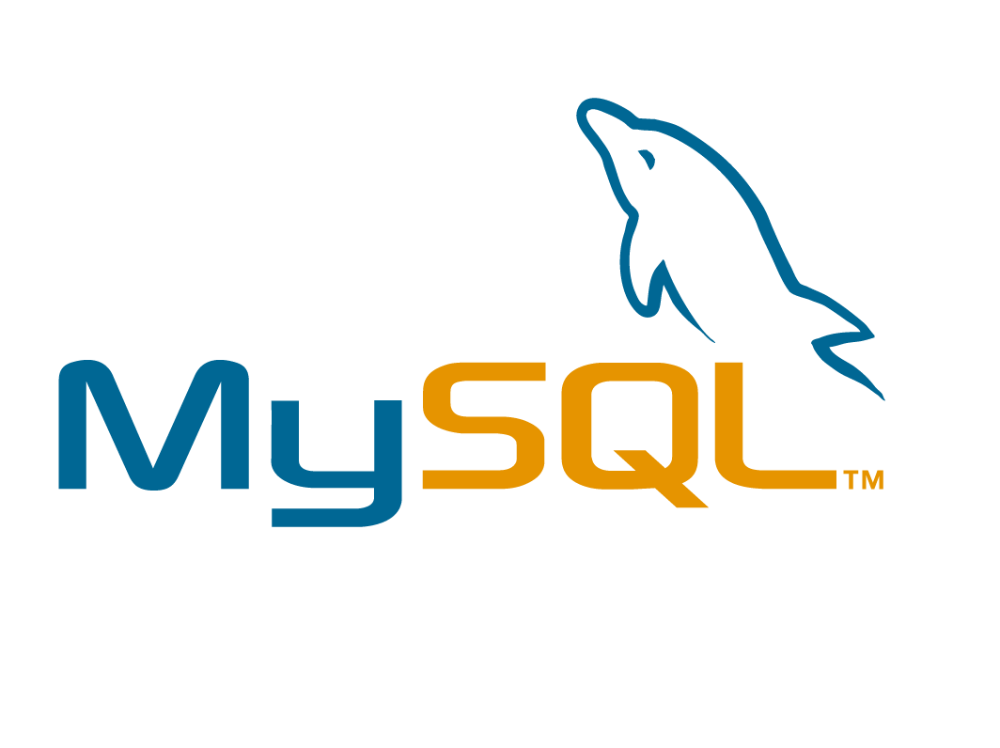
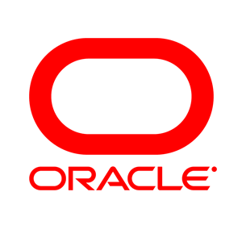

+++
title = 'About'
date = 2024-03-07T15:00:59+08:00
weight = 1000
+++

# 杨博 (Aaron)

### &#127919;求职意向
__希望作为<u>JAVA高级工程师 </u> 为团队做出贡献__

### &#128170;擅长技能

__1. 熟练掌握 Clickhouse,Podman,Apache Calicite等框架和中间件的使用，能够使用 Flink对海量数据进行实时处理__

__2. 熟悉  Java 服务端开发 以及  SpringBoot 框架下WEB应用后台项目的搭建和运行__

__3. 理解常用数据挖掘算法和机器学习算法，如聚类，推荐系统等__

__4. 能够使用 Tensorflow2 对常见深度学习模型的创建和应用__

### &#128084;工作经验

[__之江实验室-天文计算研究中心, 杭州, 中国__]()  `2024.01 - Present`

_高级工程专员_  

主要负责
- 完成项目: 
    - [__宇宙触角__](https://nebula-inner.lab.zjvis.net/): 接受处理多个FPGA单元发送的UDP包，实时处理相关业务数据，分流调用不同天文学算法，推进科学发现，设计流量800Gb/s
    - [__CSST__](http://www.bao.ac.cn/csst/): 中国空间站工程巡天望远镜，提供数据存储和数据处理支持。
    - [flink-s3-fs-multiple](https://aaronyang2333.gitlab.io/docs/demo/flink-s3-f3-multiple/): 扩展flink-filesystem下插件`flink-s3-fs-hadoop`功能，支持在同一job内，同时操作多个对象存储中的文件，并完成join/union。

- 熟练掌握以下工具: 
    - Flink, Clickhouse, Minio, Kubernetes, ArgoCD
 

[__之江实验室-大数据智能研究中心, 杭州, 中国__]()  `2021.06 - 2023.12`

_工程专员_  

主要负责团队大数据分析平台的优化和开发，保证数据处理，任务调度的高效稳定运行。对多源异构数据处理以及联邦查询服务有相关了解。
- 完成项目: 
    - [__见微可视分析平台__](https://gitee.com/zhijiangtianshu/nebula): 开源通用数据处理平台， 平台提供了一种以低代码拖拽方式来构建数据处理流程的可能， 用户将上传后的数据通过ETL节点、机器学习算子和数据清洗操作的处理之后，使用可视化组件渲染数据处理结果。
    - [__自研爬虫框架__](https://gitea-ops.lab.zjvis.net/bee/crawler): 开源爬虫框架，通过解析开发者提供的YAML描述文件，使得数据爬取任务转化成责任链模式数据流转，生成的爬虫任务高度灵活可定制。 累计帮助团队节省数据获取费用200W以上。
- 熟练掌握以下工具: 
    - SpringBoot 2.5, Postgres, Apache Calcite, Mysql,  Neo4J,Minio
 

[__银江股份有限公司-中央研究院, 杭州, 中国__]()  `2017.01 - 2018.04`
_Java Web 后台开发工程师_  

主要负责公司大数据产品以及研究课题项目的服务器接口API开发，>熟悉前后端分离开发协作模式,   精通Springboot快速开发框架和SwaggerAPI文档接口应用。对主流关系型数据库Oracle以及常用格式JSON、XML有相关了解。
- 完成项目: 
    - [__上海司法行政数据服务网__](): 一个司法主题的数据服务网站，该站的主要功能是整合司法局、监狱局、法院、公证处、 调解办等职能机构数据资源，构建信息数据可视化平台，帮助市民处理相关司法程序更便捷。
    - [__Enloop-iEx信息交换平台__](): 银江内部的一个信息交换平台，交换平台可以将各地分散的信息系统的数据整合汇聚，并使用自研工具生成接口API； 将收集到的接口内的数据进行清洗和脱敏，以rest服务的方式提供给需要的用户群体。
    - [__杭州市卡口流量分析研判平台__](): 省级课题项目，该程序可以分析道路交通中摄像机图像数据，对市内外交通流量进行 分析和预测，为交管部门提供可视化信息，并可以实现对套牌车，冒牌车的定位等功能。
- 熟练掌握以下工具: 
    - SpringBoot 1.5, Hadoop2, Mybatis 3, Oracle,  Swagger
 

### &#127891;教育经历 

[__南加利福尼亚大学 (USC), QS30, 洛杉矶, 美国__]() `2019.01 - 2021.06`

- <u>应用数据科学-硕士学位</u> [已获得]
- GPA: 3.70 [[PDF](assets/apds_4.pdf)]
- 已通过课程: 
    - [机器学习](https://github.com/AaronYang2333/DSCI_552/blob/master/README.md), [数据挖掘](https://github.com/AaronYang2333/DSCI_553/blob/master/README.md), [机器学习应用（游戏方向）](https://github.com/AaronYang2333/LOL_Overlay_Assistant_Tool/blob/master/README.md), [自然语言处理](https://github.com/AaronYang2333/CSCI_544/blob/master/README.md), [知识图谱](https://github.com/AaronYang2333/DSCI_558/blob/master/README.md)  

- 完成项目:
    - [基于深度学习的LOL游戏助手](https://github.com/AaronYang2333/LOL_Overlay_Assistant_Tool/blob/master/README.md): 基于图像识别，和目标检测技术开发的MOBA游戏辅助客户端应用程序
        - 使用:  Tensorflow2,  PyQT5,  Python3,  OCR
    - [混合推荐系统](https://github.com/AaronYang2333/DSCI_553/tree/master/project): 一个使用 switching 和 cascade 策略的推荐系统，可以实现向 Yelp（国外版大众点评）潜在用户群体推荐餐厅的功能.
        - 使用:  Spark2,  协同过滤,  用户画像,  XGboost
    - [Collegiate Explorer](https://chit-chaat.github.io/Collegiate_Explorer_APP/): 一个应用知识图谱技术的课程项目，亮点在于熔合分散在5个美国网站中的大学信息，实现相关信息一站式浏览。  同时集成了NLP的情感分析和NER实体识别 .
        - 使用:  Spark,  Neo4J,  Vue,  Django
 

- <u>硕士预科项目</u>  [已完成 2019.01 至 2019.04]
- GPA: 3.51 [[PDF](assets/ia_grade.pdf)]
- 主要课程:
    - [学术写作], [论文阅读], [沟通技巧]  
 

[__太原理工大学 (TYUT), 211, 太原, 中国__]() `2013.09 - 2017.06`

- <u>软件工程-工学-学士学位</u> [已获得]
- GPA: 3.56 [[PDF](assets/typt.pdf)]
- 主要课程: 
    - [软件工程导论], [网站应用开发], [数据库基础]  
- 完成项目:
    - [__Hello Hell__](https://www.bilibili.com/video/BV1uz411b7Vk): 一款2.5D塔防类安卓端游戏APP，从UI设计绘制排版，到3D模型修改制作，再到编码测试发布， 自己独立完成的手机游戏，并在苏软程序设计大赛（移动娱乐类）中获得一等奖。
        - 使用:  Unity3D,  C#,  Autodesk Maya, PhotoShop

### &#128240;专利 和 证书

[__之江实验室, 作为主要作者__]()
- 基于SQL的多源异构数据交互分析引擎及方法, 专利号 [No. CN114756629B] `06/2022` [[PDF](assets/patent/ZL-2022-1-00568.pdf)]   
- 一种页面区块的懒加载方法、装置、存储介质及设备, 专利号 [No. CN202310982912.2] `08/2023` [[PDF]()]  
- 一种多源异构数据关联查询加速方法、装置及设备, 专利号 [No. CN117056316B] `10/2023` [[PDF](assets/patent/ZL-2023-1-00906.pdf)]  
- 一种基于知识图谱同概念下实体数据可视化配置方法与装置, 专利号 [No. CN117033420B] `10/2023` [[PDF](assets/patent/ZL-2023-1-00846.pdf)]  
- 一种基于neo4j及jena的知识图谱构建方法与系统, 专利号 [No. ZJ-2023-1-000450-CN-02] `11/2023` [[PDF]()]  
- 一种基于多通道交互的数据处理系统及方法, 专利号 [No. ZJ-2023-1-000194-CN-02] `11/2023` [[PDF]()]  

[__银江股份有限公司, 作为参与者__]()
- 一种面向数据共享的敏感信息脱敏方法及系统, 专利号 [No. CN107480549A], `12/2017` 
- 基于卡口数据的城市道路交通拥堵指数计算方法, 专利号 [No. CN105869405B] `03/2018` 

[__软件设计师(中级), 中国__]()
- 全国计算机技术与软件专业技术中级资格证书, No. 1750500462. `02/2018` [[PDF](assets/nptq.png)]
