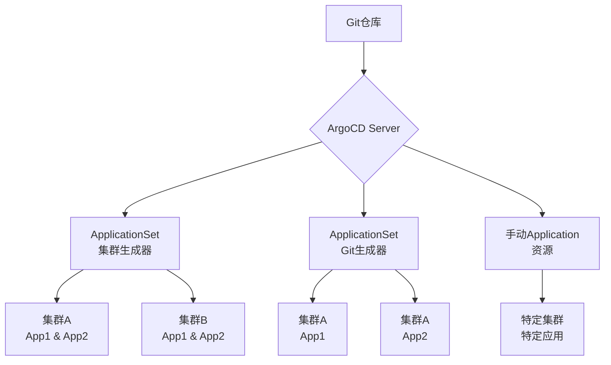

+++
title = 'Deploy N Clusters'
date = 2025-03-14T15:00:59+08:00
+++

ArgoCD 凭借其声明式的 GitOps 理念，能非常优雅地处理多 Kubernetes 集群的应用发布。它允许你从一个中心化的 Git 仓库管理多个集群的应用部署，确保状态一致并能快速回滚。

下面这张图概括了使用 ArgoCD 进行多集群发布的典型工作流，帮你先建立一个整体印象：



### 🔗 连接集群到 ArgoCD

要让 ArgoCD 管理外部集群，你需要先将目标集群的访问凭证添加进来。

1.  **获取目标集群凭证**：确保你拥有目标集群的 `kubeconfig` 文件。
2.  **添加集群到 ArgoCD**：使用 ArgoCD CLI 添加集群。这个操作会在 ArgoCD 所在命名空间创建一个存储了集群凭证的 Secret。
    ```bash
    argocd cluster add <context-name> --name <cluster-name> --kubeconfig ~/.kube/config
    ```
    *   `<context-name>` 是你 `kubeconfig` 中的上下文名称。
    *   `<cluster-name>` 是你在 ArgoCD 中为这个集群起的别名。
3.  **验证集群连接**：添加后，你可以在 ArgoCD UI 的 "Settings" > "Clusters" 页面，或通过 CLI 查看集群列表：
    ```bash
    argocd cluster list
    ```

### 💡 选择多集群部署策略

连接集群后，核心是定义部署规则。ArgoCD 主要通过 `Application` 和 `ApplicationSet` 资源来描述部署。

- **`Application` 资源**：定义一个应用在特定集群的部署。管理大量集群和应用时，手动创建每个 `Application` 会很繁琐。
- **`ApplicationSet` 资源**：这是实现多集群部署的**推荐方式**。它能根据生成器（Generators）自动为多个集群或多个应用创建 `Application` 资源。

上面的流程图展示了 `ApplicationSet` 的两种主要生成器以及手动创建 `Application` 的方式。

#### ApplicationSet 常用生成器对比

| 生成器类型 | 工作原理 | 适用场景 |
| :--- | :--- | :--- |
| **List Generator** | 在 YAML 中静态列出集群和URL。 | 集群数量固定、变化少的场景。 |
| **Cluster Generator** | 动态使用 ArgoCD 中已注册的集群。 | 集群动态变化，需自动纳入新集群的场景。 |
| **Git Generator** | 根据 Git 仓库中的目录结构自动生成应用。 | 管理大量微服务，每个服务在独立目录。 |

### 🛠️ 配置实践示例

这里以 **Cluster Generator** 为例，展示一个 `ApplicationSet` 的 YAML 配置：

```yaml
apiVersion: argoproj.io/v1alpha1
kind: ApplicationSet
metadata:
  name: my-app-multi-cluster
spec:
  generators:
    - clusters: {} # 自动发现ArgoCD中所有已注册集群
  template:
    metadata:
      name: '{{name}}-my-app'
    spec:
      project: default
      source:
        repoURL: 'https://your-git-repo.com/your-app.git'
        targetRevision: HEAD
        path: k8s-manifests
      destination:
        server: '{{server}}' # 生成器提供的集群API地址
        namespace: my-app-namespace
      syncPolicy:
        syncOptions:
        - CreateNamespace=true # 自动创建命名空间
        automated:
          prune: true # 自动清理
          selfHeal: true # 自动修复漂移
```

在这个模板中：
*   `generators` 下的 `clusters: {}` 会让 ArgoCD 自动发现所有已注册的集群。
*   在 `template` 中，`{{name}}` 和 `{{server}}` 是变量，Cluster Generator 会为每个已注册的集群填充它们。
*   `syncPolicy` 下的配置实现了自动同步、自动创建命名空间和资源清理。

### ⚠️ 多集群管理的关键要点

1.  **集群访问权限与网络**：确保 ArgoCD 控制平面能够**网络连通**所有目标集群的 API Server，并具有在目标命名空间中创建资源的 **RBAC 权限**。
2.  **灵活的同步策略**：
    *   对于开发环境，可以开启 `automated` 同步，实现 Git 变更自动部署。
    *   对于生产环境，建议**关闭自动同步**，采用手动触发同步（`Manual`）或通过 PR 审批流程，以增加控制力。
3.  **高可用与性能**：管理大量集群和应用时，考虑高可用（HA）部署。你可能需要调整 `argocd-repo-server` 和 `argocd-application-controller` 的副本数和资源限制。
4.  **考虑 Argo CD Agent**：对于大规模集群管理，可以探索 **Argo CD Agent**。它将一部分控制平面组件（如 application-controller）分布到托管集群上运行，能提升可扩展性。请注意，截至2025年10月，该功能在 OpenShift GitOps 中仍处于**技术预览（Tech Preview）** 阶段。

### 💎 总结

利用 ArgoCD 管理多 Kubernetes 集群应用发布，核心是掌握 **ApplicationSet** 和 **Generators** 的用法。通过 Cluster Generator 或 Git Generator，你可以灵活地实现“一次定义，多处部署”。

希望这些信息能帮助你着手搭建多集群发布流程。如果你能分享更多关于你具体环境的信息（比如集群的大致数量和应用的组织结构），或许我可以给出更贴合你场景的建议。