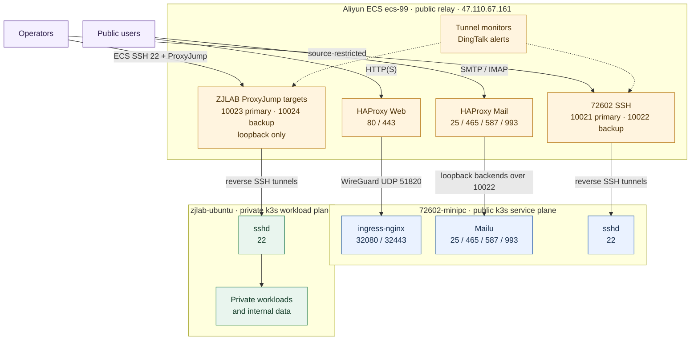

+++
title = '☁️CSP Related'
date = 2024-03-07T15:00:59+08:00
weight = 32
+++

## Managed Network Topology

The two k3s clusters have different trust boundaries and service roles. `zjlab`
is the private company-network workload plane; `72602` is the public service
plane. `ecs-99` is the shared public relay and SSH jump host. The diagram shows
stable roles and paths, not a live health status.

The data-path arrows point from the client-facing listener to the destination.
The reverse SSH sessions themselves are initiated outbound by `72602-minipc`
and `zjlab-ubuntu` toward ECS.

### SSH Alias Convention

Use the alias matching the machine where the command runs. `local` aliases are
direct paths from the matching host; `proxy` aliases use the approved ECS
forwarding path. These are SSH configuration aliases, not DNS names.

| Command runs on | ZJLAB | 72602 | ECS |
|---|---|---|---|
| `zjlab-ubuntu` | `zjlab-ubuntu-local` | `72602-minipc-proxy` | `ecs-99` |
| `72602-minipc` | `zjlab-ubuntu-proxy` | `72602-minipc-local` | `ecs-99` |

Validate an alias with `ssh -G` and an SSH connection. Do not use the old
unqualified names `zjlab`, `zjlab-backup`, or `minipc`, and do not test an SSH
alias with a DNS lookup.

### Stable Port Map

| ECS port | Destination or function | Exposure |
|---|---|---|
| `10021/tcp` | 72602 SSH primary reverse tunnel | Public, source-restricted |
| `10022/tcp` | 72602 SSH backup reverse tunnel; independent Mailu loopback forwards | Public, source-restricted |
| `10023/tcp` | ZJLAB SSH primary listener used through ECS ProxyJump | ECS loopback only |
| `10024/tcp` | ZJLAB SSH backup listener used through ECS ProxyJump | ECS loopback only |
| `51820/udp` | WireGuard Web transport between ECS and 72602 | Public, source-restricted |

The four SSH tunnel paths are monitored independently and notify through
DingTalk. A simultaneous `ssh_banner_failed` alert for ZJLAB `primary` and
`backup` should first trigger checks of the shared ECS SSH prerequisite and the
current ZJLAB egress-IP allowlist; it is not by itself evidence that the stable
port map changed. Never publish or add public security-group rules for
`10023/10024`.

{}
