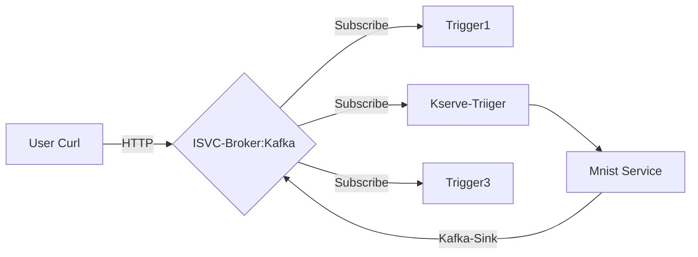

+++
tags = ["Kafka"]
title = 'Build Async Preidction Flow'
date = 2024-03-07T15:00:59+08:00
weight = 9
+++

## Flow


## Setps

### 1. Create Broker Setting
```yaml
kubectl apply -f - <<EOF
apiVersion: v1
kind: ConfigMap
metadata:
  name: kafka-broker-config
  namespace: knative-eventing
data:
  default.topic.partitions: "10"
  default.topic.replication.factor: "1"
  bootstrap.servers: "kafka.database.svc.cluster.local:9092" #kafka service address
  default.topic.config.retention.ms: "3600"
EOF
```

### 2. Create Broker
```yaml
kubectl apply -f - <<EOF
apiVersion: eventing.knative.dev/v1
kind: Broker
metadata:
  annotations:
    eventing.knative.dev/broker.class: Kafka
  name: isvc-broker
  namespace: kserve-test
spec:
  config:
    apiVersion: v1
    kind: ConfigMap
    name: kafka-broker-config
    namespace: knative-eventing
EOF
```

### 3. Create Trigger

kubectl apply -f - << EOF
apiVersion: eventing.knative.dev/v1
kind: Trigger
metadata:
  name: kserve-trigger
  namespace: kserve-test
spec:
  broker: isvc-broker
  filter:
    attributes:
      type: prediction-request-udf-attr # you can change this
  subscriber:
    uri: http://test-transformer.kserve-test.svc.cluster.local/v1/models/mnist:predict
EOF


### 4. Create InferenceService

kubectl apply -f - <<EOF
apiVersion: serving.kserve.io/v1beta1
kind: InferenceService
metadata:
  name: test-transformer
  namespace: kserve-test
spec:
  predictor:
    model:
      modelFormat:
        name: pytorch
      storageUri: gs://kfserving-examples/models/torchserve/image_classifier/v1
  transformer:
    containers:
      - image: docker-registry.lab.zverse.space/data-and-computing/ay-dev/msg-transformer:dev9
        name: kserve-container
        env:
        - name: KAFKA_BOOTSTRAP_SERVERS
          value: kafka.database.svc.cluster.local
        - name: KAFKA_TOPIC
          value: test-topic # result will be saved in this topic
        - name: REQUEST_TRACE_KEY
          value: test-trace-id # using this key to retrieve preidtion result
        command:
          - "python"
          - "-m"
          - "model"
        args:
          - --model_name
          - mnist
EOF


{}
```plaintext
root@ay-k3s01:~# kubectl -n kserve-test get pod 
NAME                                                             READY   STATUS    RESTARTS   AGE
test-transformer-predictor-00001-deployment-5d86dd94b7-w74zd     2/2     Running   0          5h11m
test-transformer-transformer-00001-deployment-65678f64f7-2h9j4   2/2     Running   0          25m
```
{}


### [[Optional]]() 5. Invoke InferenceService 
- preparation
```shell
wget -O ./mnist-input.json https://raw.githubusercontent.com/kserve/kserve/refs/heads/master/docs/samples/v1beta1/torchserve/v1/imgconv/input.json
SERVICE_NAME=test-transformer
MODEL_NAME=mnist
INPUT_PATH=@./mnist-input.json
PLAIN_SERVICE_HOSTNAME=$(kubectl -n kserve-test get inferenceservice $SERVICE_NAME -o jsonpath='{.status.url}' | cut -d "/" -f 3)
```
- fire!!
```shell
export INGRESS_HOST=192.168.100.112
export INGRESS_PORT=$(kubectl -n istio-system get service istio-ingressgateway -o jsonpath='{.spec.ports[?(@.name=="http2")].nodePort}')
curl -v -H "Host: ${PLAIN_SERVICE_HOSTNAME}" -H "Content-Type: application/json" -d $INPUT_PATH http://${INGRESS_HOST}:${INGRESS_PORT}/v1/models/$MODEL_NAME:predict
```

### 6. Invoke Broker
- preparation
```shell
cat > image-with-trace-id.json << EOF
{
    "test-trace-id": "16ec3446-48d6-422e-9926-8224853e84a7",
    "instances": [
        {
            "data": "iVBORw0KGgoAAAANSUhEUgAAABwAAAAcCAAAAABXZoBIAAAAw0lEQVR4nGNgGFggVVj4/y8Q2GOR83n+58/fP0DwcSqmpNN7oOTJw6f+/H2pjUU2JCSEk0EWqN0cl828e/FIxvz9/9cCh1zS5z9/G9mwyzl/+PNnKQ45nyNAr9ThMHQ/UG4tDofuB4bQIhz6fIBenMWJQ+7Vn7+zeLCbKXv6z59NOPQVgsIcW4QA9YFi6wNQLrKwsBebW/68DJ388Nun5XFocrqvIFH59+XhBAxThTfeB0r+vP/QHbuDCgr2JmOXoSsAAKK7bU3vISS4AAAAAElFTkSuQmCC"
        }
    ]
}
EOF
```
- fire!!
```shell
export MASTER_IP=192.168.100.112
export KAFKA_BROKER_INGRESS_PORT=$(kubectl -n knative-eventing get service kafka-broker-ingress -o jsonpath='{.spec.ports[?(@.name=="http-container")].nodePort}')
curl -v "http://${MASTER_IP}:${KAFKA_BROKER_INGRESS_PORT}/kserve-test/isvc-broker" \
  -X POST \
  -H "Ce-Id: $(date +%s)" \
  -H "Ce-Specversion: 1.0" \
  -H "Ce-Type: prediction-request-udf-attr" \
  -H "Ce-Source: event-producer" \
  -H "Content-Type: application/json" \
  -d @./image-with-trace-id.json 
```
- check kafka topic `test-topic`
```shell
kubectl -n database exec -it deployment/kafka-client-tools -- bash -c \
  'kafka-console-consumer.sh --bootstrap-server $BOOTSTRAP_SERVER --consumer.config $CLIENT_CONFIG_FILE --topic test-topic --from-beginning'
```

{}
```json
{
    "specversion": "1.0",
    "id": "745ac69b-fc1f-4f63-a05e-e76056d49a1f",
    "source": "data-and-computing/kafka-sink-transformer",
    "type": "org.zhejianglab.zverse.data-and-computing.kafka-sink-transformer",
    "time": "2025-07-02T08:20:12.908936+00:00",
    "data":
    {
        "predictions": [2]
    },
    "request-host": "test-transformer-transformer.kserve-test.svc.cluster.local",
    "kserve-isvc-name": "test-transformer",
    "kserve-isvc-namespace": "kserve-test",
    "test-trace-id": "16ec3446-48d6-422e-9926-8224853e84a7"
}
```
{}