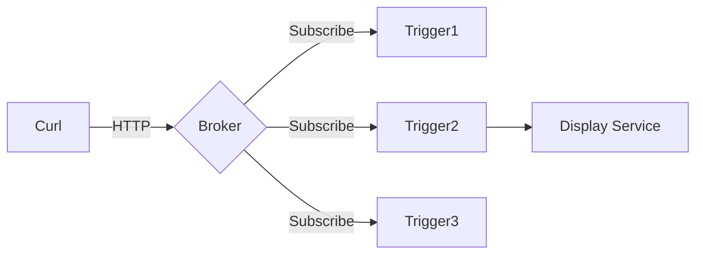

+++
tags = ["Kafka", "Broker"]
title = 'Display Broker Message'
date = 2024-03-07T15:00:59+08:00
weight = 40
+++

### Flow


## Setps

### 1. Create Broker Setting
```yaml
kubectl -n knative-eventing apply -f - <<EOF
apiVersion: v1
kind: ConfigMap
metadata:
  name: kafka-broker-config
  namespace: knative-eventing
data:
  default.topic.partitions: "10"
  default.topic.replication.factor: "1"
  bootstrap.servers: "kafka.database.svc.cluster.local:9092" #kafka service address
  default.topic.config.retention.ms: "3600"
EOF
```

### 2. Create Broker
```yaml
kubectl apply -f - <<EOF
apiVersion: eventing.knative.dev/v1
kind: Broker
metadata:
  annotations:
    eventing.knative.dev/broker.class: Kafka
  name: first-broker
  namespace: kserve-test
spec:
  config:
    apiVersion: v1
    kind: ConfigMap
    name: kafka-broker-config
    namespace: knative-eventing
EOF
```
deadletterSink:

### 3. Create Trigger
```yaml
apiVersion: eventing.knative.dev/v1
kind: Trigger
metadata:
  name: display-service-trigger
spec:
  broker: first-broker
  subscriber:
    ref:
      apiVersion: serving.knative.dev/v1
      kind: Service
      name: event-display
```

### 4. Create Sink Service (Display Message)
```yaml
kubectl apply -n kserve-test -f - <<EOF
apiVersion: serving.knative.dev/v1
kind: Service
metadata:
  name: event-display
spec:
  template:
    spec:
      containers:
        - image: gcr.io/knative-releases/knative.dev/eventing/cmd/event_display
EOF
```


### 5. Test
```shell
kubectl run curl-test --image=curlimages/curl -it --rm --restart=Never -- \
  -v "http://kafka-broker-ingress.knative-eventing.svc.cluster.local/kserve-test/first-broker" \
  -X POST \
  -H "Ce-Id: $(date +%s)" \
  -H "Ce-Specversion: 1.0" \
  -H "Ce-Type: test.type" \
  -H "Ce-Source: curl-test" \
  -H "Content-Type: application/json" \
  -d '{"test": "Broker is working"}'
```

