+++
title = 'Error'
date = 2024-03-07T15:00:59+08:00
weight = 3
+++

```mermaid
gantt
    dateFormat HH:mm
    axisFormat %H:%M
    Initial milestone : milestone, m1, 17:49, 2m
    Task A : 10m
    Task B : 5m
    Final milestone : milestone, m2, 18:08, 4m
```

1. 甘特图是一种能清晰描述每个任务的开始和截止时间，能有效获得 _任务并行进行的信息_ 的项目管理工具, **不能获得各任务之间的依赖关系**

2. **固定成本**
    > 固定成本是指其总额在一定期间和一定业务量范围内，不受业务量变动的影响而保持固定不变的成本。

    > 例如，管理人员的工资、办公费、固定资产折旧费、员工培训费等。固定成本又可分为酌量性固定成本和约束性固定成本。
    - 酌量性固定成本: 指管理层的决策可以影响其数额的固定成本，例如，广告费、**员工培训费**、**技术开发经费**等；
    - 约束性固定成本: 指管理层无法决定其数额的固定成本，即必须开支的成本，例如，办公场地及机器设备的折旧费、房屋及设备租金、管理人员的工资等。

3. **变动成本**
    > 变动成本也称为可变成本，是指在一定时期和一定业务量范围内其总额随着业务量的变动而成正比例变动的成本。

    > 例如，直接材料费、产品包装费、外包费用、开发奖金等。变动成本也可以分为酌量性变动成本和约束性变动成本。
    开发奖金、外包费用等可看作是酌量性变动成本；约束性变动成本通常表现为系统建设的直接物耗成本，以直接材料成本最为典型。

4. 松弛时间 = 活动的最早开始时间 - 最晚开始时间 (还需要在关键路径上)