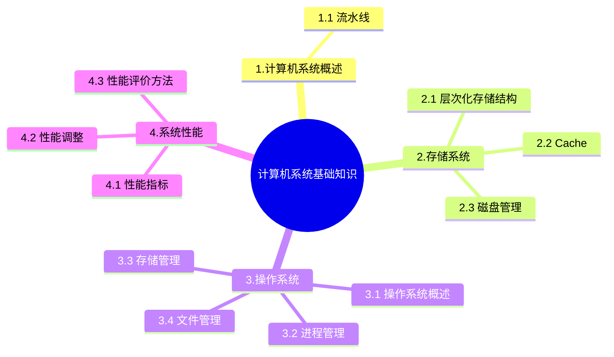

+++
title = '8. 计算机系统基础知识'
date = 2024-03-07T15:00:59+08:00
weight = 11
+++

### 计算机系统概述
1. 流水线

### 存储系统
1. 层次化存储结构
计算机采用分级存储提起的主要目的是为了解决存储的容量、价格和速度之间的矛盾

2. Cache
- 高速缓存器Cache是对程序员**透明的**
- Cache的设计思想是在合理的成本下提高命中率

3. 磁盘管理
- 磁盘概念
- 磁盘移臂调度算法
    >
    * 先来先服务FCFS
    * 最短寻道时间优先
    * 扫描算法
    * 循环扫描算法