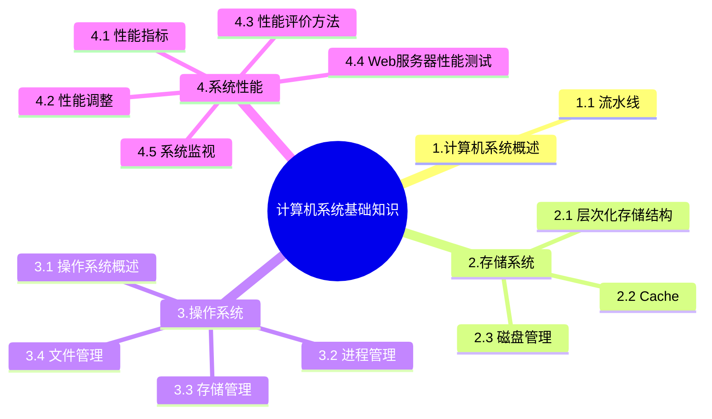

+++
title = '8. 计算机系统基础知识'
date = 2024-03-07T15:00:59+08:00
weight = 11
+++

### 计算机系统概述
1. 流水线

### 存储系统
1. 层次化存储结构
计算机采用分级存储提起的主要目的是为了解决存储的容量、价格和速度之间的矛盾

2. Cache
- 高速缓存器Cache是对程序员**透明的**
- Cache的设计思想是在合理的成本下提高命中率

3. 磁盘管理
- 磁盘概念
- 磁盘移臂调度算法
    >
    * 先来先服务FCFS
    * 最短寻道时间优先
    * 扫描算法
    * 循环扫描算法

### 操作系统
管理系统的软件、硬件和计算资源，主要包括
- 进程管理
    >
    * 进程与线程的基本概念
    * 进程的状态
        
    * 信号量与PV操作
        >
        * P 操作：申请资源
        * V 操作：释放资源
    * 前趋图
    * 死锁
        >
        * 死锁的预防 -》 打破四大条件
        * 死锁的米面 -》 
            * 有序分配资源法
            * 银行家算法
                >
                * 分配资源的原则：
                    - 当一个进程对资源的最大需求量不超过系统中资源数时可以接纳该进程
                    - 进程可以分期请求资源，但请求的总数不能超过最大需求量
                    - 当系统现有资源不能满足进程还需要的资源数时，对进程的请求可以推迟分配，但总能使进程在有限的时间里获得资源
- 存储管理
    >
    * 页式存储
        > 
        
    * 段式存储
        >
        
    * 段页式存储
        >
        
- 文件管理
    * 索引文件结构
    * 位示图
- 作业管理
- 设备管理

### 系统性能
1. 硬件指标
2. 软件指标
3. 性能调整
    > Amdahl's law
    
    
4. 性能评价方法
    > 
    
    
    - 把应用程序中应用最频繁的那部分**核心程序**作为评价计算机性能的标准程序，称为**核心)基准测试程序**
5. Web服务器测试
    - 在Web服务器测试时，反映其性能的指标包括：**最大并发连接数**、**响应延迟** 和 **吞吐量**
    - 常见的Web服务器性能测试方法有 **基准性能测试**、**压力测试** 和 **可靠性测试**
6. 系统监视
    > 进行系统监视通畅有3种方式
    1. 通过系统本身提供的命令
    2. 通过系统记录文件查阅系统在特定时间内的运行状态
    3. 使用集成了命令、文件记录和可视化的监控工具

### RISC
RISC特点：
1. 使用**等长指令**，目前典型长度为**4**个字节寻址方式少且简单，一般为2-3种； 

2. **绝不出现**存储器间接寻址方式只有取数指令、存数指令访问存储器指令集中的指令数目一般少于100种，指令格式一般少于4种指令功能简单； 

3. 控制器多采用**硬布线**方式，以期更快的执行速度平均而言，所有的指令的执行时间为一个处理时钟周期强调通用寄存器资源的优化使用

### DSP （Digital Signal Processing）数字信号处理技术芯片
> DSP芯片广泛应用于数字控制、运动控制方面的应用主要有磁盘驱动控制、引擎控制、激光打印机控制、喷绘机控制、马达控制、电力系统控制、机器人控制、高精度伺服系统控制、数控机床等。面向低功耗、手持设备、无线终端的应用主要有：手机、PDA、GPS、数传电台等。

编程DSP芯片是一种具有特殊结构的微处理器，为了达到快速进行数字信号处理的目的，DSP芯片一般都采用特殊的软硬件结构：
1. **哈佛结构**。DSP采用了哈佛结构，将存储器空间划分成两个，分别存储程序和数据。它们有两组总线连接到处理器核，允许同时对它们进行访问，每个存储器独立编址，独立访问。这种安排将处理器的数据吞吐率加倍，更重要的是同时为处理器核提供数据与指令。在这种布局下，DSP得以实现单周期的MAC指令。在哈佛结构中，由于程序和数据存储器在两个分开的空间中，因此取指和执行能完全重叠运行。
2. 流水线。与哈佛结构相关，DSP芯片广泛采用2-6级流水线以减少指令执行时间，从而增强了处理器的处理能力。这可使指令执行能完全重叠，每个指令周期内，不同的指令都处于激活状态。
3. 独立的硬件乘法器。在实现多媒体功能及数字信号处理的系统中，算法的实现和数字滤波都是计算密集型的应用。在这些场合，乘法运算是数字处理的重要组部分，是各种算法实现的基本元素之一。乘法的执行速度越快，DSP处理器的性能越高。相比与一般的处理器需要30-40个指令周期，DSP芯片的特征就是有一个专用的硬件乘法器，乘法可以在一个周期内完成。
4. 特殊的DSP指令。DSP的另一特征是采用特殊的指令，专为数字信号处理中的一些常用算法优化。这些特殊指令为一些典型的数字处理提供加速，可以大幅提高处理器的执行效率。使一些高速系统的实时数据处理成为可能。
5. 独立的DMA总线和控制器。有一组或多组独立的DMA总线，与CPU的程序、数据总线并行工作。在不影响CPU工作的条件下，DMA的速度已经达到800MB/S以上。这在需要大数据量进行交换的场合可以减小CPU的开销，提高数据的吞吐率。提高系统的并行执行能力。
6. 多处理器接口。使多个处理器可以很方便的并行或串行工作以提高处理速度。
7. JTAG（Joint Test Action Group）标准测试接口（IEEE 1149标准接口）。便于对DSP作片上的在线仿真和多DSP条件下的调试。
8. 快速的指令周期。哈佛结构，流水线操作，专用的硬件乘法器，特殊的DSP指令再加上集成电路的优化设计，可是DSP芯片的指令周期在10ns以下。快速的指令周期可以使DSP芯片能够实时实现许多DSP应用。

### 串行总线
关于串行总线的特点，总结如下：
1. 串行总线有半双工、全双工之分，全双工是一条线发一条线收。
2. 串行总线适宜长距离传输数据。
3. 串行总线按位（bit）发送和接收。尽管比按字节（byte）的并行通信慢，但是串口可以在使用一根线发送数据的同时用另一根线接收数据。它很简单并且能够实现远距离通信。比如IEEE488定义并行通行状态时，规定设备线总长不得超过20米，并且任意两个设备间的长度不得超过2米；而对于串口而言，长度可达1200米。
4. 串口通信最重要的参数是波特率、数据位、停止位和奇偶校验。对于两个进行通行的端口，这些参数必须匹配。串行总线的数据正确性依赖于校验和重传
5. 串行总线的数据发送和接收可以使用多种方式，中断方式与DMA都较为常见。

### 存取方式
存储器中数据常用的存取方式有顺序存取、直接存取、随机存取和相联存取等4种。
1. 顺序存取：存储器的数据以记录的形式进行组织。对数据的访问必须按特定的线性顺序进行。磁带存储器采用顺序存取的方式。
2. 直接存取：与顺序存取相似，直接存取也使用一个共享的读写装置对所有的数据进行访问。但是，每个数据块都拥有唯一的地址标识，读写装置可以直接移动到目的数据块的所在位置进行访问。存取时间也是可变的。磁盘存储器ROM采用直接存取的方式。
3. 随机存取：存储器的每一个可寻址单元都具有自己唯一的地址和读写装置，系统可以在相同的时间内对任意一个存储单元的数据进行访问，而与先前的访问序列无关。主存储器RAM采用随机存取的方式。
4. 相联存取：相联存取也是一种随机存取的形式，但是选择某一单元进行读写是取决于其内容而不是其地址。与普通的随机存取方式一样，每个单元都有自己的读写装置，读写时间也是一个常数。使用相联存取方式，可以对所有的存储单元的特定位进行比较，选择符合条件的单元进行访问。为了提高地址映射的速度，Cache采取相联存取的方式。

### CPU 中断
> CPU利用中断方式完成数据的I/O。
当I/O系统与外设交换数据时，CPU无需等待也不必去查询I/O的状态，当I/O系统完成了数据传输后则以中断信号通知CPU。然后CPU通过栈保存正在执行程序的现场，转入I/O中断服务程序完成与I/O系统的数据交换。再然后返回原主程序继续执行。与程序控制方式相比，中断方式因为CPU无需等待而提高了效率。

### AI芯片
通常，AI芯片的技术架构包括GPU、FPGA、ASIC三类。
1. GPU即显卡芯片，拥有成百上千个流处理器，适合做大规模的浮点数计算。多用于神经网络技术。
2. FPGA可对芯片硬件层进行编程和配置，实现半定制化，针对较为特定的AI场景。
3. ASIC是专用芯片，针对特定场景进行了深度的定制，特定的计算性能优化。