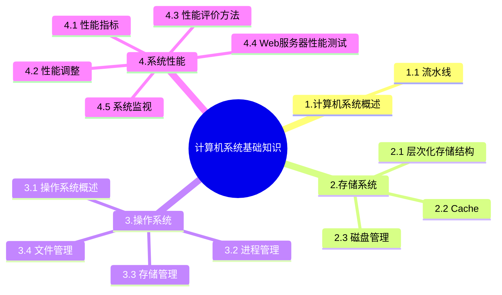

+++
title = '8. 计算机系统基础知识'
date = 2024-03-07T15:00:59+08:00
weight = 11
+++

### 计算机系统概述
1. 流水线

### 存储系统
1. 层次化存储结构
计算机采用分级存储提起的主要目的是为了解决存储的容量、价格和速度之间的矛盾

2. Cache
- 高速缓存器Cache是对程序员**透明的**
- Cache的设计思想是在合理的成本下提高命中率

3. 磁盘管理
- 磁盘概念
- 磁盘移臂调度算法
    >
    * 先来先服务FCFS
    * 最短寻道时间优先
    * 扫描算法
    * 循环扫描算法

### 操作系统
管理系统的软件、硬件和计算资源，主要包括
- 进程管理
    >
    * 进程与线程的基本概念
    * 进程的状态
        
    * 信号量与PV操作
        >
        * P 操作：申请资源
        * V 操作：释放资源
    * 前趋图
    * 死锁
        >
        * 死锁的预防 -》 打破四大条件
        * 死锁的米面 -》 
            * 有序分配资源法
            * 银行家算法
                >
                * 分配资源的原则：
                    - 当一个进程对资源的最大需求量不超过系统中资源数时可以接纳该进程
                    - 进程可以分期请求资源，但请求的总数不能超过最大需求量
                    - 当系统现有资源不能满足进程还需要的资源数时，对进程的请求可以推迟分配，但总能使进程在有限的时间里获得资源
- 存储管理
    >
    * 页式存储
        > 
        
    * 段式存储
        >
        
    * 段页式存储
        >
        
- 文件管理
    * 索引文件结构
    * 位示图
- 作业管理
- 设备管理

### 系统性能
1. 硬件指标
2. 软件指标
3. 性能调整
    > Amdahl's law
    
    
4. 性能评价方法
    > 
    
    
    - 把应用程序中应用最频繁的那部分**核心程序**作为评价计算机性能的标准程序，称为**核心)基准测试程序**
5. Web服务器测试
    - 在Web服务器测试时，反映其性能的指标包括：**最大并发连接数**、**响应延迟** 和 **吞吐量**
    - 常见的Web服务器性能测试方法有 **基准性能测试**、**压力测试** 和 **可靠性测试**
6. 系统监视
    > 进行系统监视通畅有3种方式
    1. 通过系统本身提供的命令
    2. 通过系统记录文件查阅系统在特定时间内的运行状态
    3. 使用集成了命令、文件记录和可视化的监控工具

