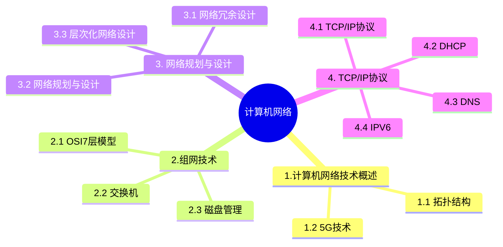

+++
title = '10. 计算机网络'
date = 2024-03-07T15:00:59+08:00
weight = 13
+++

### 计算机网络技术概述
- 网络拓扑结构

- 5G技术

SBA: Service-Based Architecture 服务化架构

### 组网技术
- OSI7层模型

- 交换机
  1. 交换技术
    > 数据在网络中转发通常离不开交换机。交换机的功能包括：集线功能、中继功能、桥接功能、隔离冲突域
  2. 基本交换原理
    > 交换机是一种基于MAC地址识别，能完成封装转发数据包功能的网络设备。交换机可以学习MAC地址，并把其存放在内部地址表中，通过在数据的始发者和目标接受者之间建立临时的交换路径，是数据直接由原地址到达目的地址。
  3. 需要实现的功能：
    * 转发路径学习，根据收到数据中的源MAC地址建立该地址同交换机端口的映射写入MAX地址表中
    * 数据转发。如果交换机根据数据中的目的MAC地址在建立好的MAC地址表中查询到了，就向对应端口进行转发。
    * 数据泛洪，如果数据中的目的MAC地址不在MAC地址表中，则向所有端口转发也就是泛洪。广播帧和组播帧向所有端口进行转发，不包括原地址
    * 链路地址更新， MAC地址表会每隔一定时间更新一次。。

### 网络规划与设计
- 网络冗余设计
  > 设计目标有两个：一个是备用路径（一般近在主路径失效时投入使用），一个是负载分担
- 网络规划与设计
  * 流程: 需求分析 -》 通信规范分析 -》 逻辑网络设计 -》 物理网络设计 -》 实施阶段
  * 逻辑网络设计
  
  * 物理网络设计
  
- 层次化网络设计
  
  > 某企业通过一台路由器上联总部,下联4个分支机构,设计人员分配给下级机构一个连续的地址空间,采用一个子网或者超网段表示。这样做的主要作用是**层次化路由选择**。
  
  > 层次化路由的含义是指对网络拓扑结构和配置的了解是局部的,一台路由器不需要知道所有的路由信息,只需要了解其管辖的路由信息,层次化路由选择需要配合层次化的地址编码。而子网或超网就属于层次化地址编码行为。

  > 其中核心层在逻辑上只有一个,它连接多个分布层交换机,通常是一个园区中连接多个建筑物的总交换机的核心网络设备;汇聚层定义的网络的访问策略;接入层提供局域网络接入功能,可以使用集线器代替交换机。A选项错误,核心层只负责高速转发以及出口路由,访问控制列表检查是汇聚层的任务。

  > 进行网络层次化设计时,一般分为核心层、汇聚层、接入层三个层次。为了保证网络的层次性,不能在设计中随意加入额外连接、除去接入层,其他层次应尽量采用模块化方式,模块间的边界应非常清晰。进行层次化网络设计时,应是先从接入层开始设计,然后逐级往核心层走。原因是接入层其实代表了需求,是因为有大量终端设备要接入,并有速度上的要求,才有了汇聚层要达到什么要求,核心层得怎么设计

### TCP/IP协议
- TCP/IP协议
  
- DHCP 动态主机配置协议 
  > 分配方式
    * 固定分配 
    * 动态分配 -》 有限期限的IP地址；租期为8天，租约过半时，客户机需要想DHCP申请续约
    * 自动分配
- DNS
  > 当浏览器输入域名： HOSTs -》 本地DNS缓存 -》本地DNS服务器 -》 根域名服务器 -》 顶级域名服务器 -》 权限域名服务器
  * 递归查询： 服务器必须回答目标IP与域名的映射关系
  * 迭代查询： 服务器收到一次迭代查询回复一次结果，这个结果不一定是目标IP与域名的映射关系，也可以是其他DNS服务器的地址
  * PTR记录是DNS的反向记录，通过IP查询域名
- IPV6
  * ipv4的头部比ipv6复杂
  * IPV6寻址模式分为三种，即单播地址、组播地址和泛播地址。
  * 通常一台IPV6主机有多个IPv6地址，即使该主机只有一个单接口。一台IPv6主机可以同时拥有以下几种单点传送地址:每个接口的链路本地地址;每个接口的单播地址(可以是一个站点本地地址和一个或多个可聚集全球地址);回环(loopback)接口的回环地址(::1);此外，每台主机还需要时刻保持收听以下多点传送地址上的信息;节点本地范围内所有节点组播地址(FF01::1);链路本地范围内所有节点组播地址(FF02::1);请求节点(solicited-node)组播地址(如果主机的某个接口加入请求节点组);组播组组播地址(如果主机的某个接口加入任何组播组)。

### SNMP
SNMPV3把对网络协议的安全威胁分为主要的和次要的两类。标准规定安全模块必须提供防护的两种主要威胁是:(1)修改信息:就是某些未经授权的实体改变了进来的SNMP报文，企图实施未经授权的管理操作，或者提供虚假的管理对象。
(2)假冒:即未经授权的用户冒充授权用户的标识，企图实施管理操作。
必须提供防护的两种次要威胁是:(1)修改报文流:由于SNMP协议通常是基于无连接的传输服务，重新排序报文流、延迟或重放报文的威胁都可能出现。这种威胁的危害性在于通过报文流的修改可能实施非法的管理操作。(2)消息泄露:SNMP引擎之间交换的信息可能被偷听，对于这种威胁的防护应采取局部的策略。不必提供防护的威胁包括:
(1)拒绝服务:因为在很多情况下拒绝服务和网络失效无法区别，所以可以由网络管理协议来处理，安全子系统
不必采取措施。(2)通信分析:即由第三者分析管理实体之间的通信规律，从而获取需要的信息。由于通常都是由少数管理站来管理整个网络的，所以管理系统的通信模式是可预见的，防护通信分析就没有多大作用了。根据以上分析可以得知，本题应选B。

> 采用虚拟化技术，能够在一台物理服务器出现故障时迅速将业务迁移到另一台服务器上，从而减少了因硬件故障导致的服务中断时间，提高了业务的连续性和可用性。所以方案二相比方案一的优点是业务的连续性得到了保障