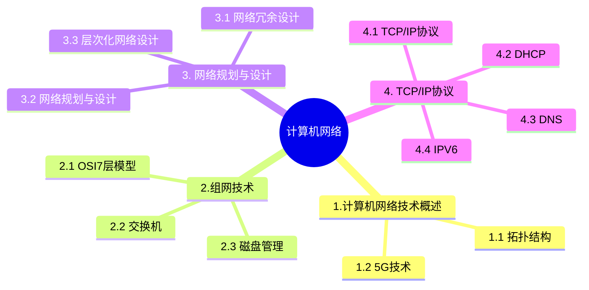

+++
title = '10. 计算机网络'
date = 2024-03-07T15:00:59+08:00
weight = 13
+++

### 计算机网络技术概述
- 网络拓扑结构

- 5G技术

SBA: Service-Based Architecture 服务化架构

### 组网技术
- OSI7层模型

- 交换机
  1. 交换技术
    > 数据在网络中转发通常离不开交换机。交换机的功能包括：集线功能、中继功能、桥接功能、隔离冲突域
  2. 基本交换原理
    > 交换机是一种基于MAC地址识别，能完成封装转发数据包功能的网络设备。交换机可以学习MAC地址，并把其存放在内部地址表中，通过在数据的始发者和目标接受者之间建立临时的交换路径，是数据直接由原地址到达目的地址。
  3. 需要实现的功能：
    * 转发路径学习，根据收到数据中的源MAC地址建立该地址同交换机端口的映射写入MAX地址表中
    * 数据转发。如果交换机根据数据中的目的MAC地址在建立好的MAC地址表中查询到了，就向对应端口进行转发。
    * 数据泛洪，如果数据中的目的MAC地址不在MAC地址表中，则向所有端口转发也就是泛洪。广播帧和组播帧向所有端口进行转发，不包括原地址
    * 链路地址更新， MAC地址表会每隔一定时间更新一次。。

### 网络规划与设计
- 网络冗余设计
  > 设计目标有两个：一个是备用路径（一般近在主路径失效时投入使用），一个是负载分担
- 网络规划与设计
  * 流程: 需求分析 -》 通信规范分析 -》 逻辑网络设计 -》 物理网络设计 -》 实施阶段
  * 逻辑网络设计
  
  * 物理网络设计
  
- 层次化网络设计
  
  > 某企业通过一台路由器上联总部,下联4个分支机构,设计人员分配给下级机构一个连续的地址空间,采用一个子网或者超网段表示。这样做的主要作用是**层次化路由选择**。
  
  > 层次化路由的含义是指对网络拓扑结构和配置的了解是局部的,一台路由器不需要知道所有的路由信息,只需要了解其管辖的路由信息,层次化路由选择需要配合层次化的地址编码。而子网或超网就属于层次化地址编码行为。

  > 其中核心层在逻辑上只有一个,它连接多个分布层交换机,通常是一个园区中连接多个建筑物的总交换机的核心网络设备;汇聚层定义的网络的访问策略;接入层提供局域网络接入功能,可以使用集线器代替交换机。A选项错误,核心层只负责高速转发以及出口路由,访问控制列表检查是汇聚层的任务。

### TCP/IP协议
- TCP/IP协议
  
- DHCP 动态主机配置协议 
  > 分配方式
    * 固定分配 
    * 动态分配 -》 有限期限的IP地址；租期为8天，租约过半时，客户机需要想DHCP申请续约
    * 自动分配
- DNS
  > 当浏览器输入域名： HOSTs -》 本地DNS缓存 -》本地DNS服务器 -》 根域名服务器 -》 顶级域名服务器 -》 权限域名服务器
  * 递归查询： 服务器必须回答目标IP与域名的映射关系
  * 迭代查询： 服务器收到一次迭代查询回复一次结果，这个结果不一定是目标IP与域名的映射关系，也可以是其他DNS服务器的地址
  * PTR记录是DNS的反向记录，通过IP查询域名
- IPV6