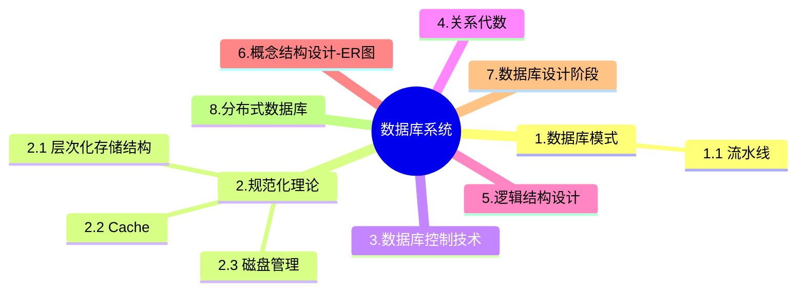

+++
title = '11. 数据库系统'
date = 2024-03-07T15:00:59+08:00
weight = 14
+++

```mermaid
mindmap
  root((数据库系统))
    1.数据库模式
        1.1 流水线
    2.规范化理论
        2.1 层次化存储结构
        2.2 Cache
        2.3 磁盘管理
    3.数据库控制技术
    4.关系代数
    5.逻辑结构设计
    6.概念结构设计-ER图
    7.数据库设计阶段
    8.分布式数据库
```

### 关系范式
1NF
2NF的规定是消除非主属性对码的部分函数依赖
3NF