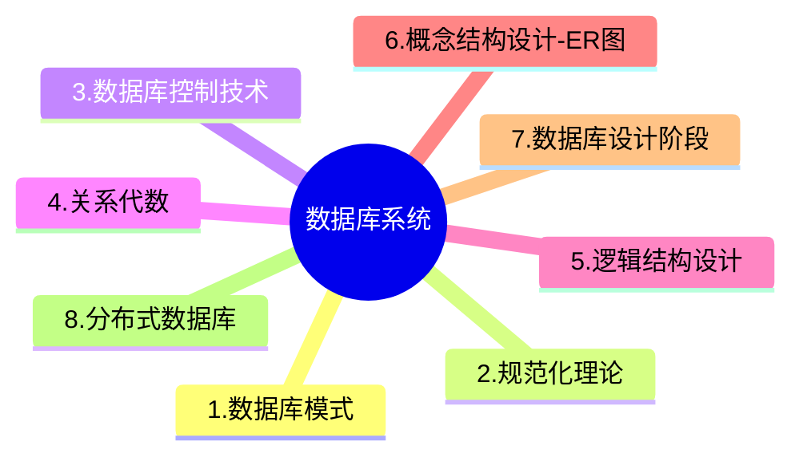

+++
title = '11. 数据库系统'
date = 2024-03-07T15:00:59+08:00
weight = 14
+++

### 数据库模式
1. 内模式
2. 外模式
3. 概念模式

### 规范化理论
> 非规范化的关系模式，可能存在的问题包括：数据冗余、更新异常（修改操作一致性问题）、插入异常、删除异常
- 注意事项：
   * 候选键：唯一标识元祖，且无冗余
   * 主键：从候选键中任选一个
   * 外键，其他关系的主键
- 主属性与非主属性：组成候选码的数据性就是主属性，其他的就是非主属性。
- 函数依赖

- 范式

  * 第一范式：在关系模式R中，当且仅当所有域中只含有原子值，即每个属性都是不可再分的数据项
  * 第二范式：当且仅当实体E是第一范式，且每一个非主属性完全依赖主键，（不存在部分依赖）
  * 第三范式：当且仅当实体E是第二范式，且E中没有非主属性传递依赖于码
  * BC范式：设R是一个关系模式，F是他的依赖集，R属于BCNF当且仅当其F中每个依赖的决定因素必定包含R的某个候选码。

### 数据库控制技术
1. 事物ACID特性
2. 数据库安全
    > 数据库的安全机制中，通过提供**存储过程**，第三方开发人员调用进行数据更新，从而保证数据库的关系模式不被第三方所获取
3. 数据库备份

### 关系代数

### 逻辑结构设计

### 概念结构设计-ER图

ER图集成时产生的冲突及解决办法:
- 属性冲突:包括属性域冲突和属性取值冲突。
- 命名冲突:包括同名异义和异名同义。
- 结构冲突:包括同一对象在不同应用中具有不同的抽象，以及同一实体在不同局部E-R图中所包含的属性个数和属性排列次序不完全相同。

### 数据库设计阶段

* 在数据库设计的**逻辑设计**阶段进行关系规范化
* 在数据库设计的需求分析阶段应完成包括**数据字典**，**数据流图**在内的文档

### 分布式数据库DDBMS
>
- 模式
    1. 分片模式： 分片模式将数据水平分割成多个部分（分片），每个分片存储在不同的节点上。
    2. 全局外模式：全局外模式是用户视角下的数据表示模式，通常用于提供特定用户组的视图，不涉及整个系统数据的整体逻辑视图。
    3. 分布模式：分布模式描述了数据在不同物理节点上的分布方式。
    4. 全局概念模式：全局概念模式定义了整个分布式数据库的逻辑结构，是一个高层次的概念模型。
- 两阶段提交协议2PC
    * 阶段
        1. 表决阶段，目的是形成一个共同的决定
        2. 执行阶段，目的是实现这个协调者的决定
    * 规则
        1. 只要有一个参与者撤销事务，协调者就必须做出全局撤销的决定
        2. 只要所有参与者都同意提交事务，协调者才能做出全局提交决定
- 特性：
    1. 数据独立性
    2. 集中于自治共享结合的控制结构
    3. 适当增加数据冗余度
    4. 全局的一致性
    5. 可串行性和可恢复性
- 组成：
    1. 局部数据库管理系统LDBMS: 每个节点的本地数据库的管理模块，负责改节点数据的存储、访问和管理
    2. 全局数据库管理系统GDBMS: 用于全局管理整个分布式数据库系统，包括多个节点的协同工作和全局数据的管理与访问
    3. 全局数据字典
    4. 通信管理CM
- 结构：
    1. 全局控制集中的DDBMS
    2. 全局控制分散的DDBMS
    3. 全局控制部分分散的DDBMS
- 分布式透明性
    1. 分片透明性
    2. 复制透明
    3. 位置透明性
    4. 局部数据模型透明性 （逻辑透明）

### 数据安全治理
数据安全治理的目标主要有三个:满足合规要求、管理数据安全风险、促进数据开发利用。这些目标旨在确保数据安全与业务发展的双向促进,同时保障组织在数据安全方面的合规性。

