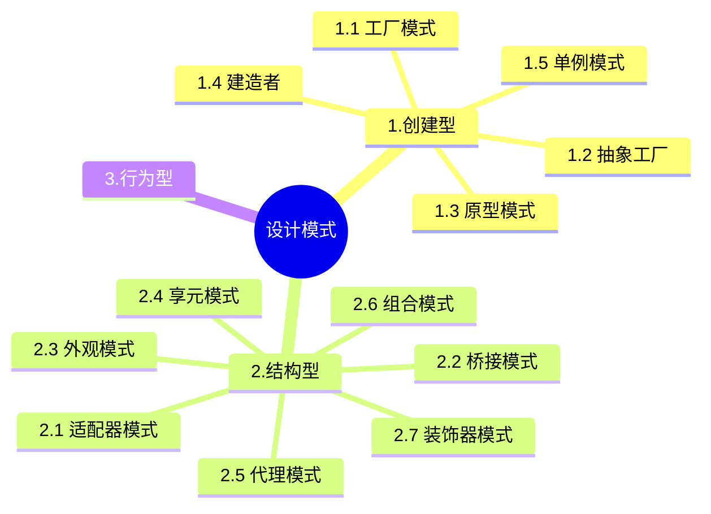

+++
title = '设计模式'
date = 2024-03-07T15:00:59+08:00
+++

设计模式是一套可以被反复使用的、多数人知晓的、经过分类编目的、代码设计经验的总结,使用设计模式是为了可重用代码、让代码更容易被他人理解并且提高代码的可靠性。

## 设计模式的分类:
- (1) 根据目的分类:
    * 创建型主要用于创建对象。有工厂方法模式(Factory Method)、抽象工厂模式(Abstract Factory)、建造者模式(Builder)、原型模式(Prototype)、单例模式(Singleton)共5种。
    * 结构型主要用于处理类和对象的组合。有适配器模式(Adapter)、桥接模式(Bridge)、组合模式(Composite)、装饰器模式(Decorator)、外观模式(Facade)、享元模式(Flyweight)、代理模式(Proxy)共7种。
    * 行为型主要用于描述类或对象怎样交互和怎样分配职责。有职责链模式(Chain of Responsibility)、命令模式(Command)、解释器模式(Interpreter)、迭代器模式(Iterator)、中介者模式(Mediator)、备忘录模式(Memento)、观察者模式(Observer)、状态模式(State)、策略模式(Stratege)、模板方法模式(Template Method)、访问者模式(Visitor)共11种。

- (2) 根据作用范围分类:
    可分为类模式和对象模式。
    * 类模式用于处理类和子类的关系,这种关系通过继承建立,在编译时就确定了,是一种静态关系。
    * 对象模式处理对象间的关系,具有动态关系。

#### 原型模式
Prototype (原型模式):用原型实例指定创建对象的类型,并且通过拷贝这个原型来创建新的对象。允许对象在不了解创建对象的确切类以及如何创建细节的情况下创建自定义对象。

#### 抽象工厂模式
Abstract Factory(抽象工厂模式):提供一个创建一系列相关或相互依赖对象的接口,而无需指定它们具体的类。

#### 建造者模式
Builder (建造者模式):将一个复杂类的表示与其构造相分离,使得相同的构建过程能够得出不同的表示。

#### 单例模式
Singleton (单例模式):保证一个类只有一个实例,并提供一个访问它的全局访问点。

#### 工厂模式

--------------------------------------

#### 适配器模式

#### 装饰器模式
装饰模式:动态地给一个对象添加一些额外的职责。它提供了用子类扩展功能的一个灵活的替代,比派生一个子类更加灵活。
> 很据题干描述，可以看出其基础是一个图形界面，并要求为图形界面提供一些定制的特效，例如带滚动条的图形界面，能够显示艺术字体且透明的图形界面等。这要求能够动态地对一个对象进行功能上的扩展，也可以对其子类进行功能上的扩展。装饰模式最符合这一要求。

#### 桥接模式
特点是实现接口与实现的分离
> 当案例会带来“类爆炸”的问题时，使用桥接模式是合适的。桥接模式的最核心特点便是:将抽象部分与它的实现部分分离,使它们都可以独立地变化。

#### 享元模式

#### 代理模式

#### 外观模式
外观(facade)模式是对象的结构模式,要求外部与一个子系统的通信必须通过一个统一的外观对象进行,为子系统中的一组接口提供一个一致的界面,外观模式定义了一个高层接口,这个接口使得这一子系统更加容易使用。

#### 组合模式
Composite (组合模式):将对象组合成树形结构以表示“部分-整体”的层次结构。它使得客户对单个对象和复合对象的使用具有一致性。

--------------------------------------

#### 访问者模式
> 某软件公司承接了为某工作流语言开发解释器的工作。该工作流语言由多种活动节点构成，具有类XML的语法结构。用户要求解释器工作时，对每个活动节点进行一系列的处理，包括执行活动、日志记录、调用外部应用程序等，并且要求处理过程具有可扩展能力。针对这种需求，公司采用**访问者模式**最为恰当。

对某个具有固定结构的活动节点需要多种处理能力，且处理能力可扩展也就是说要求在不改变原来类结构(活动节点)的基础上增加新功能。访问者模式最符合要求。

#### 备忘录模式

#### 解释器模式
解释器(Interpreter)模式。解释器模式属于类的行为型模式,描述了如何为语言定义一个文法,如何在该语言中表示一个句子,以及如何解释这些句子,这里的“语言”是使用规定格式和语法的代码。解释器模式主要用在编译器中,在应用系统开发中很少用到。

#### 策略模式
策略(Strategy) 模式。策略模式是一种对象的行为型模式,定义一系列算法,并将每一个算法封装起来,并让它们可以相互替换。策略模式让算法独立于使用它的客户而变化,其目的是将行为和环境分隔,当出现新的行为时,只需要实现新的策略类。
> 为了实现图像处理算法的灵活选择与替换，采用策略模式最为合适，因为策略模式定义一系列的算法，把它们封装起来，并且使它们可相互替换，使得算法可独立于使用它的客户而变化。

#### 中介者模式
中介者(Mediator)模式。中介者模式是一种对象的行为型模式,通过一个中介对象来封装一系列的对象交互。中介者使得各对象不需要显式地相互引用,从而使其耦合松散,而且可以独立地改变它们之间的交互。中介者对象的存在保证了对象结构上的稳定,也就是说,系统的结构不会因为新对象的引入带来大量的修改工作。

#### 迭代器模式
迭代器(Iterator)模式。迭代器模式是一种对象的行为型模式,提供了一种方法来访问聚合对象,而不用暴露这个对象的内部表示。迭代器模式支持以不同的方式遍历一个聚合对象,复杂的聚合可用多种方法来进行遍历;允许在同一个聚合上可以有多个遍历,每个迭代器保持它自己的遍历状态,因此,可以同时进行多个遍历操作。

#### 责任链模式
Chain of Responsibility(责任链模式):为解除请求的发送者和接收者之间耦合,而使多个对象都有机会处理这个请求。将这些对象连成一条链,并沿着这条链传递该请求,直到有一个对象处理它。

#### 命令模式
> 某软件公司一款图像处理软件的需求分析与设计过程，并明确指出采用设计模式实现关键需求对系统灵活性与扩展性的要求。为了支持灵活的撤销与重做等行为，采用命令模式最为合适，因为命令模式可以将一个请求封装为一个对象，从而使你可用不同的请求对客户进行参数化，还可以对请求排队，或记录请求日志，以及支持可撤销的操作。

#### 状态模式
> 为了封装图像操作与照片特征之间的复杂逻辑关系，采用状态模式最为合适，因为状态模式将每一个条件分支放入一个独立的类中，这样就可以根据对象自身的情况将对象的状态作为一个对象，这一对象可以不依赖于其他对象而独立变化;