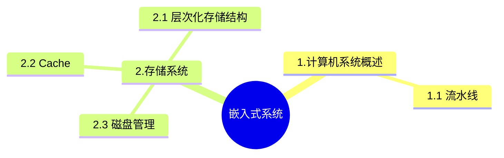

+++
title = '9. 嵌入式系统'
date = 2024-03-07T15:00:59+08:00
weight = 12
+++

```mermaid
mindmap
  root((嵌入式系统))
    1.计算机系统概述
        1.1 流水线
    2.存储系统
        2.1 层次化存储结构
        2.2 Cache
        2.3 磁盘管理
```