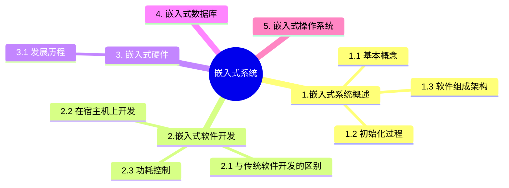

+++
title = '9. 嵌入式系统'
date = 2024-03-07T15:00:59+08:00
weight = 12
+++

### 嵌入式系统
- 嵌入式系统是以应用为中心，以计算机技术为基础，并将可配置与可裁剪的软件集成于一体的专用计算机系统，需要满足应用对功能、可靠性、成本、体积和功耗等方面的严格要求。
- 从计算机角度看，嵌入式系统是嵌入各种设备及应用产品内部的计算机系统。它主要完成信号控制的功能，体积小、结构紧凑，可作为一个部件埋藏在所控制的装置中。
- 一般嵌入式系统由嵌入式处理器、相关支撑硬件、嵌入式操作系统、支撑软件及应用软件组成

* 嵌入式系统初始化过程：
  1. 片级初始化
  2. 版级初始化
  3. 系统级初始化

* 嵌入式系统软件组成架构
  1. 嵌入式微处理器MCU
  2. 存储器 RAM/ROM
  3. 内外总线逻辑
  4. 定时/计数器
  5. 看门狗电路 ： 定时器超时则中断，系统复位处理
  6. I/O接口 （串口、网络、USB、JTAG接口：用来进行CPU调试的常用接口）
  7. 外部设备（LED等）
  8. 其他部件

### 嵌入式软件开发
- 与传统软件开发的区别

- 在宿主机上开发

- 功耗控制
  1. 软硬件协同设计，即软件的设计要与硬件匹配，考虑硬件因素
  2. 编译优化，采用低功耗优化的编译技术。
  3. 减少系统的持续运行时间，可以从算法角度进行优化。
  4. 用“中断”代替查询。
  5. 进行电源的有效管理

### 嵌入式硬件
- 发展历程

- 嵌入式微处理器

- AI芯片
通常，AI芯片的技术架构包括GPU、FPGA、ASIC三类。
1. GPU即显卡芯片，拥有成百上千个流处理器，适合做大规模的浮点数计算。多用于神经网络技术。
2. FPGA可对芯片硬件层进行编程和配置，实现半定制化，针对较为特定的AI场景。
3. ASIC是专用芯片，针对特定场景进行了深度的定制，特定的计算性能优化。

- 嵌入式微处理器体系结构

- 总线
总线是一组能为多个部件分时共享的信息传送线，用来连接多个部件并为之提供信息交换的通路（通常为半双工的）
特点：
  1. 挂接在总线上的多个部件只能分时向总线发送数据，但可以同时从总线接受数据。
  2. 通过总线复用方式可以减少总线中信号线的数量，以较少的信号线传输更多的信息。
  3. 从功能上来说，总线进行划分数据总线、地址总线和控制总线
  4. 从数据传输的方式划分并行总线和串行总线

- 串行总线vs并行总线
  1. 并行总线：将数据字节的各位用多条数据线同时进行传送。 （短距离）
  2. 串行总线：数据是一位一位地进行传输的，在传输中每一位数据都战局一个固定的时间长度。（长距离，传输波特率可调整，正确性依赖于校验码，数据传输方式可以使用多种）

### 嵌入式操作系统
- 实时操作系统

- 系统调度算法

- 操作系统内核架构

### 嵌入式数据库 EDBMS
- 分类

- 嵌入式网络数据库

嵌入式系统的数据库系统称为嵌入式数据库系统或嵌入式实时数据库系统，就是在嵌入式设备上使用的DBMS。由于用到EDBMS的嵌入式系统多是移动信息设备，例如，掌上电脑、PDA、车载设备等移动通信设备，位置固定的嵌入式设备很少用到，
因此，嵌入式数据库也称为移动数据库或嵌入式移动数据库。EDBMS的作用主要是解决移动计算环境下数据的管理问题，移动数据库是移动计算环境中的分布式数据库。嵌入式数据库管理系统一般只提供本机服务接口且只为前端应用提供基本的数据支持。

- 嵌入式数据库管理系统一般支持实时数据的管理
- 嵌入式数据库管理系统一般支持多线程并发操作
- 嵌入式数据库管理胸一般只提供本机服务接口
- 嵌入式数据库管理系统一般只为前端应用提供基本的数据支持

### 并串转化
一般来说，嵌入式系统通常采用**接口中的移位寄存器**来实现数据的串/并和并/串转换操作。

### Soc片上系统
- SoC称为片上系统，它是一个产品，是一个有专用目标的集成电路，其中包含完整系统，还有嵌入软件的全部内容。
- SoC不是一块处理器芯片。它是一种技术，用以实现从确定系统功能开始，到软/硬件划分，并完成设计的整个过程。

- 从狭义角度讲，它是信息系统核心的芯片集成，是将系统关键部件集成在一块芯片上;
- 从广义角度讲，SoC是一个微小型系统，如果说中央处理器(CPU)是大脑，那么SoC就是包括大脑、心脏、眼晴和手的系统。
- 国内外学术界一般倾向将SoC定义为将微处理器、模拟IP核、数字IP核和存储器(或片外存储控制接口)集成在单一芯片上，它通常是客户定制的，或是面向特定用途的标准产品。