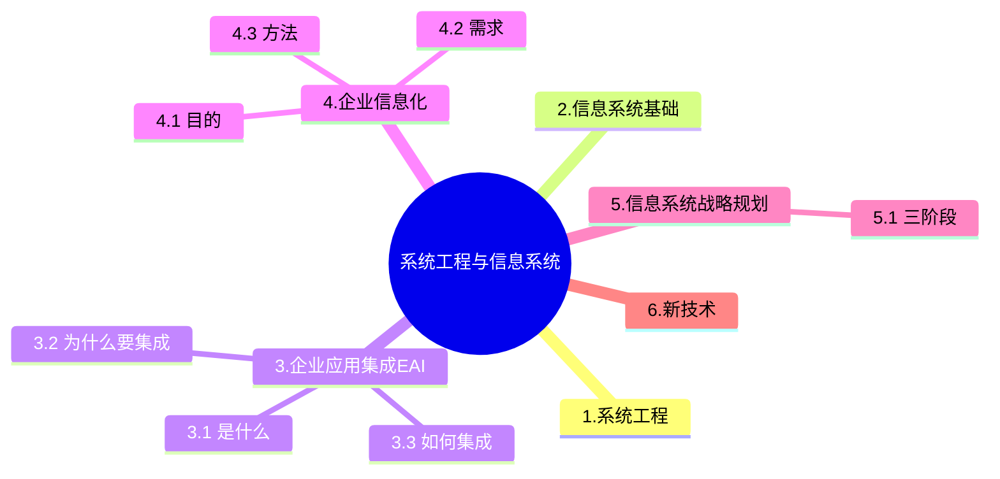

+++
title = '1.3 企业信息化&应用集成'
date = 2024-03-07T15:00:59+08:00
weight = 3
+++

## 企业信息化
企业信息化涉及对企业管理理念的创新，管理流程的优化，管理团队的重组和管理手段的革新。管理创新是按照市场发展的要求，对企业现有的管理流程重新整合，从作为管理核心的**财务**、**物料**管理，转向**技术**、**物资**、**人力资源**的管理，并延伸到企业技术创新、工艺设计、产品设计、生产制造过程的管理，进而还要扩展到客户关系管理、供应链管理乃至发展到电子商务。

### 目的
企业信息化旨在提高企业的竞争力

### 信息化需求
- 战略需求：提升组织的竞争能力
- 运作需求：实现信息化战略目标、运作策略、人才培养的需要
- 技术需要：信息技术层面上对系统的完善、升级、及集成

### 信息化方法
不是重点

### 信息化三流
- 信息流
  > 需求信息流：客户订单，生产计划，采购合同

  > 供应信息流：如入库单，完工报告单，库存记录，提货发运单
- 资金流
- 物流

### 缩写
- MIS，Management Information System 管理信息系统
- ERP，Enterprise Resource Planning 企业资源计划
  > 主要包括：财会管理、物流管理、生产控制管理、人力资源管理等四个主要功能模块
- MRP, Material Requirement Planning 物料需求计划
- CRM, Customer Relationship Management 客户关系管理
  > 核心是**客户价值管理**，其目的是与客户建立长期和有效的业务关系，最大限度地增加利润。市场营销和客户服务时CRM的支柱性功能，是客户与企业产生联系的主要方面。
  
  > 客户关系管理(CRM) 系统将市场营销的科学管理理念通过信息技术的手段集成在软件上,能够帮助企业构建良好的客户关系。在客户管理系统中,销售自动化是其中最为基本的模块,营销自动化作为销售自动化的补充,包括营销计划的编制和执行、计划结果分析等功能。客户服务与支持是CRM系统的重要功能。目前,客户服务与支持的主要手段有两种,分别是呼叫中心和互联网。CRM系统能够与ERP系统在财务、制造、库存等环节进行连接,两者之间虽然关系比较独立,但由于两者之间具有一定的关系,因此会形成一定的闭环反馈结构。
- SCM，Supply Chain Management 供应链管理
  > 整合优化“信息化的三流”，打通企业间“信息孤岛”严格的数据交换标准
- BPR，Business Process Reconstruction 业务流程重组
  > 遵循的原则：以流程为中心的原则，以客户为导向的原则，以人为本的原则
- BPM，Business Process Management业务流程管理

### 客户关系管理系统
客户关系管理系统的核心是客户价值管理,而不是客户信息管理。CRM的价值包括:提高工作效率,节省开支、提高客户满意度、提高客户的忠诚度。
所谓供应链就有供应商、制造商、分销商、零售商等等所供成的物流的网络,那么同一个企业就可能处在这个网络当中的一个节点,所以SCM他是一种集成的管理思想和方法,从单一的企业角度来看,SCM他是通过改善上下游的关系,整合和优化供应链当中的物流、信息流、资金流,来获得企业的竞争的优势,所以整个供应链的内容大概就包括了计划、采购、制造、配送和退货这五个方面的基本内容,所以整个供应链应该理解为从源头的供应商开始,到最终的消费者的集成的业务整个流程,不仅对消费者带来有价值的消费和服务,而且还能为顾客带来一些有
用的信息,在整个SCM当中,他的关键问题,就是配送网络的重构问题以及配送的战略问题,另外一个就是供应链集成与战略伙伴的关系。SCM包括计划、采购、制造、配送、退货五大基本内容。
1. 计划:这是SCM的策略性部分。企业需要有一个策略来管理所有的资源,以满足客户对产品的需求。好的计
划是建立一系列的方法监控供应链,使它能够有效、低成本地为顾客递送高质量和高价值的产品或服务。
2. 采购:选择能为企业提供产品和服务的供应商,与供应商建立一套定价、配送和付款流程,并监控和改善管
理。
3. 制造:安排生产、测试、打包和准备送货所需的活动,是供应链中测量内容最多的部分,包括质量水平、产
品产量和工人的生产效率等的测量。
4. 配送:也称为物流,是调整用户的订单收据、建立仓库网络、派递送人员提货并送货到顾客手中、建立产品
计价系统、接收付款。
5. 退货:这是供应链中的问题处理部分。建立网络接收客户退回的次品和多余产品,并在客户应用产品出问题
时提供支持。

### 企业门户
企业门户是一个信息技术平台,这个平台可以提供个性化的信息服务,为企业提供一个单一的访问企业各种信息资源和应用程序的入口。现有的企业门户大致可以分为企业信息门户、企业知识门户和企业应用门户三种。其中企业信息门户重点强调为访问结构数据和无结构数据提供统一入口,实现收集、访问、管理和无缝集成。企业知识门户提供了一个创造、搜集和传播企业知识的平台,通过企业知识门户,员工可以与工作团队中的其他成员取得联系,寻找能够提供帮助的专家。企业应用门户是一个用来提高企业的集中贸易能力、协同能力和信息管理能力的平台。它以商业流程和企业应用为核心,将商业流程中功能不同的应用模块通过门户集成在一起,提高公司的集中贸易能力、协同能力和信息管理能力。

> 某大型公司欲开发一个门户系统,该系统为访问结构数据和无结构数据提供统一入口,实现收集访问、管理和无缝集成。根据这种需求,采用企业**信息**门户解决方案最为合适

---

## 信息系统战略规划
**企业战略**规划是评价环境和企业现状，进而选择和确定企业的总体和长远目标，指定和选择实现目标的行动方案。**信息系统**战略规划关注如何通过信息系统来支撑业务流程的运作，进而实现企业的关键业务目标。

1. 第一阶段：以数据处理为核心围绕职能部门需求
  > 关键成功因素法CSF：抓主要矛盾

  > 战略集合转化法SST: 将整个过程看成一个“信息集合”，并将组织的战略目标转成管理信息系统MIS的战略目标
  
  > 企业系统规划法BSP：通过自伤而下的识别企业目标、企业过程和数据，然后对数据进行分析，自下而上地设计信息系统
2. 第二阶段：以企业内部MIS为核心，围绕企业整体需求
3. 第三阶段：综合考虑企业内外环境以集成为核心，围绕企业的战略需求

企业战略数据模型分为数据库模型和数据仓库模型，
- 数据库模型用来描述日常事务处理中的数据及其关系;
- 数据仓库模型则描述企业高层管理决策者所需信息及其关系。

在企业信息化过程中，数据库模型是基础，一个好的数据库模型应该客观地反映企业生产经营的内在联系。数据库是办公自动化、计算机辅助管理系统、开发与设计自动化、生产过程自动化、Intranet的基础和环境。

---

## 企业应用集成
EAI（企业应用集成） 是一种通过系统架构和技术手段，实现企业内部多个系统间数据交换和协作的解决方案。在数据集成方面，EAI主要包括以下方式：
1. 数据复制：将数据从一个系统复制到另一个系统，适合于静态数据或更新频率较低的数据。
2. 基于接口的数据集成：通过定义系统间的数据接口，实现动态数据交换。
3. 数据联邦：通过联邦机制，使多个数据源看起来像一个虚拟数据库，适合实时性要求较高的场景。

> EAI技术是将进程、软件、标准和硬件联合起来,在两个或更多的企业信息系统之间实现无缝集成,使它们就像一个整体一样。EAI提供4个层次的服务,从下至上依次为**通讯服务**、**信息传递与转化服务**、**应用连接服务**、**流程控制服务**,最上层是流程控制服务。

### 为什么要集成
解决数据孤岛

### 怎么集成
企业集成通常包括以下五个主要层次：（由易到难）
1. 界面集成，(表示集成), 统一入口，产生整体的感觉，最小代价实现一体化操作
2. 数据集成，将不同来源的数据逻辑或者物理上“集中”，为企业提供全面的数据共享，是其他后续集成方法的基础
3. 控制集成，调用其他系统已有的方法，达到集成效果
4. 过程集成，（物业流程集成），跨企业，或优化流程而非直接调用，企业必须对各种业务信息的交换进行定义、授权和管理，对企业之间的信息共享能力提出了要求
5. 门户集成，将内部系统对接到互联网上
<!-- 企业集成通常包括以下四个主要层次：
1. 数据集成：最底层，解决数据的共享和统一问题。通过数据抽取、清洗、转换等方法实现数据资源的集中化或分布式管理。
2. 会聚集成：通过整合不同的系统或模块，使它们能够协同工作。解决的是“如何整合系统资源”的问题，开始涉及逻辑和服务的整合。
3. 服务集成：通过服务的调用和组合，支持跨系统的业务流程。引入了SOA（面向服务的架构）和ESB（企业服务总线）等技术，关注服务的发布、发现和调用。
4. 应用集成：最高层次，通过整合业务应用，实现跨系统、跨部门的业务流程联动。关注整体的业务优化和用户体验。 -->

### 信息资源管理
集成管理是企业信息资源管理的主要内容之一。实行企业信息资源集成的前提是对企业历史上形成的企业信息功能的集成，其核心是对企业内部和外部信息流的集成，其实施的基础是各种信息手段的集成。通过集成管理实现企业信息系统各要素的优化组合，使信息系统各要素之间形成强大的协同作用，从而最大限度地放大企业信息的功能实现企业可持续发展的目的。

### 企业应用集成
"业务系统的运行平台和开发语言差异较大，而且系统所使用的通信协议和数据格式各不相同"。在这种情况下需要采用总线技术对传输协议和数据格式进行转换与适配。当需要集成并灵活定义系统功能之间的协作关系时，应该采用基于工作流的功能关系定义方式。

企业信息化程度是国家信息化建设的基础和关键，企业信息化方法不包括**组织机构变革**。

本题考查企业信息化的基本方法。
企业信息化程度是国家信息化建设的基础和关键，企业信息化就是企业利用现代信息技术，通过信息咨源的深入开发和广泛利用，实现企业生产过程的自动化、管理方式的网络化、决策支持的智能化和商务运营的电子化，不断提高生产、经营、管理、决策的效率和水平，进而提高企业经济效益和企业竞争力的过程。企业信息化方法主要包括业务流程重构、核心业务应用、信息系统建设、主题数据库、资源管理和人力资本投资方法。企业战略规划是指依据企业外部环境和自身条件的状况及其变化来制定和实施战略，并根据对实施过程与结果的评价和反馈来调整，制定新战略的过程。
而供应链管理的简称为(SCM)，属于资源管理方法，是企业信息化方法中的一种。所以答案选B选项