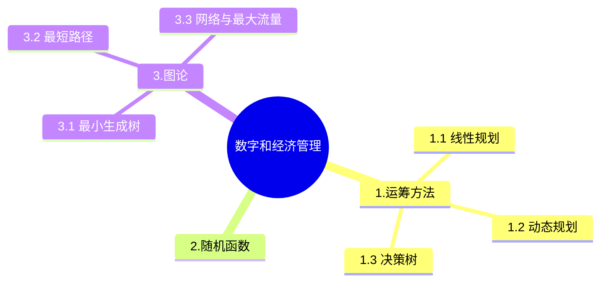

+++
title = '12. 数字和经济管理'
date = 2024-03-07T15:00:59+08:00
weight = 15
+++

### 关系范式
本题考查电子商务方面的基础知识。 电子商务分五个方面，即电子商情广告、电子选购与交易、电子交易凭证的交换、电子支付与结算，以及网上售后服务等。参与电子商务的实体有4类：客户(个人消费者或集团购买)、商户(包括销售商、制造商和储运商)、银行(包括发行和收单行)及认证中心。

### 电子商务
电子商务模式有多种,某平台通过自己的APP将合作方实体店的团购、打折优惠信息推送给互联网用户,从而将这些用户转换为合作方实体店的客户,这种模式称O2O。
> 团购这种商务形式中,涉及的电子商务模式其实不止一种。至少包括:B2C和O2O,因为团购平台上提供的服务是商家对个人的,这符合B2C的特性,同时团队是线上线下结合的形式。而本题中,既有B2C的选项,也有O2O的选项,此时我们需要进一步分析题目关注点是什么。题目中强调了APP推送优惠信息,引导到实体店,转化为实体店消费,所以此时强调的是线上营销加线下消费,更符合O2O的特性。