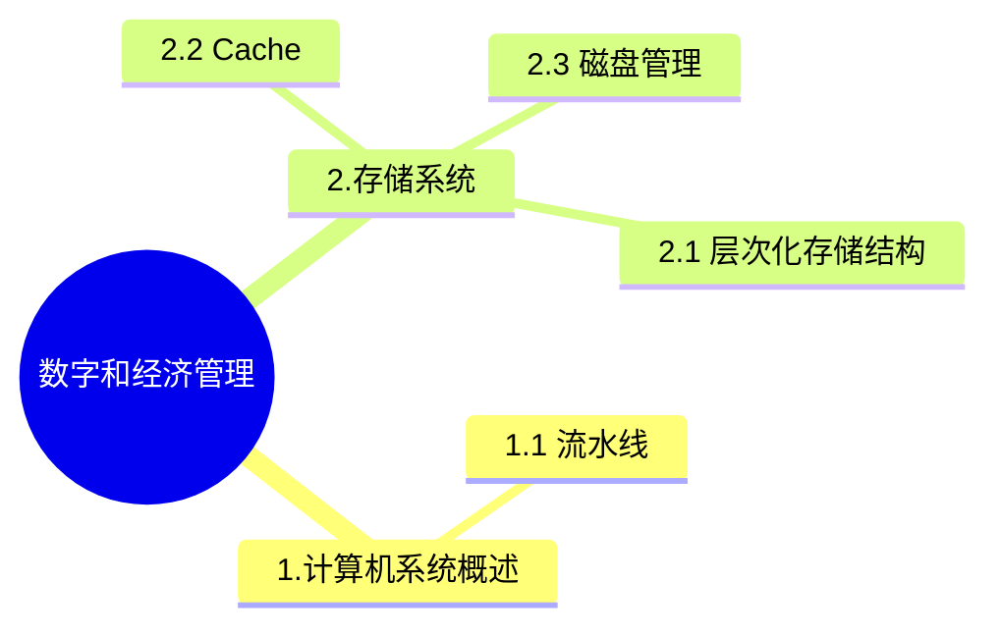

+++
title = '12. 数字和经济管理'
date = 2024-03-07T15:00:59+08:00
weight = 15
+++

### 关系范式
本题考查电子商务方面的基础知识。 电子商务分五个方面，即电子商情广告、电子选购与交易、电子交易凭证的交换、电子支付与结算，以及网上售后服务等。参与电子商务的实体有4类：客户(个人消费者或集团购买)、商户(包括销售商、制造商和储运商)、银行(包括发行和收单行)及认证中心。