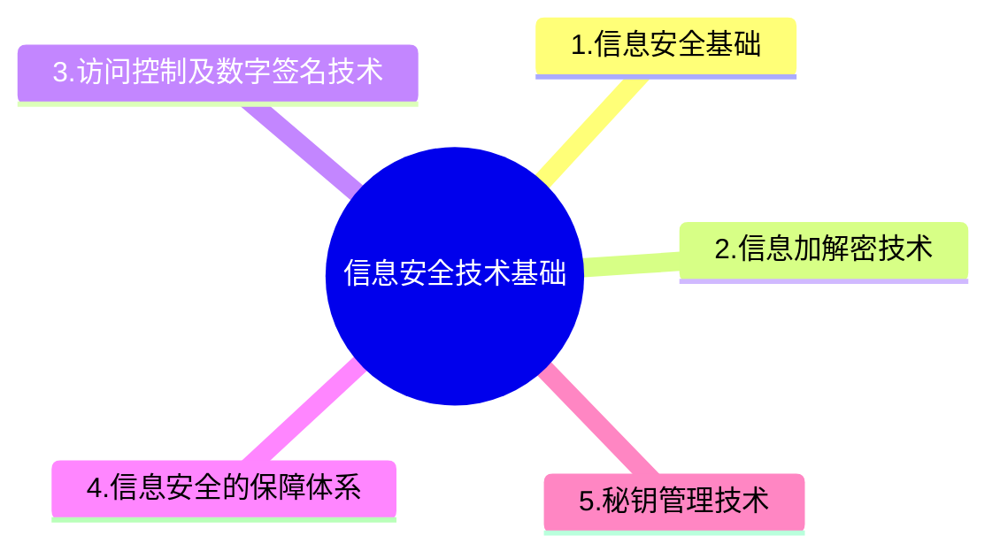

+++
title = '6. 信息安全技术基础'
date = 2024-03-07T15:00:59+08:00
weight = 9
+++

### 信息安全基础
- 5个基本要素
  
- 安全漏洞
  > 
  1. 物理安全性
  2. 软件安全漏洞
  3. 不兼容使用安全漏洞
  4. 选择合适的安全哲理
- 网络完全威胁
  > 
  1. 非授权访问
  2. 信息泄露或丢失
  3. 破坏诗句完整性
  4. 拒绝服务攻击
  5. 利用网络传播病毒
- 安全措施的目标
  > 
  1. 访问控制
  2. 认证
  3. 完整性
  4. 审计
  5. 保密

### 信息加解密技术

### 访问控制及数字签名技术
1. 访问控制技术
    * 访问控制的基本模型
    * 访问控制实现技术
      > 
      1. 矩阵
      2. 访问控制列表
2. 数字签名技术
    * 信息摘要
      - 单向散列函数，不可逆，可以防止篡改，固定长度的散列值
      - 常用算法MD5,SHA等；SHA因为秘钥长度较长，所以安全性更高，但是速度更慢
    * 数字签名过程分析
      * 加密：接收方公钥加密 --》接收方私钥解密
      * 签名：发送方私钥加密 --》发送方公钥解密
      

### 信息安全的保障体系
计算机信息系统安全保护等级包括：
1. 用户自主保护级
2. 系统审计保护级
3. 安全标记保护级
4. 架构华保护级
5. 访问验证保护级

> 军用不对外公开的信息系统的安全等级至少应该属于三级及三级以上