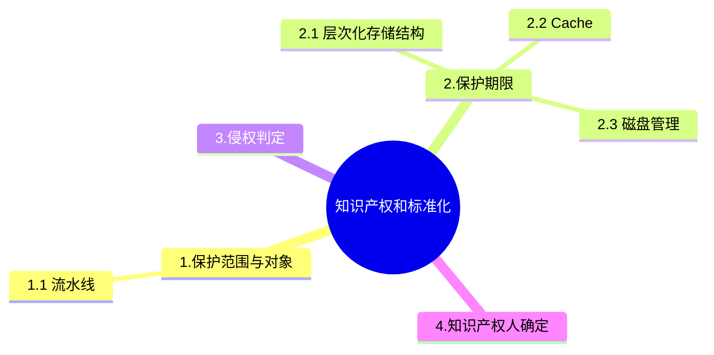

+++
title = '13. 知识产权和标准化'
date = 2024-03-07T15:00:59+08:00
weight = 16
+++

### 保护范围与对象
  - 著作权法
    * 保护对象：著作权
    * 范围：文学、绘画、摄影等作品
    * 注意事项：
      1. 不需要申请，作品完成即开始生效
      2. 绘画或摄影作品原件出售或赠与时，著作权归原作者所有，原件拥有者享受： 所有权、展览权
  - 软件著作权法
    * 保护对象：软件著作权
    * 范围： 软件产品
    * 注意事项：
      1. 不需要申请，作品完成即开始生效
      2. 登记制度便于举证
  - 专利法
    * 保护对象：专利权
    * 注意事项：
      1. 需要申请，专利权有效期是从申请日开始计算
  - 商标法：
    * 保护对象：商标权
    * 注意事项：
      1. 需要申请，核准之日起商标受保护
  - 反不正当竞争法：
    * 保护对象：商业秘密权
    * 注意事项：
      1. 商业秘密包括技术与经营两个方面
      2. 必须有保密措施才能认定商业秘密

### 保护期限

### 侵权判定

### 知识产权人确定  

- 甲公司接受乙公司的委托，开发一个应用软件，双方在没有订立任何书面合同的情况下，**甲公司**享有该软件的著作权