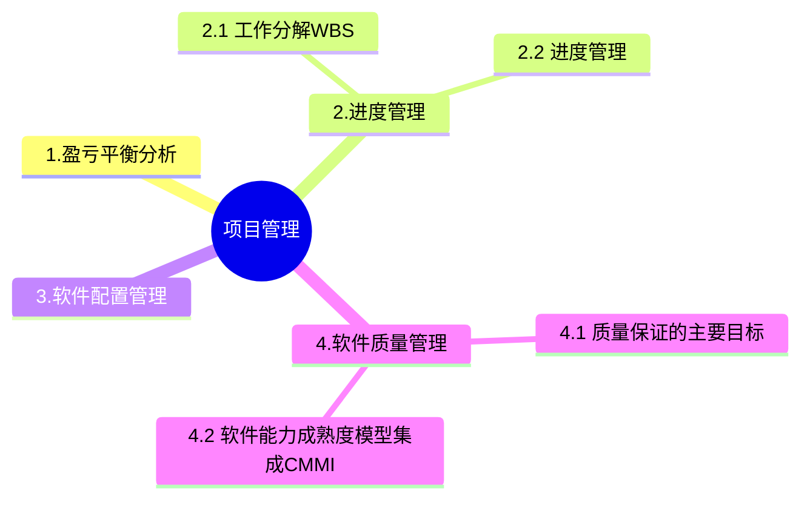

+++
title = '3. 项目管理'
date = 2024-03-07T15:00:59+08:00
weight = 6
+++

### 工作分解WBS
基本要求：
1. WBS的工作包是可控和可管理的，不能过于复杂
2. 任务分解不能过细，一般原则WBS的属性结构不超过6层
3. 每个工作包都要有一个交付成果
4. 每个任务必须有明确定义的完成标准
5. WBS必须有利于责任分配

### 项目时间管理
进度管理：是为了确保项目按期完成所需要的管理过程。
主要包括：
1. 活动定义
2. 活动排序
3. 活动资源估算
4. 活动历时估算
5. 指定进度计划
6. 进度控制

活动定义的常用工具包括:
1:分解
采用分解技术来定义活动，就是要把项目工作包分解成更小的、更易于管理的组成部分，即活动--为完成工作包而必须开展的工作。定义活动过程最终输出的是活动，而非可交付成果。可交付成果是创建工作分解结构过程的输H。
WBS、WBS 词典与活动清单，既可依次编制，也可同时编制。WBS和WBS 词典是制定最终活动清单的依据。WBS 中的每个工作包都需分解成活动，以便通过这些活动来完成相应的可交付成果。让团队成员参与分解，有助于得到更好、更准确的结果。
2.滚动式规划
滚动式规划是一种渐进明细的规划方式，即对近期要完成的工作进行详细规划，而对远期工作则暂时只在WBS 的较高层次上进行粗略规划。因此，在项目生命周期的不同阶段，工作分解的详细程度会有所不同。例如，在早期的战略规划阶段，信息尚不够明确，工作包也许只能分解到里程碑的水平;而后，随着了解到更多的信息，近期即将实施的工作包就可以分解成具体的活动。
3.模板
标准活动清单或以往项目的部分活动清单，经常可用作新项目的模板。模板中的活动属性信息，也有助于定义活动。模板还可用来识别典型的进度里程碑。
4，专家判断
富有经验并擅长制定详细项目范围说明书、工作分解结构和项目进度计划的项目团队成员或其他专家，可以为定义活动提供专业知识。

### 软件配置管理
配置管理是通过技术和行政手段对产品及其开发过程和生命周期进行控制、规范的一系列措施和过程。信息系统开发过程中的变更以及相应的返工会对产品的质量有很大的影向。
产品配置是指一个产品在其生命周期各个阶段所产生的各种形式和各种版本的**文档、计算机程序、部件及数据**的集合。
该集合中的每一个元素称为该产品配置中的一个配置项(Configuration ltem，Cl)，配置项主要有两大类:
1. 属于产品组成部分的工作成果，如需求文档、设计文档、源代码、测试用例等。
2. 属于项目管理和机构支撑过程域产生的文档，如工作计划、项目质量报告、项目跟踪报告等。这些文档虽然不是产品的组成部分，但是值得保存。

> 软件系统的文档可以分为用户文档和系统文档两类。用户文档主要描述系统功能和使用方法，并不关心这些功能是怎样实现的; 系统文档描述系统设计、实现和测试等各方面的内容。

> 配置项
* 基线配置项: 需求文档、设计文档、源代码、可执行代码测试用例、运行软件所需的数据等
* 非基线配置项：各类计划（项目管理计划、进度管理计划）、各类报告
* 配置项状态：草稿、正式发布、正在修改

> 版本控制

> 软件工具
* 软件开发工具
* 软件维护工具
* 软件管理和软件支持工具

### 软件质量管理
**质量控制**是实时控制项目的具体结果，以判断他们是否符合相关质量标准，指定有效方案，以消除产生质量问题的原因。
**质量保证**一般是每隔一定时间进行的，主要通过系统的质量审计和过程分析来保证的质量。独特工具包括：质量审计的过程分析。

#### 质量保证的主要目标
1. 事前预防工作
2. 尽量在刚刚引入缺陷时即将其捕获，而不是让缺陷扩散到下一阶段
3. 作用于**过程**而不是**最终产品**
4. 贯穿于**所有活动**之中，而不是只集中于一点。

### 软件能力成熟度模型集成CMMI
- 初始级L1：随意且混乱，组织成功依赖于个人能力
- 已管理级L2: 项目级可重复 --》 建立了项目级的控制过程
- 已定义级L3：组织级，文档化标准化
- 定量管理级L4：量化式管理-》过程性能可预测
- 优化级L5：持续优化

### 信息隐藏
信息隐藏是提高可修改性的典型设计策略,又因为信息隐藏可以有一定保密作用,所以也可以提高安全性。不过信息隐蔽从一定程度上说可以提升安全性,但是相对提升可修改性、可测试性和可移植性来说没有那么显著,

信息隐蔽是开发整体程序结构时使用的法则,即将每个程序的成分隐蔽或封装在一个单一的设计模块中,并且尽可能少地暴露其内部的处理过程。通常会将困难的决策、可能修改的决策、数据结构的内部连接,以及对它们所做的操作细节、内部特征码、与计算机硬件有关的细节等隐蔽起来。通过信息隐蔽可以提
高软件的可修改性、可测试性和可移植性,它也是现代软件设计的一个关键性原则。常考质量属性及相应设计策略如下:
1. 性能
  性能(performance)是指系统的响应能力,即要经过多长时间才能对某个事件做出响应,或者在某段时间内系统所能处理的事件的个数。
    - 代表参数:响应时间、吞吐量
    - 设计策略:优先级队列、资源调度、引入并发、维持数据或计算的多个副本、增加可用资源、控制采样频度、限制执行时间、固定优先级调度等。
2. 可用性
  可用性(availability)是系统能够正常运行的时间比例。经常用两次故障之间的时间长度或在出现故障时系統能够恢复正常的速度来表示。
    - 代表参数:故障间隔时间
    - 设计策略:冗余、心跳线、命令/响应机制、心跳机制、异常处理机制、冗余机制等。
3. 安全性
  安全性(security)是指系统在向合法用户提供服务的同时能够阻止非授权用户使用的企图或拒绝服务的能力。安全性又可划分为机密性、完整性、不可否认性及可控性等特性。
    - 设计策略:追踪审计、身份认证、限制访问、检测攻击、维护完整性等
4. 可修改性
  可修改性(modifiability)是指能够快速地以较高的性能价格比对系统进行变更的能力。通常以某些具体的变更为基准,通过考察这些变更的代价衡量可修改性。
    - 主要策略:信息隐藏
5. 可靠性
  可靠性(reliability)是软件系统在应用或系統错误面前,在意外或错误使用的情况下维持软件系统的功能特性的基本能力。主要考虑两个方面:容错、健壮性。
    - 代表参数:MTTF、MTBF
    - 设计策略:冗余、心跳线

### 可修改性
可修改性(modifiability)是指能够快速地以较高的性能价格比对系统进行变更的能力。通常以某些具体的变更为
基准,通过考查这些变更的代价衡量可修改性。可修改性包含四个方面。
1. 可维护性(maintainability)。这主要体现在问题的修复上:在错误发生后“修复“软件系统。为可维护性做好准备的软件体系结构往往能做局部性的修改并能使对其他构件的负面影响最小化。
2. 可扩展性(extendibility)。这一点关注的是使用新特性来扩展软件系统,以及使用改进版本来替换构件并删除不需要或不必要的特性和构件。为了实现可扩展性,软件系统需要松散耦合的构件。其目标是实现一种体系结构,它能使开发人员在不影响构件客户的情况下替换构件。支持把新构件集成到现有的体系结构中也是必要的。
3. 结构重构(reassemble)。这一点处理的是重新组织软件系统的构件及构件间的关系,例如通过将构件移动到一个不同的子系统而改变它的位置。为了支持结构重组,软件系统需要精心设计构件之间的关系。理想情况下,它们允许开发人员在不影响实现的主体部分的情况下灵活地配置构件。
4. 可移植性(portability)。可移植性使软件系统适用于多种硬件平台、用户界面、操作系统、编程语言或编译器。为了实现可移植,需要按照硬件无关的方式组织软件系统,其他软件系统和环境被提取出。可移植性是系统能够在不同计算环境下运行的能力。这些环境可能是硬件、软件,也可能是两者的结合。在关于某个特定计算环境的所有假设都集中在一个构件中时,系统是可移植的。如果移植到新的系统需要做些更改,则可移植性就是一种特殊的可修改性。

### 架构权衡 (Architecture Tradeoff Analysis Method)
架构权衡分析方法是一种系统架构评估方法,主要在系统开发之前,针对性能、**可用性**、安全性和可修改性等质量属性进行评价和折中。

ATAM可以分为4个主要的活动阶段,包括需求收集、**架构视图描述**、属性模型构造和分析、架构决策与折中,整个评估过程强调以**属性**作为架构评估的核心概念。
某软件公司采用ATAM进行软件架构评估,在评估过程中识别出了多个关于质量属性的描述。其中,系統在进行文件保存操作时,应该与Windows系统的操作方式保持一致。这是一种减轻用户记忆负担,降低学习成本的做法,这有利于提高系统的**易用性**。“系统应该提供一个开放的API接口,支持远程对系统的行为进行控制与调试”,在此处,我们注意到描述的核心落在“支持远程对系统的行为进行控制与调试”上了,而调试是在测试之后精确定位系统错误的一种机制,所以这种做法有利于提高系统的**可测试性**。在识别出上述描述后,通常采用**效用树**对质量属性的描述进行刻画与排序。在评估过程中,**权衡点**是一个会影响多个质量属性的架构设计决策。

ATAM是软件体系结构评估中的一种方法，主要对软件体系结构的设计结果进行评估。
评估是软件系统详细设计实现和测试之前的阶段工作，因此评估不涉及系统的实现代码和测试，因为评估是考查软件体系结构是否能够合适地解决软件系统的需求，并不对软件需求自身是否准确进行核实，而软件需求是否准确是需求评审阶段的工作。
ATAM并不是一种精确的评估方法，该方法表现的主要形式是评审会议。

### 成本预算
在项目的成本管理中，成本预算是将总的成本估算分配到各项活动和工作包上的过程，以此来建立一个成本的基线。成本预算是成本管理的一个关键步骤，它涉及将项目的总体成本估算细分为各个工作包或活动的成本估算，为项目的成本控制提供了基准。

配置管理是PMBOK、ISO9000和CMMI中的重要组成元素，它在产品开发的生命周期中，提供了结构化的、有序化的、产品化的管理方法，是项目管理的基础工作。
### 产品配置

### 用户文档
用户文档是用户了解系统的第一步，它可以让用户获得对系统的准确的初步印象。用户文档至少应该包括下述5方面的内容:
- (1)功能描述:说明系统能做什么;
- (2)安装文档:说明怎样安装这个系统以及怎样使系统适应特定的硬件配置;
- (3)使用手册:简要说明如何着手使用这个系统(通过丰富的例子说明怎样使用常用的系统功能，并说明用户操作错误时怎样恢复和重新启动);
- (4)参考手册:详尽描述用户可以使用的所有系统设施以及它们的使用方法，并解释系统可能产生的各种出错信息的含义(对参考手册最主要的要求是完整，因此通常使用形式化的描述技术);
- (5)操作员指南(如果需要有系统操作员的话):说明操作员应如何处理使用中出现的各种情况。系统文档
所谓系统文档指从问题定义、需求说明到验收测试计划这样一系列和系统实现有关的文档。描述系统设计、实现和测试的文档对于理解程序和维护程序来说是非常重要的。

### 变更控制
变更控制委员会可以由一个小组担任，也可以由多个不同的组担任。变更控制委员会的成员应能代表变更涉及的团体。变更控制委员会可能包括如下方面的代表:
(1)产品或计划管理部门;
(2)项目管理部门;
(3)开发部门;
(4)测试或质量保证部门;
(5)市场部或客户代表;
(6)制作用户文档的部门;
(7)技术支持部门;
(8)帮助桌面或用户支持热线部门;
(9)配置管理部门。