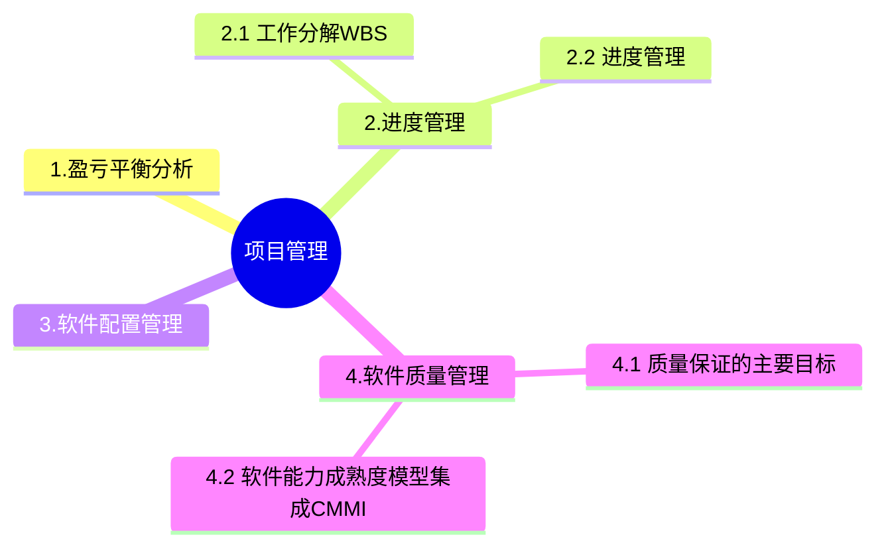

+++
title = '3. 项目管理'
date = 2024-03-07T15:00:59+08:00
weight = 6
+++

### 工作分解WBS
基本要求：
1. WBS的工作包是可控和可管理的，不能过于复杂
2. 任务分解不能过细，一般原则WBS的属性结构不超过6层
3. 每个工作包都要有一个交付成果
4. 每个任务必须有明确定义的完成标准
5. WBS必须有利于责任分配

### 项目进度管理
进度管理：是为了确保项目按期完成所需要的管理过程。
主要包括：
1. 活动定义
2. 活动排序
3. 活动资源估算
4. 活动历时估算
5. 指定进度计划
6. 进度控制

### 软件配置管理
产品配置是指一个产品在其生命周期各个阶段所产生的各种形式和各种版本的**文档、计算机程序、部件及数据**的集合。

> 配置项
* 基线配置项: 需求文档、设计文档、源代码、可执行代码测试用例、运行软件所需的数据等
* 非基线配置项：各类计划（项目管理计划、进度管理计划）、各类报告
* 配置项状态：草稿、正式发布、正在修改

> 版本控制

> 软件工具
* 软件开发工具
* 软件维护工具
* 软件管理和软件支持工具

### 软件质量管理
**质量控制**是实时控制项目的具体结果，以判断他们是否符合相关质量标准，指定有效方案，以消除产生质量问题的原因。
**质量保证**一般是每隔一定时间进行的，主要通过系统的质量审计和过程分析来保证的质量。独特工具包括：质量审计的过程分析。

#### 质量保证的主要目标
1. 事前预防工作
2. 尽量在刚刚引入缺陷时即将其捕获，而不是让缺陷扩散到下一阶段
3. 作用于**过程**而不是**最终产品**
4. 贯穿于**所有活动**之中，而不是只集中于一点。

### 软件能力成熟度模型集成CMMI
- 初始级L1：随意且混乱，组织成功依赖于个人能力
- 已管理级L2: 项目级可重复 --》 建立了项目级的控制过程
- 已定义级L3：组织级，文档化标准化
- 定量管理级L4：量化式管理-》过程性能可预测
- 优化级L5：持续优化

### 信息隐藏
信息隐藏是提高可修改性的典型设计策略,又因为信息隐藏可以有一定保密作用,所以也可以提高安全性。不过信息隐蔽从一定程度上说可以提升安全性,但是相对提升可修改性、可测试性和可移植性来说没有那么显著,

信息隐蔽是开发整体程序结构时使用的法则,即将每个程序的成分隐蔽或封装在一个单一的设计模块中,并且尽可能少地暴露其内部的处理过程。通常会将困难的决策、可能修改的决策、数据结构的内部连接,以及对它们所做的操作细节、内部特征码、与计算机硬件有关的细节等隐蔽起来。通过信息隐蔽可以提
高软件的可修改性、可测试性和可移植性,它也是现代软件设计的一个关键性原则。常考质量属性及相应设计策略如下:
1. 性能
  性能(performance)是指系统的响应能力,即要经过多长时间才能对某个事件做出响应,或者在某段时间内系统所能处理的事件的个数。
    - 代表参数:响应时间、吞吐量
    - 设计策略:优先级队列、资源调度、引入并发、维持数据或计算的多个副本、增加可用资源、控制采样频度、限制执行时间、固定优先级调度等。
2. 可用性
  可用性(availability)是系统能够正常运行的时间比例。经常用两次故障之间的时间长度或在出现故障时系統能够恢复正常的速度来表示。
    - 代表参数:故障间隔时间
    - 设计策略:冗余、心跳线、命令/响应机制、心跳机制、异常处理机制、冗余机制等。
3. 安全性
  安全性(security)是指系统在向合法用户提供服务的同时能够阻止非授权用户使用的企图或拒绝服务的能力。安全性又可划分为机密性、完整性、不可否认性及可控性等特性。
    - 设计策略:追踪审计、身份认证、限制访问、检测攻击、维护完整性等
4. 可修改性
  可修改性(modifiability)是指能够快速地以较高的性能价格比对系统进行变更的能力。通常以某些具体的变更为基准,通过考察这些变更的代价衡量可修改性。
    - 主要策略:信息隐藏
5. 可靠性
  可靠性(reliability)是软件系统在应用或系統错误面前,在意外或错误使用的情况下维持软件系统的功能特性的基本能力。主要考虑两个方面:容错、健壮性。
    - 代表参数:MTTF、MTBF
    - 设计策略:冗余、心跳线

### 可修改性
可修改性(modifiability)是指能够快速地以较高的性能价格比对系统进行变更的能力。通常以某些具体的变更为
基准,通过考查这些变更的代价衡量可修改性。可修改性包含四个方面。
1. 可维护性(maintainability)。这主要体现在问题的修复上:在错误发生后“修复“软件系统。为可维护性做好准备的软件体系结构往往能做局部性的修改并能使对其他构件的负面影响最小化。
2. 可扩展性(extendibility)。这一点关注的是使用新特性来扩展软件系统,以及使用改进版本来替换构件并删除不需要或不必要的特性和构件。为了实现可扩展性,软件系统需要松散耦合的构件。其目标是实现一种体系结构,它能使开发人员在不影响构件客户的情况下替换构件。支持把新构件集成到现有的体系结构中也是必要的。
3. 结构重构(reassemble)。这一点处理的是重新组织软件系统的构件及构件间的关系,例如通过将构件移动到一个不同的子系统而改变它的位置。为了支持结构重组,软件系统需要精心设计构件之间的关系。理想情况下,它们允许开发人员在不影响实现的主体部分的情况下灵活地配置构件。
4. 可移植性(portability)。可移植性使软件系统适用于多种硬件平台、用户界面、操作系统、编程语言或编译器。为了实现可移植,需要按照硬件无关的方式组织软件系统,其他软件系统和环境被提取出。可移植性是系统能够在不同计算环境下运行的能力。这些环境可能是硬件、软件,也可能是两者的结合。在关于某个特定计算环境的所有假设都集中在一个构件中时,系统是可移植的。如果移植到新的系统需要做些更改,则可移植性就是一种特殊的可修改性。

### 架构权衡 (Architecture Tradeoff Analysis Method)
架构权衡分析方法是一种系统架构评估方法,主要在系统开发之前,针对性能、**可用性**、安全性和可修改性等质量属性进行评价和折中。

ATAM可以分为4个主要的活动阶段,包括需求收集、**架构视图描述**、属性模型构造和分析、架构决策与折中,整个评估过程强调以**属性**作为架构评估的核心概念。
某软件公司采用ATAM进行软件架构评估,在评估过程中识别出了多个关于质量属性的描述。其中,系統在进行文件保存操作时,应该与Windows系统的操作方式保持一致。这是一种减轻用户记忆负担,降低学习成本的做法,这有利于提高系统的**易用性**。“系统应该提供一个开放的API接口,支持远程对系统的行为进行控制与调试”,在此处,我们注意到描述的核心落在“支持远程对系统的行为进行控制与调试”上了,而调试是在测试之后精确定位系统错误的一种机制,所以这种做法有利于提高系统的**可测试性**。在识别出上述描述后,通常采用**效用树**对质量属性的描述进行刻画与排序。在评估过程中,**权衡点**是一个会影响多个质量属性的架构设计决策。