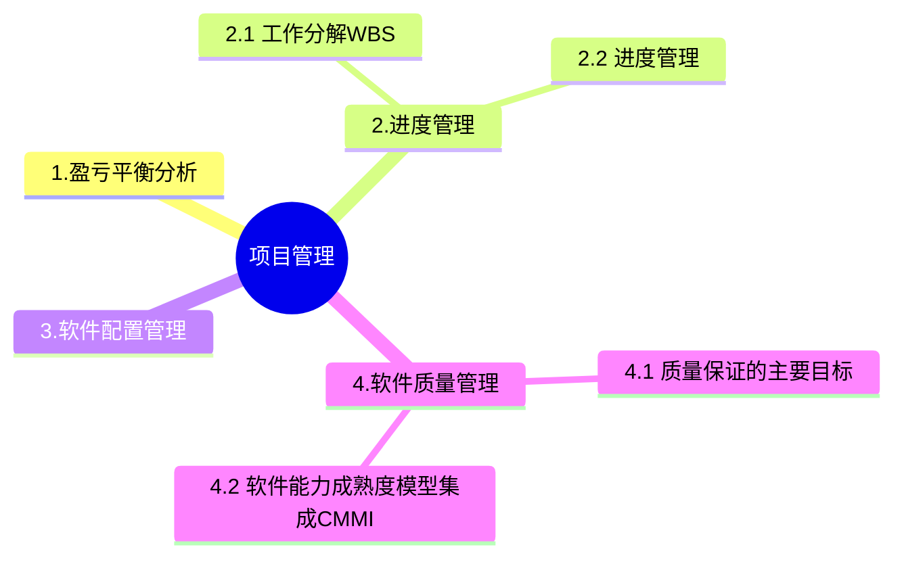

+++
title = '3. 项目管理'
date = 2024-03-07T15:00:59+08:00
weight = 6
+++

### 工作分解WBS
基本要求：
1. WBS的工作包是可控和可管理的，不能过于复杂
2. 任务分解不能过细，一般原则WBS的属性结构不超过6层
3. 每个工作包都要有一个交付成果
4. 每个任务必须有明确定义的完成标准
5. WBS必须有利于责任分配

### 项目进度管理
进度管理：是为了确保项目按期完成所需要的管理过程。
主要包括：
1. 活动定义
2. 活动排序
3. 活动资源估算
4. 活动历时估算
5. 指定进度计划
6. 进度控制

### 软件配置管理
产品配置是指一个产品在其生命周期各个阶段所产生的各种形式和各种版本的**文档、计算机程序、部件及数据**的集合。

> 配置项
* 基线配置项: 需求文档、设计文档、源代码、可执行代码测试用例、运行软件所需的数据等
* 非基线配置项：各类计划（项目管理计划、进度管理计划）、各类报告
* 配置项状态：草稿、正式发布、正在修改

> 版本控制

> 软件工具
* 软件开发工具
* 软件维护工具
* 软件管理和软件支持工具

### 软件质量管理
**质量控制**是实时控制项目的具体结果，以判断他们是否符合相关质量标准，指定有效方案，以消除产生质量问题的原因。
**质量保证**一般是每隔一定时间进行的，主要通过系统的质量审计和过程分析来保证的质量。独特工具包括：质量审计的过程分析。

#### 质量保证的主要目标
1. 事前预防工作
2. 尽量在刚刚引入缺陷时即将其捕获，而不是让缺陷扩散到下一阶段
3. 作用于**过程**而不是**最终产品**
4. 贯穿于**所有活动**之中，而不是只集中于一点。

### 软件能力成熟度模型集成CMMI
- 初始级L1：随意且混乱，组织成功依赖于个人能力
- 已管理级L2: 项目级可重复 --》 建立了项目级的控制过程
- 已定义级L3：组织级，文档化标准化
- 定量管理级L4：量化式管理-》过程性能可预测
- 优化级L5：持续优化