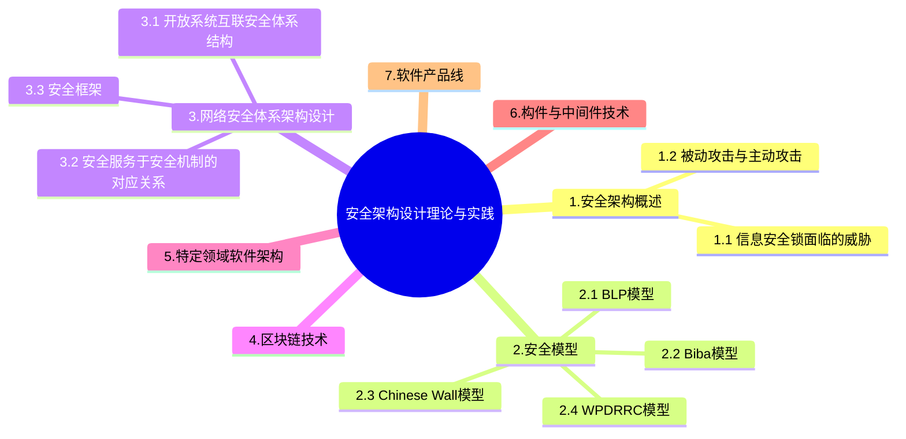

+++
title = '7. 安全架构设计'
date = 2024-03-07T15:00:59+08:00
weight = 10
+++

### 安全架构概述

### 安全模型

- BLP模型 -》 机密性模型：下读上写
    >
    * 简单安全规则：安全级别低的主体不能读安全级别高的客体
    * 星属性安全规则：安全级别高的主体不能往级别低的客体写
    * 强星属性安全规则：不允许对另一级别进行读写
    * 自主安全规则：使用访问控制矩阵来定义说明自由存取控制
- Biba模型 -》 完整性模型：上读下写
    > 
    * 星完整性规则：安全级别低的主体不能写安全级别高的客体
    * 简单完整性规则：安全级别高的主体不能从级别低的客体读数据
    * 调用属性规则：一个完整性级别低的主题不能从级别高的客体调用程序或服务
- Chinese Wall模型
    > 
    * 与主题曾经访问过的信息属于同一个公司集合的信息
- WPDRRC模型（Warn, Protect, Detect, Response, Restore, Control）
    > 包括6个环节和3大要素
    * 6个环节：预警、保护、检测、相应、恢复和反击
    * 3大要素：人员、策略和技术

### 网络安全体系架构设计
1. 开放系统互联安全体系结构

2. 安全服务于安全机制的对应关系

3. 安全框架
    >
    * 认证框架：防止其他实体占用和独立操作被鉴别实体的身份
    * 访问控制框架：访问控制决定开发系统环境中允许使用那些资源，在什么地方适合组织未授权访问的过程
    * 机密性框架：确保信息仅仅是对被授权者可用
    * 完整性框架：通过组织威胁或探测威胁，保护可能遭到不同方式危害的数据完整性和数据相关属性完整性
    * 抗抵赖框架：抗抵赖服务包括证据的生成，验证和记录，以及在解决纠纷是随机进行的证据恢复和再次验证。

### 区块链技术