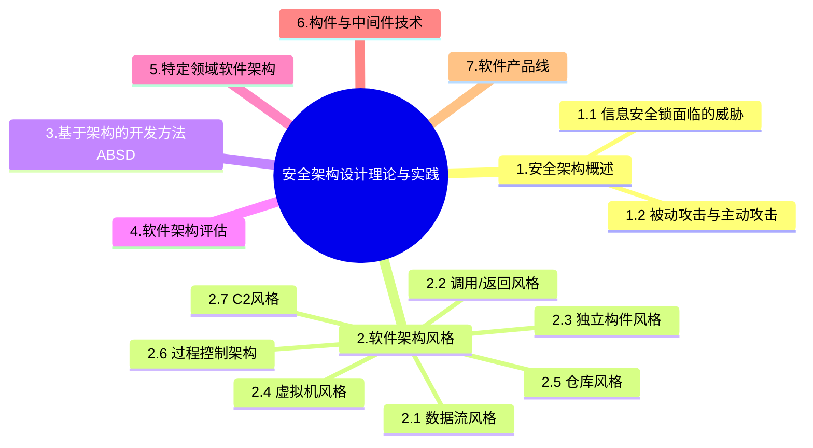

+++
title = '安全架构设计'
date = 2024-03-07T15:00:59+08:00
weight = 10
+++

### 安全架构概述

### 安全模型

- BLP模型 -》 机密性模型：下读上写
    >
    * 简单安全规则
    * 星属性安全规则
    * 强星属性安全规则
    * 自主安全规则
- Biba模型 -》 完整性模型：上读下写
    > 
    * 星完整性规则
    * 简单完整性规则
    * 调用属性规则
- Chinese Wall模型
    > 
    * 与主题曾经访问过的信息属于同一个公司集合的信息
- WPDRRC模型（Warn, Protect, Detect, Response, Restore, Control）
    > 包括6个环节和3大要素
    * 6个环节：预警、保护、检测、相应、恢复和反击
    * 3大要素：人员、策略和技术