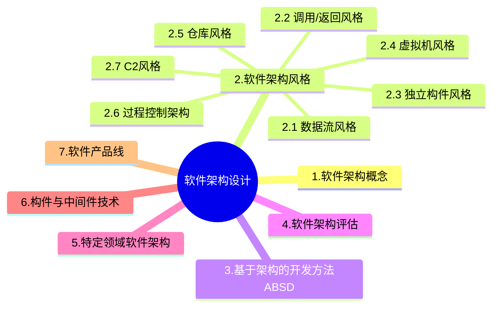

+++
title = '4.1 软件架构设计[Main]'
date = 2024-03-07T15:00:59+08:00
weight = 7
+++

### 软件架构概念
1. 架构的本质
> 软件架构风格是描述某一特定应用领域中系统组织方式的惯用模式。架构风格定义一个系统家族，即一个架构定义一个词汇表和一组约束。词汇表中包含一些构件和连接件类型，而这组约束指出系统是如何将这些构件和连接件组合起来的。架构风格反映了领域中众多系统所共有的结构和语义特性，并指导如何将各个模块和子系统有效地组织成一个完整的系统。对软件架构风格的研究和实践促进对设计的重用，一些经过实践证实的解决方案也可以可靠地用于解决新的问题。

> 软件架构设计主要关注软件组件的结构，属性和交互作用。结构指的是组件之间的组织方式，属性定义了组件的特性和行为，而交互作用则是指组件之间如何相互作用以完成系统的整体功能。

> 从本质上看，需求和软件架构设计面临的是不同的对象:一个是问题空间;另一个是解空间。保持两者的可追踪性和转换，一直是软件工程领域追求的目标。从软件需求模型向SA模型的转换主要关注两个问题:
> - 如何根据需求模型构建软件架构模型
> - 如何保证模型转换的可追踪性。
2. 架构的作用
   > 软件架构能够在设计变更相对容易的阶段，考虑系统结构的可选方案，便于技术人员与非技术人员就软件设计进行交互，能够展现软件的结构、属性与内部交互关系。但是软件架构与用户对系统的功能性需求没有直接的对应关系

   > 软件系统架构是关于软件系统的结构、**行为**和属性的高级抽象。在描述阶段，主要描述直接构成系统的抽象组件以及各个组件之间的连接规则，特别是相对细致地描述组件之间的**交互关系**。在实现阶段，这些抽象组件被细化为实际的组件，比如具体类或者对象。软件系统架构不仅指定了软件系统的组织结构和**拓扑结构**，而且显示了系统需求和构成组件之间的对应关系，包括设计决策的基本方法和基本原理

3. 架构所处的位置
    - 软件架构=软件体系结构
    - 架构设计就是需求分配，即将满足需求的职责分配到组件上。
    - 软件架构设计包括提出架构模型、产生架构设计和进行设计评审等活动，是一个选代的过程，在建立软件架构的初期，一般需要选择一个合适的架构风格，并将架构分析阶段已标识的构件映射到架构中，并分析这些构件之间的关系，一旦得到了详细的软件架构设计，需要邀请独立于系统开发的外部人员对系统进行评审。一般来说，软件架构设计活动将已标识构件集成到软件架构中，设计这些构件，但不予以实现。
    - 软件架构贯穿于软件的整个生命周期，但在不同的阶段对软件架构的关注力度并不相同。其中需求分析阶段主要关注问题域;设计阶段主要将需求转换为软件架构模型;软件实现阶段主要关注将架构设计转换为实际的代码;软件部署阶段主要通过组装软件组件提高系统的实现效率，其中设计与实现阶段在软件架构上的工作最多，也最重要因此关注力度最大。
4. 架构发展历程
    - 无架构阶段-汇编语言
    - 萌芽阶段-程序结构设计
    - 初级阶段-统一建模语言
    - 高级阶段-4+1视图
      > 
      1. 逻辑视图：关注系统的功能性需求；描述系统的功能如何被软件的各个模块和组件实现，通常使用类图，包图表示；逻辑视图帮助开发者理解系统的业务功能和各部分之间的关系。
      2. 开发视图，也称实现视图，描述了软件模块的组织与管理
      3. 进程视图，描述系统的动态方面，如并发和同步机制，关注系统如何运行，使用活动图或者顺序图来表示。
      4. 物理视图，描述软件部件如何映射到硬件上，常用部署图来表示。
      5. 场景，用来展示系统的具体用例或者用户故事，通过用例图和序列图来描述用户如何与系统交互。
5. 架构描述语言ADL
    - 是一种形式化语言
    - 有三个基本元素
      1. 构件： 计算或数据存储单元
      2. 连接件： 用于构件之间交互建模的体系结构构造块及其支配只写交互的规则
      3. 架构配置：描述体系结构的构件与连接件的连接图。

### 软件架构风格

1. 数据流风格
    * 1.1 批处理：大量整体数据、无需用户交互
    * 1.2 管道过滤器：流式数据、弱用户交互
        > 管道过滤器风格的完整流程为：「读端口」获取需要处理的信息，通过管道传递给过滤器链，每个过滤器自行判断是否需要对信息进行处理，一个过滤器处理完后通过管道将消息传递给下一个或多个过滤器，直到所有的过滤器全部处理完毕，通过「写端口」，将处理完成的信息写出到目标位置。而传统编译器（包括词法分析、语法分析、语义分析和代码生成）一个阶段的输出是另一个阶段的输入，符合管道过滤器风格的特点。
2. 调用/返回风格
    * 2.1 主程序/子程序：面向过程
    * 2.2 面向对象：对象方法的调用
    * 2.3 分层架构：层与层之间的方法调用，可扩展性好，对层次结构抽象要求高
        > e.g. 物联网系统
3. 独立构件风格
    * 3.1 进程通信：
    * 3.2 隐式调用：
        > 
        > 推荐系统
4. 虚拟机风格
    * 4.1 解释器：
        > 在运行时，能提供系统行为定义与改变的能力
    * 4.2 规则系统
        > 规则系统比较适合根据外部事件，以自身状态为基础自动进行处理和动作的场景
    > 
5. 仓库风格
    > 
6. 过程控制架构
    > 适合嵌入式系统，用于解决简单闭环控制问题
    > 其特点是，**不断采集系统当前状态**，并与系统中的设定状态进行比对，通过对比进行控制
7. C2风格
8. 以数据为中心
    > 现代编译器的集成开发环境一般采用数据仓储(即以数据为中心的架构风格)架构风格进行开发，其中心数据就是程序的语法树。

### [基于架构的开发方法ABSD](https://aaronyang2333.gitlab.io/docs/ruankao/notes/information_system/index.html)
参考 信息系统-信息系统开发方法-其他方法-基于架构的开发方法ABSD

> 基于软件架构的设计ABSD强调由商业、质量和功能需求的组合来驱动软件架构设计。 他强调采用 **视角** 和 **视图** 来描述软件架构，采用 **用例** 和 **质量属性场景** 来描述需求。进一步来说，用例描述的功能需求，质量属性场景描述的事质量需求（侧重于非功能需求）

> ABSD方法是一个自顶向下，递归细化的方法，软件系统的体系结构通过该方法得到细化，直到能产生软件构件和类。

> 基于架构的软件设计ABSD方法有三个基础，分别是对系统进行**功能分解**、采用架构风格实现质量属性与商业需求、采用软件模板设计软件结构。

> ABSD把整个基于架构的软件过程划分为 架构需求、设计、文档化、复审、实现、演化等6个子过程。

> 绝大部分的架构都是抽象的，由一些概念上的构件组成。 例如，层的概念在任何程序设计语言中都不存在。因此，要让系统分析师和程序员都实现架构，还必须得把架构进行文档化。

> 文档是在系统演化的每一个阶段，系统设计与开发人员的通信媒介，是为验证架构设计和提炼 或 修改这些设计 所预先分析的基础。

> 架构文档化过程的主要输出结果是 架构需求规格说明 和 测试架构需求的质量设计说明书 这两个文档。

> 软件架构文档是对软件架构的一种描述,帮助程序员使用特定的程序设计语言实现软件架构。软件架构文档的写作应该遵循一定的原则,这些原则包括:文档要从使用者的角度进行编写;必须分发给所有与系统有关的开发人员;应该保持架构文档的即时更新,但更新不要过于频繁;架构文档中描述应该尽量避免不必要的重复;每次架构文档修改都应该记录进行修改的原则。

> 生成需求模型构件的精确的形式化的描述，作为用户和开发者之间的一个协约。

> 以架构为核心的软件系统开发方法。在该方法中，架构用来激发和调整设计策略，不同的视图用来表达与质量目标有关的信息。架构设计是一个选代过程，在建立软件架构的初期，选择一个合适的**架构风格**是首要的，在此基础上，开发人员通过架构模型，可以获得关于软件**架构属性**的理解，为将来的架构实现与演化过程建立了目标。

> 软件架构需求是指用户对目标软件系统在功能、行为、性能和设计约束等方面的期望。需求过程主要是获取用户需求，标识系统中所要用到的构件，并进行架构需求评审。其中标识构件又详细分为生成类图、对类图进行分组和将类打包成构件二步。软件架构需求并不应该包括设计构件的过程

>> 体系结构需求:需求过程主要是获取用户需求,标识系统中所要用到的构件。
体系结构设计:体系结构设计是一个迭代过程,如果要开发的系统能够从已有的系统中导出大部分,则可以使用已有系统的设计过程。
体系结构文档化:绝大多数的体系结构都是抽象的,由一些概念上的构件组成,因此要去实现体系结构,还必须得把体系结构文档化。体系结构文档化过程的主要输出结果是体系结构规格说明和测试体系结构需求的质量设计说明书这2个文档。
体系结构复审:体系结构设计、文档化和复审是一个迭代过程。复审的目的是表示潜在的风险,及早发现体系结构设计中的缺陷和错误,包括体系结构能否满足需求、质量需求是否在设计中得到体现、层次是否清晰、构件划分是否合理、文档表达是否明确、构件设计是否满足功能与性能的要求等。
体系结构实现:所谓“实现”就是要用实体显示出一个软件体系结构,即要符合体系结构描述的结构性设计决策,分割成规定的构件,按规定的方式互相交互。整个实现过程是以复审后的文档化的体系结构说明书为基础的,每个构件必须满足软件体系结构中说明的对其他构件的责任。最后一步是测试,包括单个构件的功能性测试和被组装应用的整体功能和性能测试。
体系结构演化:在构件开发过程中,用户的需求可能还有变动。在软件开发完毕,正常运行后,由一个单位移植到另一个单位,需求也会发生变化。在这两种情况下,就必须相应地修改软件体系结构,以适应新的变化了的软件需求。体系结构演化是使用系统演化步骤去修改应用,以满足新的需求。

> 在考虑软件架构时，重要的时从不同的**视角**（perspective）来检查，这促使软件设计师考虑架构的不同属性。
>> 例如，展示功能组织的**静态视角**能判断质量特性，展示并发行为的**动态视角**能判断系统行为特性。选择的特定视角或视图也就是逻辑视图，进程视图，实现视图和**配置视图**。使用**逻辑视图**来记录设计元素的功能和概念接口，设计元素的功能定义了它本身在系统的角色，这些角色包括功能，性能等。（**配置视图**=**物理视图**=**部署视图** 其实是同一个东西在不同时期的叫法）
>> 例如:展示功能组织的静态视角能判断质量特性,展示并发行为的动态视角能判断系统行为特性。在ABSD(基于架构的软件设计)方法中,使用不同的视角来观察设计元素,一个子系统并不总是一个静态的架构元素,而是可以从动态和静态视角观察的架构元素。将选择的特定视角或视图与Kruchten提出的类似,也就是逻辑视图、进程视图、实现视图和配置视图。使用逻辑视图来记录设计元素的功能和概念接口,设计元素的功能定义了它本身在系统中的角色,这些角色包括功能性能等。进程视图也称为并发视图,使用并发视图来检查系统多用户的并发行为。使用“并发“来代替“进程”,是为了强调没有对进程或线程进行任何操作,一旦执行这些操作,则并发视图就演化为进程视图。使用的最后一个视图是配置视图,配置视图代表了计算机网络中的节点,也就是系统的物理结构。

### 架构复审
架构复审一词来自于ABSD。在ABSD中,架构设计、文档化和复审是一个迭代过程。从这个方面来说,在一个主版本的软件架构分析之后,要安排一次由外部人员(用户代表和领域专家)参加的复审。
复审的目的是标识潜在的风险,及早发现架构设计中的缺陷和错误,包括架构能否满足需求、质量需求是否在设计中得到体现、层次是否清晰、构件的划分是否合理、文档表达是否明确、构件的设计是否满足功能与性能的要求等等。
由外部人员进行复审的目的是保证架构的设计能够公正地进行检验,使组织的管理者能够决定正式实现架构。

> 在架构神父过程中，主要有**用户代表和领域专家**决定架构是否满足需求、质量需求是否在设计中得到体现。

### 软件建构评估
1. 软件质量属性
    > asdasdas 
    1. 性能
    2. 可靠性
    3. 可用性：系统能够正常运行的时间比例
    4. 安全性：系统在向合法用户提供服务的同时能够阻止非授权用户使用的企图或者拒绝服务的能力
        * 4.1. 机密性
        * 4.2. 完整性
        * 4.3. 不可否认性
        * 4.4. 可控性
    5. 可修改性：能够快速地以较高的性价比对系统进行变更的能力
    6. 功能性
    7. 可变性
    8. 互操作性
    

2. 敏感点权衡点风险点与非风险点

3. 架构评估方法
    > asdasdsad
    1. 场景评估方法
    2. 基于场景的评估方法
        * 2.1 软件架构分析法SAAM：最初关注可修改性，后扩充到可移植性、可扩展性等
        > 
        * 2.2 架构权衡分析法ATAM：从SAAM发展而来，主要针对：性能、实用性、安全性和可修改性
        > 
        * 2.3 成本效益分析法CBAM: 在ATAM基础上建立的，软件的“经济”模型

### 架构标准 ANSI/IEEE 1471-2000
ANSI/IEEE 1471-2000是描述软件架构的第一个标准，其中要素的关系如下:
第一层:mission
第二层:Environment.System,Architecture
第二层:StakeholderArchitectural Description.Rationale
第四层:Concem,Viewpoint.View
第五层:Library Viewpoint,Model
- Mission: 任务，使命。也就是为什么我们要做这个系统。可能的原因是为了更大的赢利，市场占有率更高，完善产品系列等等。
- System: 系统。具体的定义是:一系列组件，组织在一起，相互作用从而完成一个或者一些特殊的功能。
- Model: 模型。就是用来表达视图的方法。直白地说，就是系统中各种元素是如何组织在一起发挥作用。用图形化的表示把看到的东西表达出来。
- Architecture: 系统架构。每个系统有一个架构。是对所有利益相关人的关注点(Concern)的响应和回答，通过架构描述(Architecture Description)来说明。
 
> 在ANSIIEEE 1471-2000标准中，系统是为了达成利益相关人(Stakeholder)的某些使命(Mission)，在特定环境(Enviroment)中构建的。每一个系统都有一个架构(Architecture)。架构(Architecture)是对所有利益相关人的关注点(Concem)的响应和回答，通过架构描述(Architecture Descrintion)来说明，每一个利益相关人都有各自的关注点。这些关注点是指对其重要的，与系统的开发、运营或其他方面相关的利益。架构描述(Architecture Description)本质上是多视图的。每一个视图(View)是从一个特定的视角(Viewpoint)来表述架构的某一个独立的方面。试图用一个单一的视图来夏盖所有的关注点当然是最好的，但实际上这种表述方式将很难理解。视角(Viewpoint)的选择，基于要解决哪些利益相关人的哪些关注点。它决定了用来创建视图的语言、符号和模型等，以及任何与创建视图相关的建模方法或者分析技术。一个视图(View)包括一个或者多个架构模型(Model)，一个模型也可能参与多个视图。模型较文本的表述的好处在于，可以更容易的可视化、检查、分析、管理和集成。

> ANSIIEEE 1471-2000是对软件密集型系统的架构进行描述的标准。在该标准中，**视图**这一概念主要用于描述软件架构模型。在此基础上，通常采用**视角**描述基个利益相关人(Siakenolder)所关注架构模型的某一方面。**架构**则是对所有利益相关人关注点的响应和回答。