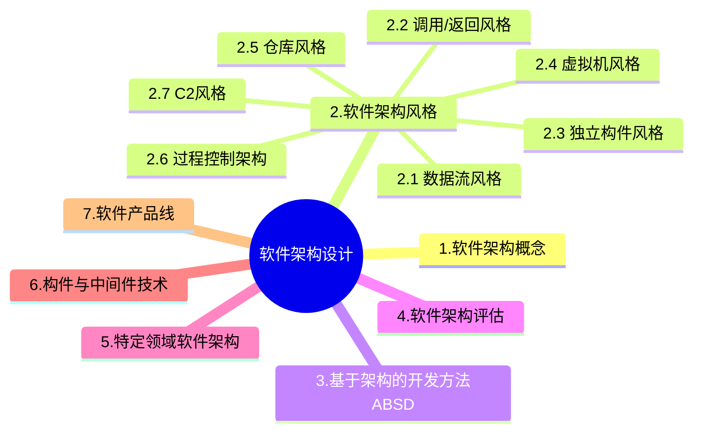

+++
title = '4.1 软件架构设计[Main]'
date = 2024-03-07T15:00:59+08:00
weight = 7
+++

### 软件架构概念
1. 架构的本质
> 软件架构风格是描述某一特定应用领域中系统组织方式的惯用模式。架构风格定义一个系统家族，即一个架构定义一个词汇表和一组约束。词汇表中包含一些构件和连接件类型，而这组约束指出系统是如何将这些构件和连接件组合起来的。架构风格反映了领域中众多系统所共有的结构和语义特性，并指导如何将各个模块和子系统有效地组织成一个完整的系统。对软件架构风格的研究和实践促进对设计的重用，一些经过实践证实的解决方案也可以可靠地用于解决新的问题。
2. 架构的作用
3. 架构所处的位置
    - 软件架构=软件体系结构
    - 架构设计就是需求分配，即将满足需求的职责分配到组件上。
4. 架构发展历程
    - 无架构阶段-汇编语言
    - 萌芽阶段-程序结构设计
    - 初级阶段-统一建模语言
    - 高级阶段-4+1视图
      > 
      1. 逻辑视图：关注系统的功能性需求；描述系统的功能如何被软件的各个模块和组件实现，通常使用类图，包图表示；逻辑视图帮助开发者理解系统的业务功能和各部分之间的关系。
      2. 开发视图，也称实现视图，描述了软件模块的组织与管理
      3. 进程视图，描述系统的动态方面，如并发和同步机制，关注系统如何运行，使用活动图或者顺序图来表示。
      4. 物理视图，描述软件部件如何映射到硬件上，常用部署图来表示。
      5. 场景，用来展示系统的具体用例或者用户故事，通过用例图和序列图来描述用户如何与系统交互。
5. 架构描述语言ADL
    - 是一种形式化语言
    - 有三个基本元素
      1. 构件： 计算或数据存储单元
      2. 连接件： 用于构件之间交互建模的体系结构构造块及其支配只写交互的规则
      3. 架构配置：描述体系结构的构件与连接件的连接图。

### 软件架构风格

1. 数据流风格
    * 1.1 批处理：大量整体数据、无需用户交互
    * 1.2 管道过滤器：流式数据、弱用户交互
        > 管道过滤器风格的完整流程为：「读端口」获取需要处理的信息，通过管道传递给过滤器链，每个过滤器自行判断是否需要对信息进行处理，一个过滤器处理完后通过管道将消息传递给下一个或多个过滤器，直到所有的过滤器全部处理完毕，通过「写端口」，将处理完成的信息写出到目标位置。而传统编译器（包括词法分析、语法分析、语义分析和代码生成）一个阶段的输出是另一个阶段的输入，符合管道过滤器风格的特点。
2. 调用/返回风格
    * 2.1 主程序/子程序：面向过程
    * 2.2 面向对象：对象方法的调用
    * 2.3 分层架构：层与层之间的方法调用，可扩展性好，对层次结构抽象要求高
3. 独立构件风格
    * 3.1 进程通信：
    * 3.2 隐式调用：
    
4. 虚拟机风格
    * 4.1 解释器：
        > 在运行时，能提供系统行为定义与改变的能力
    * 4.2 规则系统
        > 规则系统比较适合根据外部事件，以自身状态为基础自动进行处理和动作的场景
    > 
5. 仓库风格
    > 
6. 过程控制架构
    > 适合嵌入式系统，用于解决简单闭环控制问题
    > 其特点是，**不断采集系统当前状态**，并与系统中的设定状态进行比对，通过对比进行控制
7. C2风格

### [基于架构的开发方法ABSD](https://aaronyang2333.gitlab.io/docs/ruankao/notes/information_system/index.html)
参考 信息系统-信息系统开发方法-其他方法-基于架构的开发方法ABSD

> 基于软件架构的设计ABSD强调由商业、质量和功能需求的组合来驱动软件架构设计。 他强调采用 **视角** 和 **视图** 来描述软件架构，采用 **用例** 和 **质量属性场景** 来描述需求。ABSD方法是一个自顶向下，递归细化的方法，软件系统的体系结构通过该方法得到细化，直到能产生软件构件和类。

> 基于架构的软件设计ABSD方法有三个基础，分别是对系统进行**功能分解**、采用架构风格实现质量属性与商业需求、采用软件模板设计软件结构。

> ABSD把整个基于架构的软件过程划分为 架构需求、设计、文档化、复审、实现、演化等6个子过程。

> 绝大部分的架构都是抽象的，由一些概念上的构件组成。 例如，层的概念在任何程序设计语言中都不存在。因此，要让系统分析师和程序员都实现架构，还必须得把架构进行文档化。

> 文档是在系统眼花的每一个阶段，系统设计与开发人员的通信媒介，是为验证架构设计和提炼 或 修改这些设计 所预先分析的基础。

> 架构文档化过程的主要输出结果是 架构需求规格说明 和 测试架构需求的质量设计说明书 这两个文档。

> 生成需求模型构件的精确的形式化的描述，作为用户和开发者之间的一个协约。

> 在考虑软件架构时，重要的时从不同的**视角**（perspective）来检查，这促使软件设计师考虑架构的不同属性。
>> 例如，展示功能组织的**静态视角**能判断质量特性，展示并发行为的**动态视角**能判断系统行为特性。选择的特定视角或视图也就是逻辑视图，进程视图，实现视图和**配置视图**。使用**逻辑视图**来记录设计元素的功能和概念接口，设计元素的功能定义了它本身在系统的角色，这些角色包括功能，性能等。（**配置视图**=**物理视图**=**部署视图** 其实是同一个东西在不同时期的叫法）

### 软件建构评估
1. 软件质量属性
    > asdasdas 
    1. 性能
    2. 可靠性
    3. 可用性：系统能够正常运行的时间比例
    4. 安全性：系统在向合法用户提供服务的同时能够阻止非授权用户使用的企图或者拒绝服务的能力
        * 4.1. 机密性
        * 4.2. 完整性
        * 4.3. 不可否认性
        * 4.4. 可控性
    5. 可修改性：能够快速地以较高的性价比对系统进行变更的能力
    6. 功能性
    7. 可变性
    8. 互操作性
    

2. 敏感点权衡点风险点与非风险点

3. 架构评估方法
    > asdasdsad
    1. 场景评估方法
    2. 基于场景的评估方法
        * 2.1 软件架构分析法SAAM：最初关注可修改性，后扩充到可移植性、可扩展性等
        > 
        * 2.2 架构权衡分析法ATAM：从SAAM发展而来，主要针对：性能、实用性、安全性和可修改性
        > 
        * 2.3 成本效益分析法CBAM: 在ATAM基础上建立的，软件的“经济”模型

