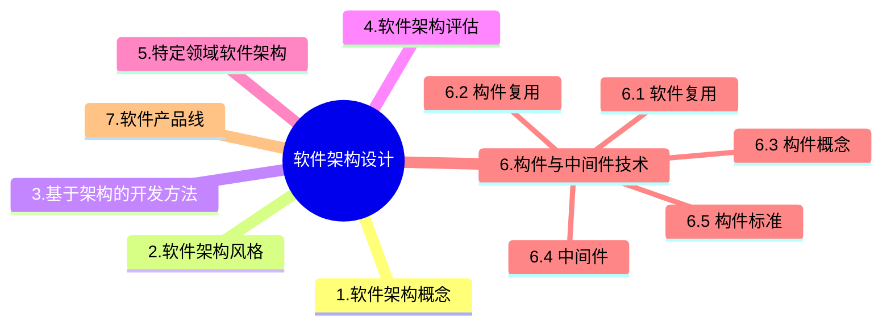

+++
title = '4.2 软件架构设计[Rest]'
date = 2024-03-07T15:00:59+08:00
weight = 8
+++

### 特定领域软件架构

### 构件与中间件技术
1. 软件复用
> 软件复用是多次不同的软件开发过程中重复使用的相同或者相似[软件元素]()的过程
{}
软件元素指：需求分析文档、设计过程、设计文档、程序代码、测试用例和领域知识
{}
  * 水平复用（横向）： 不分行业领域，通用； 指在不同的应用领域或系统之间对通用软件元素（如数据结构、算法、人机界面组件等）的重用。它强调跨领域的广泛适用性，常用于工具类库或框架的设计。
  * 垂直复用（纵向）： 分行业领域，专用；指在相同或相似的应用领域中对特定功能或模块的重用。它强调在特定领域内深度挖掘和复用，如垂直行业解决方案。

2. 构件复用
> 构件组装的三种方式
  * 1. 基于功能的组装
  * 2. 基于数据的组装
  * 3. 面向对象的组装

3. 资产复用

在软件开发中，可复用资产的生命周期通常包括几个关键步骤，这些步骤确保资产可以被有效地创建、管理和使用。
  - 1) 分析可复用资产：确定哪些资产可以被复用，以及它们在不同项目中的潜在用途。
    > 过程：分析现有的代码、组件、设计模式等，评估它们的通用性和可复用性。这一步是基础，因为只有了解了资产的特性和适用范围，才能决定如何构造和使用它们。
  - 2) 构造/获取可复用资产：创建或获取符合复用标准的资产。
    > 过程：根据分析结果，开发新的可复用组件或模块，或者从外部获取已经存在的可复用资产。这一步需要考虑资产的设计质量、接口一致性等因素，以确保它们能够被方便地集成到不同的项目中。
  - 3) 管理可复用资产：维护和更新可复用资产，确保它们的质量和适用性。
    > 过程：建立资产库，对资产进行分类、存储和版本控制。定期检查资产的使用情况和反馈，进行必要的维护和改进。有效的管理有助于提高资产的可用性和可靠性，使其能够长期为开发团队服务。
  - 4) 使用可复用资产：在实际项目中应用可复用资产，提高开发效率和产品质量。
    > 过程：根据项目需求，从资产库中选择合适的资产进行集成和使用。在使用过程中，记录资产的表现和问题，为后续的管理提供反馈。这一步是实现资产价值的关键环节，通过复用可以减少重复开发工作，加快项目进度。

4. 架构复用
> 软件架构复用的类型包括机会复用和系统复用。
  - 机会复用是指开发过程中，只要发现有可复用的资产，就对其进行复用。
  - 系统复用是指在开发之前，就要进行规划，以决定哪些需要复用。

5. 构件
> 构件是一组通常需要同时部署的原子构件。 

构件和原子构件之间的区别在于，大多数原子构件永远都不会被单独部署，尽管它们可以被单独部署。相反，大多数原子构件都属于一个构件家族，一次部署往往涉及整个家族。一个原子构件是一个模块和一组资源。原子构件是部署、版本控制和替换的基本单位。原子构件通常成组地部署，但是它也能够被单独部署。一个模块是不带单独资源的原子构件（在这个严格定义下，Java 包不是模块--在 Java 中部署的原子单元是类文件。一个单独的包被编译成多个单独的类文件--每个公共类都有一个）。模块是一组类和可能的非面向对象的结构体，比如过程或者函数。

> 构件与对象的区别：
构件的特性是:(1) 独立部署单元; (2) 作为第三方的组装单元;(3)没有(外部的)可见状态。一个构件可以包含多个类元素,但是一个类元素只能属于一个构件。将一个类拆分进行部署通常没什么意义。对象的特性是:(1) 一个实例单元,具有唯一的标志。(2)可能具有状态,此状态外部可见。 (3)封装了自己的状态和行为。

> 在构件组装过程中需要检测并解决架构失配问题。其中 **构件** 失配主要包括由于系统对构件基础设施、控制模型和数据模型的假设存在冲突引起的失配。 **连接子** 失配包括由于系统对构件交互协议、构件连接时数据格式的假设存在冲突引起的失配。

> 软件架构设计主要关注软件构件的结构、属性和交互作用，并通过多种视图全面描述特定系统的架构。

6. 中间件
- 中间件是一类构件
- 中间件是一类系统软件
### 软件产品线

7. 构件标准
  * CORBA
      > 
      1. CORBA构件模型中，对象适配器（Object Adapter）的主要作用是在底层传输平台与接收调用并返回结果的对象实现之间进行协调，目前采用的对象适配器规范是POA（可移植对象适配器），它替代了传统的BOA（基本对象适配器 Basic Object Adapter）。POA是对象实现与ORB其它组件之间的中介，它将客户请求传送到伺服对象，按需创建子POA，提供管理伺服对象的策略。
      2. CORBA对象可看作是一个具有对象标识、对象接口及对象实现的抽象实体。之所以称为抽象的，是因为并没有硬性规定CORBA对象的实现机制。
      3. 一个CORBA对象的引用又称可互操作的对象引用（Interoperable Object Reference）。从客户程序的角度看，IOR中包含了对象的标识、接口类型及其他信息以查找对象实现。
      4. 伺服对象（servant）是指具体程序设计语言的对象或实体，通常存在于一个服务程序进程之中。客户程序通过对象引用发出的请求经过ORB担当中介角色，转换为对特定的伺服对象的调用。
      5. 在一个CORBA对象的生命期中，它可能与多个伺服对象相关联，因而对该对象的请求可能被发送到不同的伺服对象。对象标识（Object ID）是一个用于在POA中标识一个CORBA对象的字符串。它既可由程序员指派，也可由对象适配器自动分配，这两种方式都要求对象标识在创建它的对象适配器中必须具有唯一性。
      6. 对象请求代理（Object Request Broker）：解释调用并负责查找实现该请求的对象，将参数传给找到的对象，并调用方法返回结果。客户方不需要了解服务对象的位置、通信方式、实现、激活或存储机制。
      7. 对象管理组织(OMG)基于CORBA基础设施定义了四种构件标准。实体(Entity)构件需要长期持久化并主要用于事务性行为，由容器管理其持久化。加工(Process)构件同样需要容器管理其持久化，但没有客户端可访问的主键。会话(Session)构件不需要容器管理其持久化，其状态信息必须由构件自己管理。服务(Service)构件是无状态的。
      8. POA是对象实现与ORB其他组件之间的中介,它将客户请求传送到伺服对象,按需创建子POA,提供管理伺服对象的策略。CORBA对象可看作是一个具有对象标识、对象接口及对象实现的抽象实体。之所以称为抽象的,是因为并没有硬性规定CORBA对象的实现机制。由于独立于程序设计语言和特定ORB产品,一个CORBA对象的引用又称可互操作的对象引用(Interoperable Object Reference)。从客户程序的角度看,IOR中包含了对象的标识、接口类型及其他信息以查找对象实现。伺服对象(Servant)是指具体程序设计语言的对象或实体,通常存在于一个服务程序进程之中。客户程序通过对象引用发出的请求经过ORB担当中介角色,转换为对特定的伺服对象的调用。在一个CORBA对象的生命期中,它可能与多个伺服对象相关联,因而对该对象的请求可能被发送到不同的伺服对象。对象标识(Object ID) 是一个用于在POA中标识一个CORBA对象的字符串。它既可由程序员指派,也可由对象适配器自动分配,这两种方式都要求对象标识在创建它的对象适配器中必须具有唯一性。
  * J2EE
  * DNA 2000

### 软件产品线

---

### 前趋图

### PV操作
公共数据单元Tj是一个临界资源，最多允许1个终端进程使用，因此需要设置一个互斥信号量S，初值等于1。

### 面向构件编程COP
面向构件的编程需要下列基本的支持：
1. 多态性（可替代性）；
2. 模块封装性（高层次信息的隐藏）；
3. 后期的绑定和装载（部署独立性）；
4. 安全性（类型和模块安全性）。

### C/S架构
三层C/S体系结构是将应用功能分成表示层、功能层和数据层三个部分，
1. 表示层表示层是应用的用户接口部分担负与应用逻辑间的对话功能。它用于用户从工作站输入的数据，并显示应用输出的数据。为使用户能直观地进行操作，一般要使用图形用户界面(GUI)，在变更用户界面时，只需改写显示控制和数据检查程序，而不影响业务逻辑。
2. 功能层
功能层是应用的本体，它负责具体的业务处理逻辑，例如在制作订购合同时要计算合同金额。表示层和功能层之间的数据互交要尽可能简洁。例如，用户检索数据时，要将有关检索要求的信息一次性地传送给功能层，检索结果数据也由功能层一次性地传送给表示层。
3. 数据层
数据层通常是数据库管理系统，负麦管理对数据库数据的读写。数据库系统必须能迅速执行大量数据的更新和检来。
三层C/S的解决方案对这三层进行明确分割，不同层构件相互独立，层间的接口简洁，适合复杂事务处理
