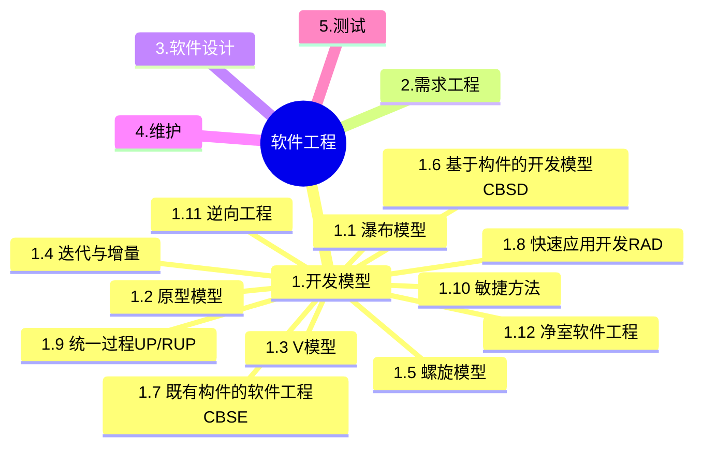
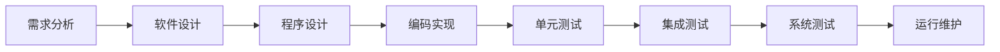
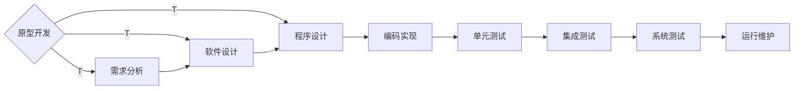
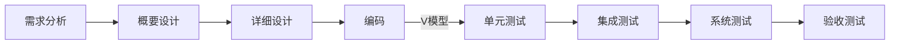
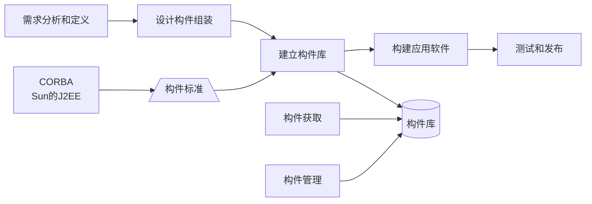
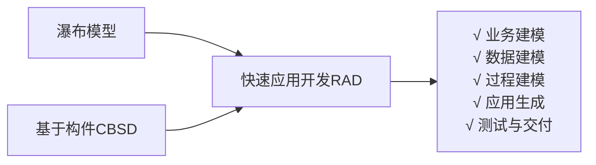
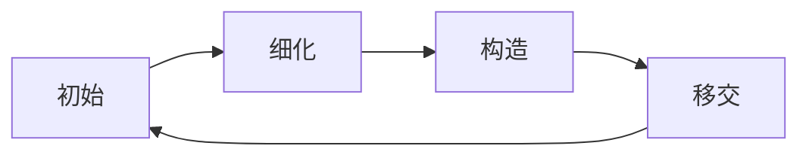

+++
title = '2.1 软件工程-开发模型'
date = 2024-03-07T15:00:59+08:00
weight = 5
+++

软件过程模型的基本概念:软件过程是制作软件产品的一组活动以及结果,这些活动主要由软件人员来完成,软件
活动主要有:
- (1) 软件描述。必须定义软件功能以及使用的限制。
- (2) 软件开发。也就是软件的设计和实现,软件工程人员制作出能满足描述的软件。
- (3) 软件有效性验证。软件必须经过严格的验证,以保证能够满足客户的需求。
- (4) 软件进化。软件随着客户需求的变化不断地改进。

### 瀑布模型 
- 严格区分各阶段，每个阶段因果关系紧密
- 只适合需求明确的项目

瀑布模型可以说是最早使用的软件生存周期模型之一。由于这个模型描述了软件生存的一些基本过程活动,所以它被称为**软件生存周期模型**。这些活动从一个阶段到另一个阶段逐次下降,形式上很像瀑布。瀑布模型的特点是因果关系紧密相连,前一个阶段工作的结果是后一个阶段工作的输入。

### 原型模型
- 适合需求不明确的项目
- 原型模型两个阶段：
  - 原型开发阶段
  - 目标软件开发阶段

原型开发分两大类:快速原型法(又称抛弃式原型法)和演化式原型法。其中快速原型法是快速开发出一个原型,利用该原型获取用户需求,然后将该原型抛弃。而演化式原型法是将原型逐步进化为最终的目标系统

### V模型
- 测试贯穿于始终
- 测试分阶段，测试计划提前
- 需求分析->验收测试与系统测试；概要设计对应集成测试，详细设计对应单元测试。

### 迭代与增量

### 螺旋模型
- 以快速原型为基础 + 瀑布模型， 也有说他是 **原型 + 生命周期模型**
- 考虑了风险问题
> 螺旋模型将整个软件开发过程分为多个阶段，每个阶段都由目标设定、风险分析、开发和有效性验证以及评审4个部分组成。
螺旋模型是在快速原型的基础上扩展而成的一种生存周期模型。这种模型将整个软件开发流程分成多个阶段，每个阶段都由4部分组成，它们是：
  1. 指定计划目标。为该项目进行需求分析，定义和确定这一个阶段的专门目标，指定对过程和产品的约束，并且制定详细的管理计划。
  2. 风险分析。对可选方案进行风险识别和详细分析，制定解决办法，采取有效的措施避免这些风险。
  3. 实施工程。风险评估后，可以为系统选择开发模型，并且进行原型开发，即开发软件产品。
  4. 客户评估。对项目进行评审，以确定是否需要进入螺旋线的下一次回路，如果决定继续，就要制定下一阶段计划。

  螺旋模型的软件开发过程实际是上述4个部分的迭代过程，每迭代一次，螺旋线就增加一周，软件系统就生成一个新版本，这个新版本实际上是对目标系统的一个逼近。
  经过若干次的迭代后，系统应该尽快地收敛到用户允许或可以接受的目标范围内，否则也可能中途夭折。 

### 基于构件的开发模型
- 优点: 易扩展、易重用、降低成本、安排任务更灵活。
- 缺点：构件设计要求经验丰富的架构师、设计不好的构件难重用、强调重用可能牺牲其他指标、第三方构件质量难控制

> 基于构件的开发模型的优点如下:
  - (1)构件的自包容性让系统的扩展变得更加容易。
  - (2)设计良好的构件更容易被重用,降低软件开发成本。
  - (3)构件的粒度较整个系统更小,因此安排开发任务更加灵活,可以将开发团队分成若干组,并行地独立开发构件。

在基于构件的软件开发中,逻辑构件模型用功能包描述系统的抽象设计,用接口描述每个服务集合,以及功能之间如何交互以满足用户需求,它作为系统的设计蓝图以保证系统提供适当的功能。物理构件模型用技术设施产品、硬件分布和拓扑结构、以及用于绑定的网络和通信协议描述系统的物理设计,这种架构用于了解系统的性能、吞吐率等许多非功能性属性。

基于构件的开发模型利用模块化方法将整个系统模块化,并在一定构件模型的支持下复用构件库中的一个或多个软件构件,通过组合手段高效率、高质量地构造应用软件系统的过程。基于构件的开发模型融合了螺旋模型的许多特征,本质上是演化形的,开发过程是迭代的。基于构件的开发模型由软件的需求分析定义、体系结构设计、构件库建立、应用软件构建以及测试和发布5个阶段组成。

### 基于构件的软件工程
- 体现了**购买而不是重新构造**的哲学

### 快速应用开发RAD

快速应用开发利用了**基本构件开发模型**的思想,大量采用现成的构件进行系统的开发,所以速度很快。但这种开发,要求系统模块化程度高,因为只有这样,才能更好利用现有的构件。

快速应用开发(Rapid Application Development, RAD)是一种比传统生存周期法快得多的开发方法,它强调极短的开发周期。RAD模型是瀑布模型的一个高速变种,通过使用基于构件的开发方法获得快速开发。如果需求理解得很好,且约束了项目范围,利用这种模型可以很快地开发出功能完善的信息系统。但是RAD也具有以下局限性:
1. 并非所有应用都适合RAD。RAD对模块化要求比较高,如果有哪一项功能不能被模块化,那么RAD所需要的构建就会有问题;如果高性能是一个指标,且该指标必须通过调整接口使其适应系统构件才能获得,则RAD也有可能不能奏效。
2. 开发者和客户必须在很短的时间完成一系列的需求分析,任何一方配合不当,都会导致RAD项目失败。
3. RAD只能用于管理信息系统的开发,不适合技术风险很高的情况。例如,当一个新系统要采用很多新技术,或当新系统与现有系统有较高的互操作性时,就不适合使用RAD。

### 统一过程UP/RUP
统一软件开发过程是一种基于面向对象技术的软件开发过程，其特点是**用例驱动，以架构为核心，迭代并增量**。
统一软件开发过程定义了四种通用的开发阶段，它们按照过程顺序分别是：初始阶段、**细化阶段**、构建阶段和 **移交阶段**。
- 初始阶段：
  - 定义最终产品视图和业务模型
  - 确定系统范围
- 细化阶段：
  - 设计及确定系统架构
  - 制定工作计划及资源要求
- 构造阶段：
  - 开发剩余构件和应用程序功能，把这些构件集成为产品，并进行详细测试
- 移交阶段：
  - 确保软件对最终用户是可用的，进行β测试，制作产品发布版本

  > 9个核心工作流
    1. 业务建模
    2. 需求
    3. 分析与设计
    4. 实现
    5. 测试
    6. 部署
    7. 配置与变更管理
    8. 项目管理
    9. 环境

统一过程（UP）定义了初启阶段、精化阶段、构建阶段、移交阶段和产生阶段，每个阶段达到某个里程碑时结束。其中初启阶段的里程碑是生命周期目标，精化阶段的里程碑是生命周期架构，构建阶段的里程碑是初始运作功能，移交阶段的里程碑是产品发布。

统一过程适合于大、中型项目的开发，可以分为4个顺序的阶段，分别是初始阶段、细化阶段、构建阶段和移交阶段。

初始阶段的任务是为系统建立业务模型并确定项目的边界。在初始阶段，必须识别所有与系统交互的外部实体，定义系统与外部实体交互的特性。在这个阶段中所关注的是整个项目的业务和需求方面的主要风险。对于建立在原有系统基础上的开发项目来说，初始阶段可能很短。

细化阶段的任务是分析问题领域，建立健全的架构基础，淘汰项目中最高风险的元素。在细化阶段，必须在理解整个系统的基础上，对架构做出决策，包括其范围、主要功能和诸如性能等非功能需求，同时为项目建立支持环境。

在构建阶段，要开发所有剩余的构件和应用程序功能，把这些构件集成为产品，并进行详细测试。从某种意义上说，构建阶段是一个制造过程，其重点放在管理资源及控制操作，以优化成本、进度和质量。构建阶段的主要任务是通过优化资源和避免不必要的报废和返工，使开发成本降到最低；完成所有所需功能的分析、开发和测试，快速完成可用的版本；确定软件、场地和用户是否已经为部署软件做好准备。在构建阶段，开发团队的工作可以实现某种程度的并行。即使是较小的项目，也通常包括可以相互独立开发的构件，从而使各团队之间实现并行开发。

当基线已经足够完善，可以安装到最终用户实际环境中时，则进入交付阶段。交付阶段的重点是确保软件对最终用户是可用的。交付阶段的主要任务是进行β测试，制作产品发布版本；对最终用户支持文档定稿；按用户的需求确认新系统；培训用户和维护人员；获得用户对当前版本的反馈，基于反馈调整产品，如进行调试、性能或可用性的增强等。根据产品的种类，交付阶段可能非常简单，也可能非常复杂。例如，发布现有桌面产品的新发布版本可能十分简单，而替换一个国家的航空交通管制系统可能就非常复杂。交付阶段结束时也要进行技术评审，评审目标是否实现，是否应该开始演化过程，用户对交付的产品是否满意等。

分析人员和测试人员关心的是系统的行为，因此会侧重于用例视图；最终用户关心的是系统的功能，因此会侧重于逻辑视图；程序员关心的是系统的配置、装配等问题，因此会侧重于实现视图；系统集成人员关心的是系统的性能、可伸缩性、吞吐率等问题，因此会侧重于进程视图；系统工程师关心的是系统的发布、安装、拓扑结构等问题，因此会侧重于部署视图。

优点：
1、降低了在一个增量上的开支风险。如果开发人员重复某个迭代,那么损失只是这一个开发有误的迭代的花费。
2、降低了产品无法按照既定进度进入市场的风险。通过在开发早期就确定风险,可以尽早来解决而不至于在开发后期匆匆忙忙。
3、加快了整个开发工作的进度。因为开发人员清楚问题的焦点所在,他们的工作会更有效率。
4、由于用户的需求并不能在一开始就作出完全的界定,它们通常是在后续阶段中不断细化的。因此,迭代过程这种模式使适应需求的变化会更容易些。

### 敏捷方法
- 强调个体和交互胜过过程和工具
- 以人为本
- 增量迭代，小步快跑
- 适合小型项目
- 面向对象

敏捷方法是一种以人为核心、迭代、循序渐进的开发方法。在敏捷方法中,软件项目的构建被切分成多个子项目,
各个子项目成果都经过测试,具备集成和可运行的特征。在敏捷方法中,从开发者的角度来看,主要的关注点有短
平快的会议、小版本发布、较少的文档、合作为重、客户直接参与、自动化测试、适应性计划调整和结对编程;从
管理者的角度来看,主要的关注点有测试驱动开发、持续集成和重构。

**具体方法**
  1. 极限编程XP：强调面对面沟通、不过度设计、及时反馈、接受变更
  2. 水晶方法：Cockburn的水晶系列方法,水晶系列方法是由Alistair Cockburn提出的。它与XP方法一样,都有以人为中心的理念,但在实践上有所不同。Alistair考虑到人们一般很难严格遵循一个纪律约束很强的过程,因此,与XP的高度纪律性不同,Alistair探索了用最少纪律约束而仍能成功的方法,从而在产出效率与易于运作上达到一种平衡。也就是说,虽然水晶系列不如XP那样的产出效率,但会有更多的人能够接受并遵循它。
  3. 迭代式增量软件开发过程SCRUM：侧重于项目管理；SCRUM已经出现很久了,像前面所论及的方法一样,该方法强调这样一个事实,即明确定义了的可重复的方法过程只限于在明确定义了的可重复的环境中,为明确定义了的可重复的人员所用,去解决明确定义了的可重复的问题。
  4. 特征驱动开发方法FDD: 认为有效的软件开发需要三要素：【人、过程、技术】，定义了6中关键角色：项目经理、首席架构设计、开发经理、主程序员、程序员和领域专家
  5. 开放式源码：这里提到的开放式源码指的是开放源码界所用的一种运作方式。开放式源码项目有一个特别之处,就是程序开发人员在地域上分布很广,这使得它和其他敏捷方法不同,因为一般的敏捷方法都强调项目组成员在同一地点工作。开放源码的一个突出特点就是查错排障(debug)的高度并行性,任何人发现了错误都可将改正源码的“补丁”文件发给维护者。然后由维护者将这些“补丁”或是新增的代码并入源码库。
  6. ASD方法,ASD (Adaptive Software Development) 方法由Jim Highsmith提出,其核心是三个非线性的、重叠的开发阶段:猜测、合作与学习。

### 逆向工程
逆向工程是设计的回复过程，包括以下4个等级：
1. 实现级：包括程序的抽象语法树、符号表、过程的设计表示
2. 结构级：包括反应程序分量之间相互依赖部分的信息，例如调用图、结构图、程序和数据结构
3. 功能级：包括反应程序段功能及程序段之间关系的信息，例如数据和控制流模型
4. 领域级：包括反应程序分量或程序等实体与应用领域概念之间对应关系的信息，例如实体关系图

### 净室软件工程
