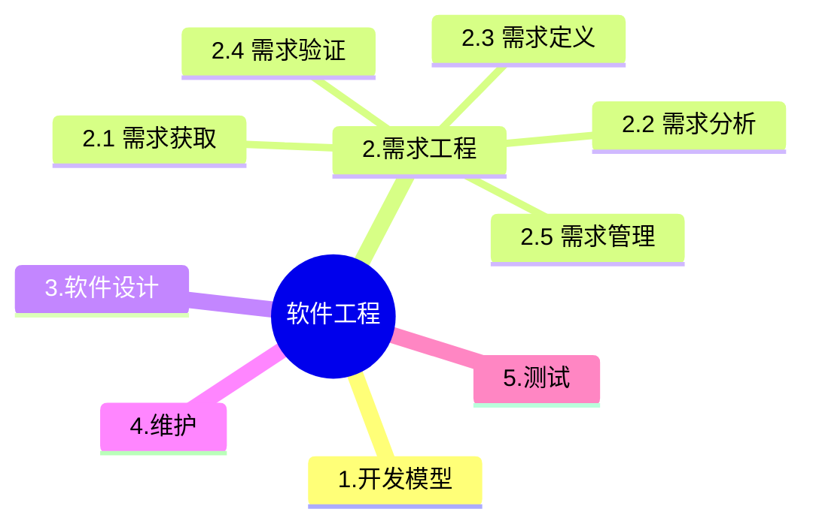

+++
title = '2.2 软件工程-需求工程'
date = 2024-03-07T15:00:59+08:00
weight = 6
+++

```mermaid
mindmap
  root((软件工程))
    1.开发模型
    2.需求工程
      2.1 需求获取
      2.2 需求分析
      2.3 需求定义
      2.4 需求验证
      2.5 需求管理
    3.软件设计
    4.维护
    5.测试
```

### 需求获取

### 需求分析
1. 结构化需求分析

2. 面向对象分析

### 需求定义

### 需求变更
