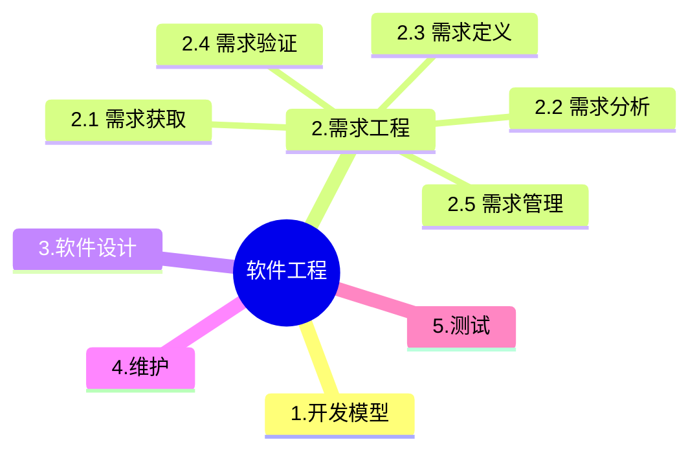

+++
title = '2.1 软件工程-需求工程'
date = 2024-03-07T15:00:59+08:00
weight = 5
+++

按照传统的软件生命周期方法学，可以把软件生命周期划分为软件定义、软件开发、软件运行与维护3个阶段。其主要活动阶段包括:可行性分析与计划制订、需求分析、软件设计(概要设计和详细设计)、软件实现(编码).测试、维护等活动，其中软件开发阶段包括软件设计、实现与测试。

### 需求获取

> JRP是一种相对来说成本较高的需求获取方法(而非需求分析与验证的方法),但也是十分有效的一种。它通过联合各个关键用户代表、系统分析师、开发团队代表一起,通过有组织的会议来讨论需求。通常该会议的参与人数为6~18人,召开时间为1~5小时。JRP的主要意图是收集需求,而不是对需求进行分析和验证。实施JRP时应把握以下主要原则:
1. 在JRP实施之前,应制订详细的议程,并严格遵照议程进行。
2. 按照既定的时间安排进行。
3. 尽量完整地记录会议期间的内容。
4. 在讨论期间尽量避免使用专业术语。
5. 充分运用解决冲突的技能。
6. 会议期间应设置充分的间歇时间。
7. 鼓励团队取得一致意见。
8. 保证参加JRP的所有人员能够遵守事先约定的规则。

> JRP将会起到群策群力的效果,对于一些问题最有歧义的时候、对需求最不清晰的领域都是十分有用的一种方法。这种方法最大的难度是会议的组织和相关人员的能力,要做到言之有物,气氛开放。否则,将难以达到预想的效果。

### 需求分析
1. 结构化需求分析

2. 面向对象分析

### 需求定义

### 需求变更

在需求管理过程中需求的变更是受严格管控的,其流程为:
1. **问题分析和变更描述**。这是识别和分析需求问题或者一份明确的变更提议,以检查它的有效性,从而产生一个更明确的需求变更提议。
2. **变更分析和成本计算**。使用可追溯性信息和系统需求的一般知识,对需求变更提议进行影响分析和评估。变更成本计算应该包括对需求文档的修改、系统修改的设计和实现的成本。一旦分析完成并且确认,应该进行是否执行这一变更的决策。
3. **变更实现**。这要求需求文档和系统设计以及实现都要同时修改。如果先对系统的程序做变更,然后再修改需求文档,这几乎不可避免地会出现需求文档和程序的不一致。

### 需求管理
需求管理的主要活动包括：变更控制、版本控制、需求跟踪、需求状态跟踪

### 需求跟踪
需求跟踪是将单个需求和其他系统元素之间的依赖关系和逻辑联系建立跟踪,这些元素包括各种类型的需求、业务规则、系统架构和构件、源代码、测试用例,以及帮助文件等。 需求跟踪一般采用需求跟踪矩阵做跟进工作,跟踪矩阵将从需求源头一直跟进到最终的软件产品。

需求跟踪时,是分层次进行的,首先需要确认从用户方获取的需求,是否与软件需求能一一对应,然后再看软件需求到下一级工作产品之间是否存在 -- 对应的关系。这样层层传递的方式,可以尽量避免开发不需要的功能,以及遗漏该开发的内容。

### UML
> 为实现对象重用，COM支持两种形式的对象组装，在**包含**重用形式下，一个外部对象拥有指向一个内部对象的唯一引用，外部对象只是把请求转发给内部对象;在**聚集**重用形式下，直接把内部对象的接口引用传给外部对象的客户，而不再转发请求。
COM不支持任何形式的实现继承
COM支持两种形式的对象组装:包含(Containment)和 聚集(Aggregation)。包含是一个对象拥有指向另一个对象的唯一引用。外部对象只是把请求转发给内部对象，所谓转发就是调用内部对象的方法包含能重用内含于其他构件的实现，是完全透明的。如果包含层次较深，或者被转发的方法本身相对简单，包含会存在性能上的问题因此 COM定义第二类重用形式，聚集。聚集直接把内部对象接口引用传给外部对象的客户，而不是再转发请求、保持透明性是很重要的，因为外部对象的客户无法辨别哪个特定接口是从内部对象聚集而来的。

### 需求跟踪能力链
利用需求跟踪能力链(traceability link)可以跟踪一个需求使用的全过程,也就是从初始需求到实现的前后生存期。需求跟踪能力链有4类

### 概要设计
软件概要设计将软件需求转化为软件设计的**数据结构**和软件的**系统结构**

### 详细设计
过程设计，通过对结果细化，得到软件详细数据结构和算法