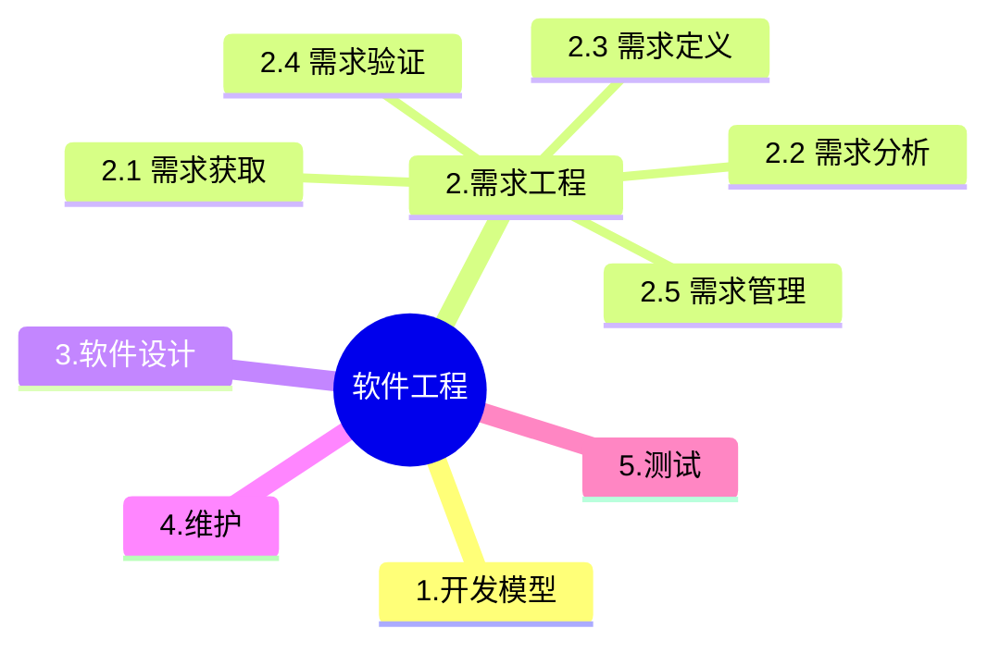

+++
title = '2.3 软件工程-软件测试'
date = 2024-03-07T15:00:59+08:00
weight = 6
+++

### 测试与调试
测试是为了发现软件中存在的错误，调试是为了定位并修正错误。
- 测试以已知条件开始，使用预先定义的程序，且有预知的结果;调试一般是以不可知的内部条件开始，没有预先定义的过程，除统计性调试外，结果是不可预见的
- 测试是有计划的，需要进行测试设计;调试是一个推理的过程，需要调试者去解释，去发现产生的原因， 没有实现设计。
- 软件测试可以描述过程或持续时间，软件测试过程主要有:分析需求文档、测试用例设计、测试执行过程、测试结果分析、形成测试报告。而软件测试周期并行与软件生命周期，存在于软件生命周期的各个阶段

### 测试种类
- 单元测试也称为模块测试，测试的对象是可独立编译或汇编的程序模块、软件构件或OO软件中的类(统称为模中的功能、性能、接口和其他设计约束等条件，发现模块内块)，其目的是检查每个模块能否正确地实现设计中的功能、性能、接口和其他设计约束等条件，发现模块内可能存在的各种差错。单元测试的技术依据是软件详细设计说明书。
- 集成测试的目的是检查模块之间，以及模块和已集成的软件之间的接口关系，并验证已集成的软件是否符合设计要求。集成测试的技术依据是软件概要设计文档。集成视试是根据软件概要设计文档来进行测试，因为概要设计文档中涉及了功能信息的相关信息及要求.
- 系统测试的对象是完整的、集成的计算机系统，系统测试的目的是在真实系统工作环境下，验证完整的软件配置项能否和系统正确连接，并满足系统/子系统设计文档和件开发合同规定的要求。系统测试的技术依据是用户需求或开发合同，除应满足一般测试的准入条件外，在进行系统测试前，还应确认被测系统的所有配置项已通过测试对需要固化运行的软件还应提供固件。
- 回归测试的目的是测试软件变更之后，变更部分的正确性和对变更需求的符合性，以及软件原有的、正确的功能回其他规定的要求的不损害性。

### 软件单元测试
在单元测试中，驱动模块用来调用北侧模块，自顶向下的单元测试中不需要另外编写驱动模块

### 软件集成测试
软件集成测试将已通过单元测试的模块集成在一起，主要测试模块之间的协作性。从组装策略而言，可以分为**一次性组装和增量式组装**。集成测试计划通常是在**软件概要设计**阶段完成，集成测试一般采用黑盒测试方法。

### 软件确认测试
软件确认测试也成有效性测试，主要验证**软件功能、性能及其他特性是否与用户需求一致**。确认测试计划通畅是在需求分析阶段完成的。根绝用户的参与程度不同，软件确认测试通常包括**内部测试、Alpha、Beta和验收测试**

### 测试目的
根据测试目的不同，性能测试主要包括压力测试、负载测试、并发测试和可靠性测试等。
- 强度测试:是在系统资源特别低的情况下考查软件系统极限运行情况。
- 负载测试:用于测试超负荷环境中程序是否能够承担，确定在各种工作负载下系统的性能，测试当负载逐渐增加时，系统各项性能指标的变化情况。
- 压力测试:通过确定系统的瓶颈或不能接收的性能点，来获得系统能够提供的最大服务级别的测试。负载测试和压力测试可以结合进行，统称为负载压力测试。
- 容量测试:并发测试也称为容量测试，主要用于测试系统可同时处理的在线最大用户数量。
- 并发测试：也称为容量测试

### 自动化测试
自动化测试工具主要使用脚本技术来生成测试用例，测试脚本不仅可以在功能测试上模拟用户的操作，比较分析,而且可以用在性能测试、负载测试上。虚拟用户可以同时进行相同的、不同的操作，给被测软件施加足够的数据和操作，检查系统的响应速度和数据吞吐能力。
线性脚本，是录制手工执行的测试用例得到的脚本，这种脚本包含所有的击键、移动、输入数据等，所有录制的测试用例都可以得到完整的回放。结构化脚本，类似于结构化程序设计，具有各种逻辑结构、函数调用功能。也允许其他脚本调用。共享脚本可以在不同主机、不同共享脚本，共享脚本是指可以被多个测试用例使用的脚本，系统之间共享，也可以在同一主机、同一系统之间共享。数据驱动脚本，将测试输入存储在独立的(数据)文件中，而不是存储在脚本中。可以针对不同数据输入实现多个测试用例。
关键字驱动脚本，关键字驱动脚本是数据驱动脚本的逻辑扩展。它将数据文件变成测试用例的描述，采用一些关键字指定要执行的任务。

### 静动态测试
- 静态测试是指被测试程序不在机器上运行，而采用人工检测和计算机辅助静态分析的手段对程序进行检测。静态测试包括对文档的静态测试和对代码的静态测试。对文档的静态测试主要以检查单的形式进行，而对代码的静态测试采用桌前检查（Desk Checking）、代码审查和代码走查。经验表明，使用这种方法能够有效地发现30%~70%的逻辑设计和编码错误。与之对应的动态测试是利用计算机运行得到测试结果的方式进行测试。
> 测试工具根据工作原理不同可分为静态测试工具和动态测试工具。其中静态测试工具是对代码进行语法扫描，找到不符合编码规范的地方，根据某种质量模型评价代码的质量，生成系统的调用关系图等。它直接对代码进行分析，不需要运行代码，也不需要对代码编译链接和生成可执行文件，静态测试工具可用于对软件需求、结构设计、详细设计和代码进行评审、走审和审查，也可用于对软件的复杂度分析、数据流分析、控制流分析和接口分析提供支持;动态测试工具与静态测试工具不同，它需要运行被测试系统，并设置探针，向代码生成的可执行文件中插入检测代码，可用于软件的覆盖分析和性能分析，也可用于软件的模拟、仿真测试和变异测试等。
> 静态分析通过解析程序文本从而识别出程序语句的各个部分，审查出可能的缺陷和异常之处，静态分析包括五个阶段:控制流分析阶段找出并突出显示那些带有多重出口或入口的循环以及不可达到的代码段;数据使用分析阶段突出程序中变量的使用情况:接口分析阶段检查子程序和过程说明及它们使用的一致性;信息流分析阶段找出输入变量和输出变量之间的依赖关系;路径分析阶段找出程序中所有可能的路径并画在此路径中执行的语句。

- 动态测试是通过运行程序发现错误，包括黑盒测试（等价类划分、边界值分析法、错误推测法）与白盒测试（各种类型的覆盖测试）。黑盒测试不关注程序的内部结构，只从程序块的功能、输入、输出角度分析问题，设计测试用例并展开测试工作。
> **黑盒测试也称为功能测试**，主要用于集成测试，确认测试和系统测试阶段。黑盒测试根据软件需求规格说明所规定般包括功能分解、等价类划分、边界值分析、判定表、因果图、状态图、随机测试、错的功能来设计测试用例，一误推测和正交试验法等。
> 确认测试中，需要“确认”的，是用户需求。所以这种测试有一个显著的特点，就是测试必须要有用户的参与。
> 在设计测试用例时，**等价类划分**是用得最多的一种黑盒测试方法。所谓等价类就是某个输入域的集合，对每一个输入条件确定若干个有效等价类和若干个无效等价类，分别设计覆盖有效等价类和无效等价类的测试用例。
> - 无效等价类是用来测试非正常的输入数据的，所以要为每个无效等价类设计一个测试用例。
> - 边界值分析通过选择等价类边界作为测试用例，不仅重视输入条件边界，而且也必须考虑输出域边界。在实际测试工作中，将等价类划分法和边界值分析结合使用，能更有效地发现软件中的错误。
> - 因果图方法是从用自然语言书写的程序规格说明的描述中找出因(输入条件)和果(输出或程序状态的改变)，可以通过因果图转换为判定表。
> - 正交试验设计法，就是使用已经造好了的正交表格来安排试验并进行数据分析的一种方法，目的是用最少的测试用例达到最高的测试覆盖率，

### 驱动模块与桩模块
- 驱动模块是用来模拟被测试模块的上一级模块，相当于被测模块的主程序。它接收数据，将相关数据传送给被测模块，启用被测模块，并打印出相应的结果。
- 桩模块(Stub)是指模拟被测试的模块所调用的模块，而不是软件产品的组成的部分。主模块作为驱动模块，与之直接相连的模块用桩模块代替。在**集成测试**前要为被测模块编制一些模拟其下级模块功能的“替身”模块，以代替被测模块的接口，接收或传递被测模块的数据，这些专供测试用的"假"模块称为被测模块的桩模块

### 静态分析
静态分析(static analysis)是一种对代码的机械性的、程式化的特性分析方法。静态分析一般常用软件工具进行，包括控制流分析、数据流分析、接口分析、表达式分析。
- 用数据流图来分析数据处理的异常现象(数据异常)，这些异常包括初始化、赋值、或引用数据等的序列的异常。
- 使用控制流图系统地检查程序的控制结构。按照结构化程序规则和程序结构的基本要求进行检查。控制流图描述了程序元素和它们的执行顺序之间的联系。一个程序元素通常是一个条件、一个简单的语句，或者一块语句(多个连续语句)
- 接口分析涉及子程序以及函数之间的接口一致性，包括检查形参与实参类型、个数、维数、顺序的一致性。当子程序之间的数据或控制传递使用公共变量块或全局变量时，也应检查它们的一致性。
- 表达式分析:括号不匹配、数组引用越界、除数为零

### AB测试
- Alpha测试(a测试)是由一个用户在开发环境下进行的测试，也可以是公司内部的用户在模拟实际操作环境下进行的受控测试，Alpha测试不能由程序员或测试员(有的地方又说可以让测试人员进行)完成。
- Beta测试(B测试)是软件的多个用户在一个或多个用户的实际使用环境下进行的测试。开发者通常不在测试现场，Beta测试不能由程序员或测试员完成。因而，Beta测试是在开发者无法控制的环境下进行的软件现场应用。

### 系统测试
系统测试是将已经确认的软件、计算机硬件、外设和网络等其他因素结合在一起，进行信息系统的各种组装测试和确认测试，其目的是通过与系统的需求相比较，发现所开发的系统与用户需求不符或矛盾的地方。
系统测试是根据系统方案说明书来设计测试例子的，常见的系统测试主要有以下内容:
- 恢复测试:恢复测试监测系统的容错能力。检测方法是采用各种方法让系统出现故障，检验系统是否按照要求能从故障中恢复过来，并在约定的时间内开始事务处理，而且不对系统造成任何伤害。如果系统的恢复是自动的(由系统自动完成)，需要验证重新初始化、检查点、数据恢复等是否正确。如果恢复需要人工干预，就要对恢复的平均时间进行评估并判断它是否在允许的范围内。
- 安全性测试:系统的安全性测试是检测系统的安全机制、保密措施是否完善，主要是为了检验系统的防范能力。测试的方法是测试人员模拟非法入侵者，采用各种方法冲破防线。系统安全性设计准则是使非法入侵者所花费的代价比进入系统后所得到的好处要大，此时非法入侵已无利可图。
- 强度测试:是对系统在异常情况下的承受能力的测试，是检查系统在极限状态下运行时，性能下降的幅度是否在允许的范围内。因此，强度测试要求系统在非正常数量、频率或容量的情况下运行。强度测试主要是为了发现在有效的输入数据中可能引起不稳定或不正确的数据组合。例如，运行使系统处理超过设计能力的最大允许值的测试例子；使系统传输超过设计最大能力的数据，包括内存的写入和读出等。
- 性能测试:检查系统是否满足系统设计方案说明书对性能的要求。性能测试覆盖了软件测试的各阶段，而不是等到系统的各部分所有都组装之后，才确定系统的真正性能。通常与强度测试结合起来进行，并同时对软件、硬件进行测试。软件方面主要从响应时间、处理速度、吞叶量、处理精度等方面来检测。
- 可靠性测试:通常使用以下两个指标来衡量系统的可靠性:平均失效间隔时间MTBF(mean time betweenfailures)是否超过了规定的时限，因故障而停机时间MTTR(mean time torepairs)在一年中不应超过多少时间。
- 安装测试:在安装软件系统时，会有多种选择。安装测试就是为了检测在安装过程中是否有误、是否容易操作等。主要监测系统的每一个部分是否齐全，硬件的配置是否合理，安装中需要产生的文件和数据库是否已产生，其内容是否正确等。

### 测试准确性
真实程序、核心程序、小型基准程序和合成基准程序，其评测准确程度依次递减。
合成基准程序覆盖面广了，但是毕竟不是全覆盖，造成了系统的不确定或者说增加了跟真实系统偏离的概率，所以相对单个的小型基准程序来说更不准确，

### 基准程序
在实际应用中，用户通常依靠评价程序来测试系统的性能。以下评价程序中，**合成基准程序**的评测准确程度最低。
事务处理性能委员会(Transaction Processing Performance Counci, TPC)是制定商务应用基准程序(benchmark)标准规范、性能和价格度量，并管理测试结果发布的非营利组织，其发布的TPC-C是 **在线事务处理** 的基准程序。

#### 软件维护的类型
软件维护的类型包括:改正性维护(正确性维护)、适应性维护、完善性维护、预防性维护。
- 改正性维护:在软件交付使用后，必然会有一部分隐藏的错误被带到运行阶段来。这些隐藏下来的错误在某些特定的使用环境下就会暴露出来。为了识别和纠正软件错误、改正软件性能上的缺陷、排除实施中的错误使用，应当进行的诊断和改正错误的过程，就叫作改正性维护。
- 适应性维护:随着计算机的飞速发展，外部环境(新的硬、软件配置)或数据环境(数据库、数据格式、数据输入输出方式、数据存储介质)可能发生变化，为了使软件适应这种变化，而去修改软件的过程就叫作适应性维护。完善性维护:在软件的使用过程中，用户往往会对软件提出新的功能与性能要求。为了满足这些要求，需要修改或再开发软件，以扩充软件功能、增强软件性能、改进加工效率、提高软件的可维护性。这种情况下进行的维护活动叫作完善性维护。
- 预防性维护:为了提高软件的可维护性、可靠性等而提出的一种维护类型，它为以后进一步改进软件打下良好基础。通常，预防性维护定义为:“把今天的方法学用于昨天的系统以满足明天的需要”。也就是说，采用先进的软件工程方法对需要维护的软件或软件中的某一部分(重新)进行设计、编制和测试。