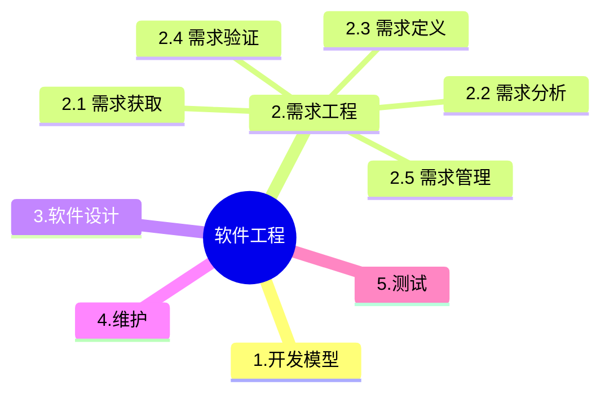

+++
title = '2.4 软件工程-UML'
date = 2024-03-07T15:00:59+08:00
weight = 6
+++

### 结构式建模图
#### 类图

类图是一个静态图，它是用来模拟一个系统的静态视图，也被认为是类图作为基础组件图和部署图类图不仅用于可视化系统的静态视图，但它们也可用于构建可执行代码的任何系统中的前向和反向工程UML图一般不直接映射到任何面向对象的编程语言，但在类图是一个例外。类图清楚地显示了映射面向对象语言，如ava，C++等，因此，从实际经验的类图通常用于构建用途,因此类图可以用来:
- 描述系统的静态视图，
- 显示静态视图中的元素之间的协作,
- 由系统执行的功能的描述，
- 构建软件应用面向对象的语言，

#### 对象图

对象图可以被想象成正在运行的系统在某一时刻的快照。我们可以举一个例子来描述它:一个正在运行的列车。现在，如果运行一个单元列车运行，那么会发现它具有以下静态图片:
* 这是一个特别的运行状态
* 一个特定的乘客数量。如果捕捉在不同的时间，这将在不断改变所以，在这里我们可以想像的列车运行的管理单元是一个对象，具有上述值。任何现实生活中的简单或复杂的系统而目的确如此,对象图可用于:
- 使一个系统的原型，
- 逆向工程。
- 造型复杂的数据结构。
- 从实用的角度了解系统。
- 捕捉实例和链接。
- 详细描述瞬态图,

#### 包图

#### 组件图

#### 部署图

#### 复合结构图

### 行为式建模图

#### 活动图

活动图是适用于该系统的活动流程建模。应用程序可以有多个系统。活动图也抓住了这些系统，并介绍了流程从一个系统到另一个。在其他图中，这个特定的用法，不提供。这些系统可以是数据库，外部队列或任何其他系统。现在，我们将看看活动图到实际应用。从上面的讨论，很显然，活动图是来自一个非常高的级别。因此，它给出了一个系统的高级视图，这种高层次的观点主要是针对企业用户或任何其他人而不是一个技术人员，
以下是活动图的主要用途:
- 使用业务建模工作流程,
- 建模的业务需求。
- 高层次的理解系统的功能。
- 调查在后一阶段的业务需求,

#### 状态图

UML 状态图可以捕获对象、子系统和系统的生命周期，可以告知一个对象可以拥有的状态，并且事件(如消息的接收，时间的流逝、错误、条件为真等)会怎样随着时间的推移来影响这些状态。一个状态图应该连接到所有具有清晰的可标志状态和复杂行为的类;该图可以确定类的行为以及该行为如何根据当前的状态而变化，也可以展示哪些事件将会改变类的对象的状态。
状态图主要是为了模拟响应系统,
以下是使用状态图的主要目的:
- 为了模拟系统的动态环节，
- 反应系统模型生命周期。
- 一个对象来描述不同的状态，在其生命周期的时间，
- 定义一个状态机模型状态的对象，

#### 用例图

要了解一个系统的动态，我们需要使用不同类型的图表。用例图就是其中之一，其具体目的是收集系统的的需求和参与者。用例图指定系统的事件和他们的流向。但从未用例图描述了他们是如何实现的。可以被想象成一个黑盒子，只有输入，输出和黑盒子的功能被称为用例图。
在这些图中使用的设计在一个非常高的水平，那么这种高层次的设计高雅，一遍又一遍完善使系统得到一个完整实用的图片。一个结构良好的用例还介绍了前置条件，后置条件和例外。而这些多余的元素在执行测试时被用来制造测试的情况下。用例都不是正向和反向工程，但他们仍然使用略有不同的方式。同样是真实的逆向工程，仍用例图的使用方式不同，使其逆向工程的一个候选,在正向工程用例图是用来做测试案例和逆向工程中的使用情况下是用来准备从现有的应用程序的需求细节,所以下面的地方使用用例图:
- 需求分析和高水平的设计。
- 模拟系统的上下文,
- 逆向工程。
- Forward engineering.

#### 通信图

#### 交互图
UML 交互图包括两种：序列图和协作图。

- 时序图

- 协作图

### UML 2.0 

#### 时间图
