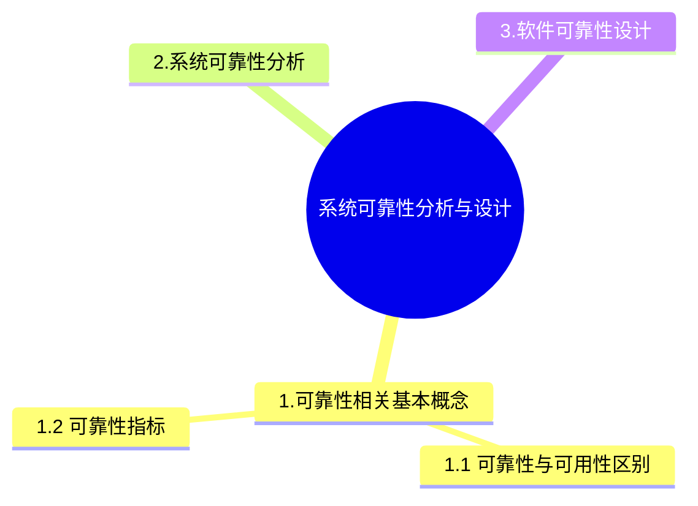

+++
title = '5. 系统可靠性分析与设计'
date = 2024-03-07T15:00:59+08:00
weight = 8
+++

### 可靠性与可用性区别
- 可靠性是软件系统在应用或系统错误面前，在意外或错误使用的情况下维持软件系统的功能特性的基本能力。
- 可用性是系统能够正常运行的时间比例。

### 可靠性指标
- 平均无故障时间
- 平均故障修复时间
- 平均故障间隔时间
- 系统可用性

### 系统可靠性分析

### 软件可靠性设计技术

#### 1. N版本程序设计

#### 2. 恢复块设计

#### 3. 防卫式程序设计
