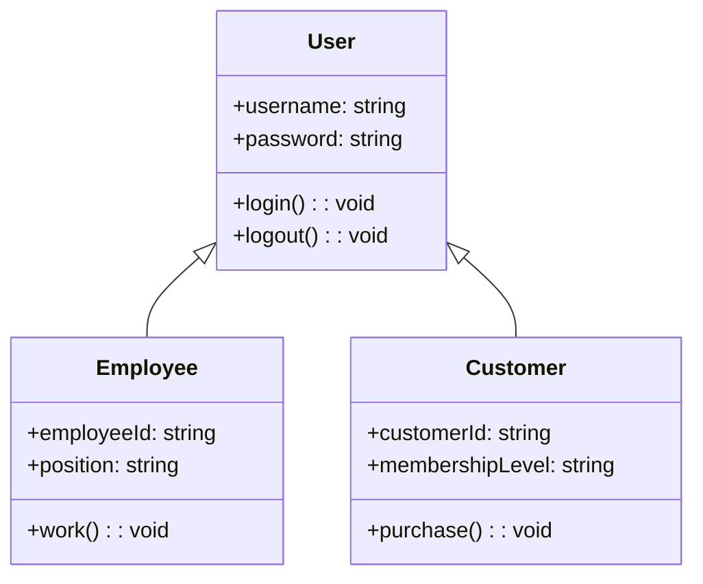

+++
title = '系统分析与设计'
date = 2024-03-07T15:00:59+08:00
LastModifierDisplayName = 'Santa Claus'
LastModifierEmail = 'santa@example.com'
+++

1.系统分析的目标就是在开发之前对要解决的问题有一个更透彻的理解。为了达到这一目标，通常需要经过在问题定义上达成共识，理解问题的本质。
问题分析阶段的四项主要任务包括：
1. 研究问题领域——深入学习当前系统
2. 分析问题和机会——问题阻碍企业经营目标而机会可以提高管理水平。
3. 制定系统改进目标——内部外部的新要求
4. 修改项目计划 ——根据结果修改计划
2.问题分析的步骤包括：问题定义上达成共识，理解问题的本质，确定项目干系人和用户，定义系统的边界和确定系统实现的约束这五个步骤。

3.问题分析的方法
1. 因果鱼骨图
因果鱼骨图是一种有效的探寻问题根源的技术，它通过直观的图形找出问题或现象的所有潜在原因，从而追踪出问题的根源。它能够帮助人们将问题的原因而放在首位，提供了一种运用集体智慧解决问题的方法。在使用时，通常按照以下步骤进行。

2. 帕累托图
帕累托图是采用直方图的形式，根据问题的相对频率或大小从高往低降序排列，帮助设计师将精力集中在重要的问题上。它为 80%的问题找到关键的 20%的原因，它可以一目了然地显示出各个问题的相对重要程度，有助于预防在解决了一些问题后，却使另外一些问题变得更糟的现象发生。

4.软件需求
1. 功能性需求——系统为了向它的用户提供相应的功能而必须执行的动作，即系统必须完成的工作。
2. 非功能性需求——指系统必须具备的属性或品质，如性能、响应时间、可靠性、容错性、扩展性等。
3. 设计约束——也称为限制条件、补充规约，这通常是对解决方案的一些约束说明，例如必须采用国有自主知识版权的数据库系统，必须在 UNIX 操作系统之下运行等。

程序流程图(Program Flow Diagram，PFD)用一些图框表示各种操作，它独立于任何一种程序设计语言，比较直观、清晰，易于学习掌握。流程图中只能包括5种基本控制结构：顺序型、选择型、WHILE循环型(当型循环)、UNTIL循环型(直到型循环)和多分支选择型。    IPO图是由IBM公司发起并逐步完善的一种流程描述工具，其主体是处理过程说明，可以采用流程图、判定树、判定表、盒图、问题分析图或过程设计语言来进行描述。IPO图中的输入、输出与功能模块、文件及系统外部项都需要通过数据字典来描述，同时需要为其中的某些元素添加注释。    N-s图与PFD类似，也包括5种控制结构，分别是顺序型、选择型、WHILE循环型(当型循环)、UNTIL循环型(直到型循环)和多分支选择型，任何一个N-S图都是这5种基本控制结构相互组合与嵌套的结果。在N-S图中，过程的作用域明确；它没有箭头，不能随意转移控制；而且容易表示嵌套关系和层次关系；并具有强烈的结构化特征。但是当问题很复杂时，N-S图可能很大。    问题分析图(Problem Analysis Diagram，PAD)是继PFD和N-S图之后，又一种描述详细设计的工具。PAD也包含5种基本控制结构，并允许递归使用。    过程设计语言(Process Design Language，PDL)也称为结构化语言或伪代码(pseudo code)，它是一种混合语言，采用自然语言的词汇和结构化程序设计语言的语法，用于描述处理过程怎么做，类似于编程语言。过程设计语言用于描述模块中算法和加工逻辑的具体细节，以便在开发人员之间比较精确地进行交流。    对于具有多个互相联系的条件和可能产生多种结果的问题，用结构化语言描述则显得不够直观和紧凑，这时可以用以清楚、简明为特征的判定表(Decision Table)来描述。判定表采用表格形式来表达逻辑判断问题，表格分成4个部分，左上部分为条件说明，左下部分为行动说明，右上部分为各种条件的组合说明，右下部分为各条件组合下相应的行动。    判定树(Decision Tree)也是用来表示逻辑判断问题的一种常用的图形工具，它用树来表达不同条件下的不同处理流程，比语言、表格的方式更为直观。判定树的左侧(称为树根)为加工名，中间是各种条件，所有的行动都列于最右侧。
接口标准是对.接口中消息模式、格式和协议的标准化

本题考查面向对象分析与设计的基本概念。 在UML中，有两种类型的图：结构图和行为图。结构图用来描述事物之间的关系；包括类图、对象图、组件图和部署图。行为图用来描述参与者和用例之间的交互，或者描述参与者如何使用系统；行为图包括用例图、顺序图、活动图、状态图和通信图。
置于用户控制之下、减轻用户的记忆负担以及保持界面的一致性是著名用户界面设计专家Theo Mandel博士所创造，通常称之为人机交互的黄金三原则。 置于用户控制之下原则包含的内容是：在定义人机交互方式时，不强迫用户采用不是必须的或者不情愿的方式来进行操作，允许交互的中断和撤销。当用户操作技能等级提高时，可以实现流水化的交互方式，允许用户定制交互方式，以便使用户界面与内部技术细节隔离，允许用户和出现在屏幕上的对象直接进行交互。
本题考查应用系统输入设计的基本知识。人的因素在系统输入设计中扮演了很重要的角色。输入应该尽可能地简单，以降低错误发生的可能性，如对于范围可控的数据，使用选择的方式替代用户输入；只输入变化的数据等。输入应该尽可能使用已有含义明确的设计，需要采用模仿的方式而非创新。为了避免用户理解的二义性，应该对表格中输入的数据给出提示信息。
状态图描述了一个对象在其生命周期中可能的状态组合；顺序图用来描述对象按照时间顺序的消息流来建模用例；数据流图是一种描述数据通过系统的流程以及系统实施的工作或处理过程的过程模型；流程图以图形化的方式展示应用程序从数据输入开始到获得输出为止的逻辑过程。

