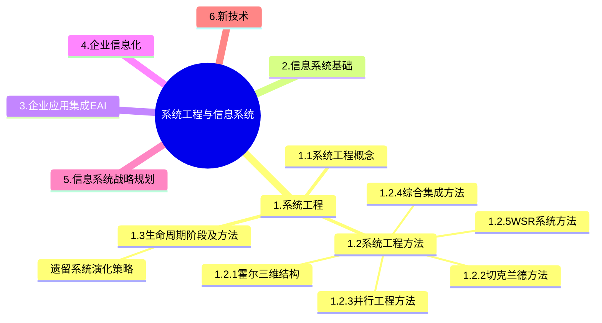
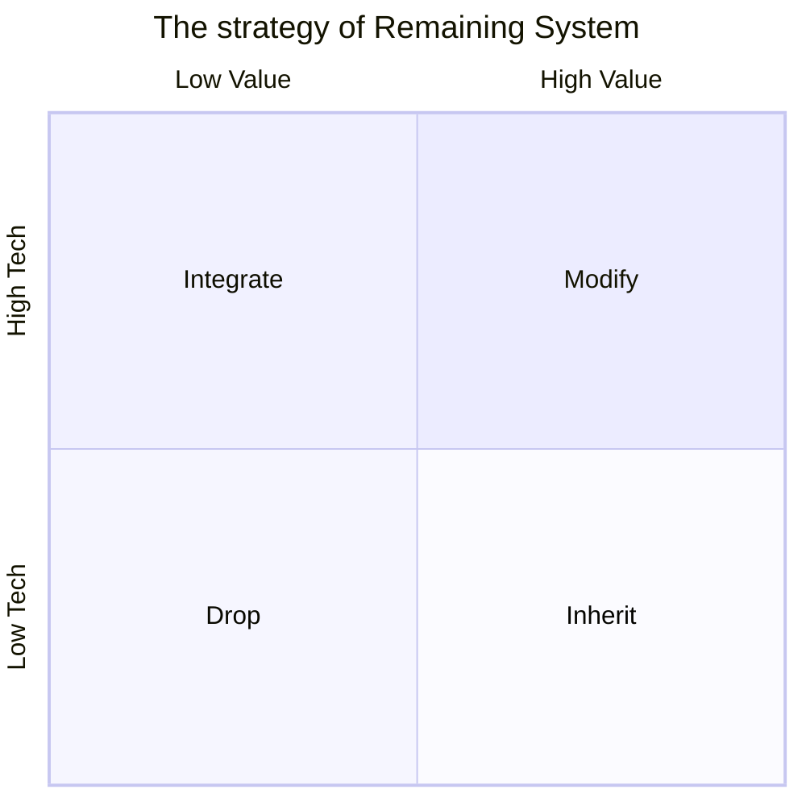

+++
title = '1.1 系统工程'
date = 2024-03-07T15:00:59+08:00
weight = 1
+++

### 系统工程
系统工程在上个世纪中后期发展起来的一门新兴学科。它最早约产生于20世纪40年代的美国，时至今日，系统工程已经成为现代社会高速发展不可或缺的一部分。

1. 概念及特点
> 1. 系统工程利用计算机作为工具，对系统的 _结构_ 、_要素_ 、_信息_ 和 _反馈_ 等进行分析，以达到**最优规划、最优设计、最优管理和最优控制**的目的
> 2. 从**整体出发**、从系统观念出发，以求**整体最优**

2. 方法
- **霍尔三维结构**
    
    > 霍尔三维结构是由逻辑维、时间维和知识维组成的立体空间结构。
    >> 应用场景： 组织和管理大型工程建设项目

    1、逻辑维 (**解决问题的逻辑过程**)：运用系统工程方法解决某一大型工程项目时，一般可分为七个步骤：
    * （1）明确问题
    * （2）确定目标：建立价值体系或评价体系
    * （3）系统综合
    * （4）系统分析
    * （5）优化：系统方案的优化选择
    * （6）系统决策：决策就是管理，决策就是决定
    * （7）实施计划：制定计划有了决策就要付诸实施，实施就要依靠严格的有效的计划。

    2、时间维（**事物和工作推进发生的顺序**）对于一个具体的工作项目，从制定规划起一直到更新为止，全部过程可分为七个阶段：
    * （1）规划阶段：即调研、程序设计阶段，目的在于谋求活动的规划与战略；
    * （2）拟定方案：提出具体的计划方案。
    * （3）**研制阶段**：作出研制方案及生产计划。
    * （4）生产阶段：生产出系统的零部件及整个系统，并提出安装计划。
    * （5）安装阶段：将系统安装完毕，并完成系统的运行计划。
    * （6）运行阶段：系统按照预期的用途开展服务。
    * （7）更新阶段：即为了提高系统功能，取消旧系统而代之以新系统，或改进原有系统，使之更加有效地工作。
* 
    3、知识维（**了解事物需要的专业科学知识**）系统工程除了要求为完成上述各步骤、各阶段所需的某些共性知识外，还需要其他学科的知识和各种专业技术，霍尔把这些知识分为工程、医药、建筑、商业、法律、管理、社会科学和艺术等。各类系统工程，如军事系统工程、经济系统工程、信息系统工程等。都需要使用其它相应的专业基础知识。
- 切克兰德方法

> 也被称为“软科学”方法，核心不是“最优化”，而是“比较”和“探寻”
>> 7步骤：认识问题、根底定义、建立概念模型、比较及探寻、选择、设计与实施、评估与反馈
- 并行工程方法（Concurrent Engineering, CE）

> “制造过程”与“支持过程”并行。
>> 强调三个方面： 产品设计开发期间，最快速度按质完成；各项工作问题协调解决；适当的信息系统工具。
- 综合集成方法
> 钱学森命名 以解决大规模、多方面和高度复杂的问题
>> 四原则：整体论原则、相互联系原则、有序性原则、动态原则
- WSR系统方法
> 吴敬琏提出，它被认为是解决复杂社会、经济问题的一种实践导向的系统分析方法。WSR代表“物”、“事”、“人”，这三个字分别触及了系统方法应用中需要考虑的三个关键维度：技术层面（物理）、管理层面（事理）和人文层面（人理）。

### 遗留系统演化策略
把对遗留系统的评价结果分列在坐标的4个象限内。对处在不同象限的遗留系统采取不同的演化策略。

1. 淘汰策略。低水平、低价值象限即遗留系统的技术含量较低，且具有较低的业务价值。对这种遗留系统的演化策略为淘汰，即全面重新开发新的系统以代替遗留系统。完全淘汰是一种极端性策略，一般是企业的业务产生了根本变化，遗留系统已经基本上不再适应企业运作的需要；或者是遗留系统的维护人员、维护文档资料都丢失了。经过评价，发现将遗留系统完全淘汰，开发全新的系统比改造旧系统从成本上考虑更合算。

2. 继承策略。低水平、高价值象限即遗留系统的技术含量较低，已经满足企业运作的功能或性能要求，但具有较高的商业价值，目前企业的业务尚紧密依赖该系统。称这种遗留系统的演化策略为继承。在开发新系统时，需要完全兼容遗留系统的功能模型和数据模型。为了保证业务的连续性，新老系统必须并行运行一段时间，再逐渐切换到新系统上运行。

3. 改造策略。高水平、高价值象限即遗留系统的技术含量较高，本身还有强大的生命力。系统具有较高的业务价值，基本上能够满足企业业务运作和决策支持的需要。这种系统可能建成的时间还很短，称这种遗留系统的演化策略为改造。改造包括系统功能的增强和数据模型的改造两个方面。系统功能的增强是指在原有系统的基础上增加新的应用要求，对遗留系统本身不做改变；数据模型的改造是指将遗留系统的旧的数据模型向新的数据模型的转化。

4. 集成策略。高水平、低价值象限即遗留系统的技术含量较高，但其业务价值较低，可能只完成某个部门(或子公司)的业务管理。这种系统在各自的局部领域里工作良好，但对于整个企业来说，存在多个这样的系统，不同的系统基于不同的平台、不同的数据模型，形成了一个个信息孤岛，对这种遗留系统的演化策略为集成。

