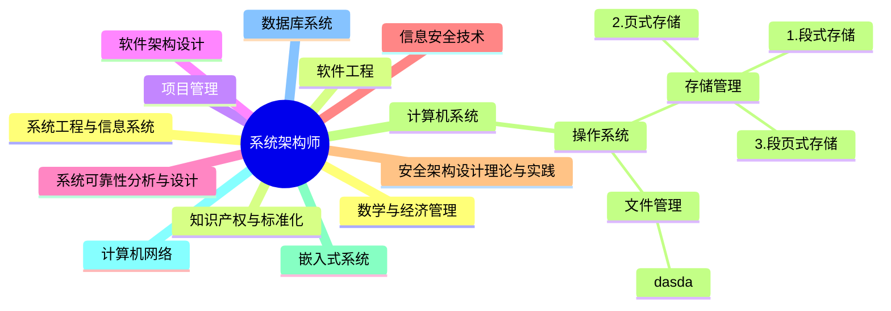

+++
title = 'RunKao'
date = 2024-03-07T15:00:59+08:00
weight = 1000
+++

```mermaid
mindmap
  root((系统架构师))
    系统工程与信息系统
    软件工程
    项目管理
    软件架构设计
    系统可靠性分析与设计
    信息安全技术
    安全架构设计理论与实践
    计算机系统
      操作系统
      ::icon(fa fa-book)
        存储管理
          1.段式存储
          2.页式存储
          3.段页式存储
        文件管理
          dasda
    嵌入式系统
    计算机网络
    数据库系统
    数学与经济管理
    知识产权与标准化
```