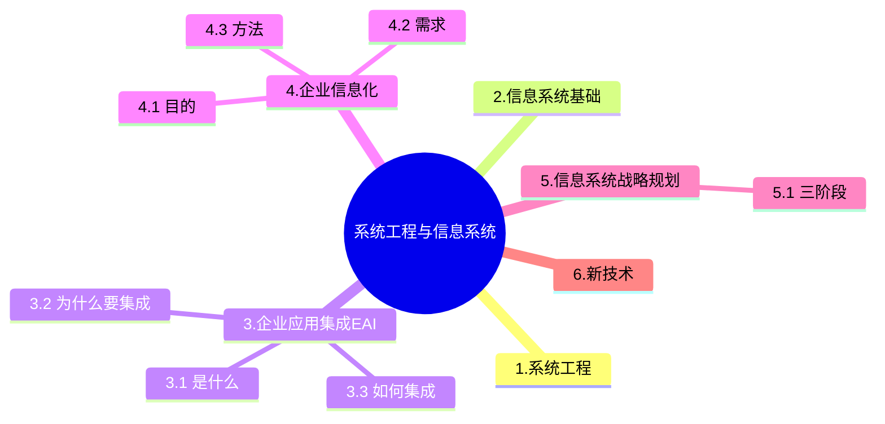

+++
title = '企业信息化&应用集成'
date = 2024-03-07T15:00:59+08:00
weight = 3
+++

## 企业信息化
企业信息化涉及对企业管理理念的创新，管理流程的优化，管理团队的重组和管理手段的革新。管理创新是按照市场发展的要求，对企业现有的管理流程重新整合，从作为管理核心的**财务**、**物料**管理，转向**技术**、**物资**、**人力资源**的管理，并延伸到企业技术创新、工艺设计、产品设计、生产制造过程的管理，进而还要扩展到客户关系管理、供应链管理乃至发展到电子商务。

### 目的
企业信息化旨在提高企业的竞争力

### 信息化需求
- 战略需求：提升组织的竞争能力
- 运作需求：实现信息化战略目标、运作策略、人才培养的需要
- 技术需要：信息技术层面上对系统的完善、升级、及集成

### 信息化方法
不是重点

### 信息化三流
- 信息流
  > 需求信息流：客户订单，生产计划，采购合同

  > 供应信息流：如入库单，完工报告单，库存记录，提货发运单
- 资金流
- 物流

### 缩写
- MIS，Management Information System 管理信息系统
- ERP，Enterprise Resource Planning 企业资源计划
  > 主要包括：财会管理、物流管理、生产控制管理、人力资源管理等四个主要功能模块
- MRP, Material Requirement Planning 物料需求计划
- CRM, Customer Relationship Management 客户关系管理
  > 核心是**客户价值管理**，其目的是与客户建立长期和有效的业务关系，最大限度地增加利润。市场营销和客户服务时CRM的支柱性功能，是客户与企业产生联系的主要方面。
- SCM，Supply Chain Management 供应链管理
  > 整合优化“信息化的三流”，打通企业间“信息孤岛”严格的数据交换标准
- BPR，Business Process Reconstruction 业务流程重组
  > 遵循的原则：以流程为中心的原则，以客户为导向的原则，以人为本的原则
- BPM，Business Process Management业务流程管理

---

## 信息系统战略规划
**企业战略**规划是评价环境和企业现状，进而选择和确定企业的总体和长远目标，指定和选择实现目标的行动方案。**信息系统**战略规划关注如何通过信息系统来支撑业务流程的运作，进而实现企业的关键业务目标。

1. 第一阶段：以数据处理为核心围绕职能部门需求
  > 关键成功因素法CSF：抓主要矛盾

  > 战略集合转化法SST: 将整个过程看成一个“信息集合”，并将组织的战略目标转成管理信息系统MIS的战略目标
  
  > 企业系统规划法BSP：通过自伤而下的识别企业目标、企业过程和数据，然后对数据进行分析，自下而上地设计信息系统
2. 第二阶段：以企业内部MIS为核心，围绕企业整体需求
3. 第三阶段：综合考虑企业内外环境以集成为核心，围绕企业的战略需求

---

## 企业应用集成
EAI（企业应用集成） 是一种通过系统架构和技术手段，实现企业内部多个系统间数据交换和协作的解决方案。在数据集成方面，EAI主要包括以下方式：
1. 数据复制：将数据从一个系统复制到另一个系统，适合于静态数据或更新频率较低的数据。
2. 基于接口的数据集成：通过定义系统间的数据接口，实现动态数据交换。
3. 数据联邦：通过联邦机制，使多个数据源看起来像一个虚拟数据库，适合实时性要求较高的场景。

### 为什么要集成
解决数据孤岛

### 怎么集成
企业集成通常包括以下五个主要层次：（由易到难）
1. 界面集成，(表示集成), 统一入口，产生整体的感觉，最小代价实现一体化操作
2. 数据集成，将不同来源的数据逻辑或者物理上“集中”，为企业提供全面的数据共享，是其他后续集成方法的基础
3. 控制集成，调用其他系统已有的方法，达到集成效果
4. 过程集成，（物业流程集成），跨企业，或优化流程而非直接调用，企业必须对各种业务信息的交换进行定义、授权和管理，对企业之间的信息共享能力提出了要求
5. 门户集成，将内部系统对接到互联网上
<!-- 企业集成通常包括以下四个主要层次：
1. 数据集成：最底层，解决数据的共享和统一问题。通过数据抽取、清洗、转换等方法实现数据资源的集中化或分布式管理。
2. 会聚集成：通过整合不同的系统或模块，使它们能够协同工作。解决的是“如何整合系统资源”的问题，开始涉及逻辑和服务的整合。
3. 服务集成：通过服务的调用和组合，支持跨系统的业务流程。引入了SOA（面向服务的架构）和ESB（企业服务总线）等技术，关注服务的发布、发现和调用。
4. 应用集成：最高层次，通过整合业务应用，实现跨系统、跨部门的业务流程联动。关注整体的业务优化和用户体验。 -->

