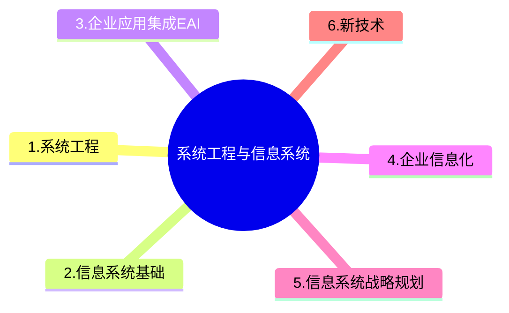

+++
title = '企业信息化&应用集成'
date = 2024-03-07T15:00:59+08:00
weight = 3
+++

### 目的
企业信息化旨在提高企业的竞争力

EAI（企业应用集成） 是一种通过系统架构和技术手段，实现企业内部多个系统间数据交换和协作的解决方案。在数据集成方面，EAI主要包括以下方式：
1)数据复制：将数据从一个系统复制到另一个系统，适合于静态数据或更新频率较低的数据。
2)基于接口的数据集成：通过定义系统间的数据接口，实现动态数据交换。
3)数据联邦：通过联邦机制，使多个数据源看起来像一个虚拟数据库，适合实时性要求较高的场景。

企业集成通常包括以下四个主要层次：
1. 数据集成：最底层，解决数据的共享和统一问题。通过数据抽取、清洗、转换等方法实现数据资源的集中化或分布式管理。
2. 会聚集成：通过整合不同的系统或模块，使它们能够协同工作。解决的是“如何整合系统资源”的问题，开始涉及逻辑和服务的整合。
3. 服务集成：通过服务的调用和组合，支持跨系统的业务流程。引入了SOA（面向服务的架构）和ESB（企业服务总线）等技术，关注服务的发布、发现和调用。
4. 应用集成：最高层次，通过整合业务应用，实现跨系统、跨部门的业务流程联动。关注整体的业务优化和用户体验。

数据集成包括对数据做哪些处理

### 企业信息化
企业信息化涉及对企业管理理念的创新，管理流程的优化，管理团队的重组和管理手段的革新。管理创新是按照市场发展的要求，对企业现有的管理流程重新整合，从作为管理核心的**财务**、**物料**管理，转向**技术**、**物资**、**人力资源**的管理，并延伸到企业技术创新、工艺设计、产品设计、生产制造过程的管理，进而还要扩展到客户关系管理、供应链管理乃至发展到电子商务。
