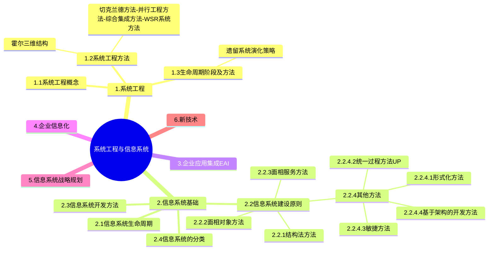

+++
title = '信息系统'
date = 2024-03-07T15:00:59+08:00
weight = 2
+++

### 信息系统
系统工程在上个世纪中后期发展起来的一门新兴学科。它最早约产生于20世纪40年代的美国，时至今日，系统工程已经成为现代社会高速发展不可或缺的一部分。

1. 概念及特点
> 1. 系统工程利用计算机作为工具，对系统的 _结构_ 、_要素_ 、_信息_ 和 _反馈_ 等进行分析，以达到**最优规划、最优设计、最优管理和最优控制**的目的
> 2. 从**整体出发**、从系统观念出发，以求**整体最优**

2. 方法
- **霍尔三维结构**
    > 霍尔三维结构是由逻辑维、时间维和知识维组成的立体空间结构。

    1、逻辑维 (事物是什么)：运用系统工程方法解决某一大型工程项目时，一般可分为七个步骤：
    * （1）明确问题
    * （2）确定目标：建立价值体系或评价体系
    * （3）系统综合
    * （4）系统分析
    * （5）优化：系统方案的优化选择
    * （6）系统决策：决策决策就是管理，决策就是决定，人类的决策管理活动面临着被决策系统的日益庞大和日益复杂。
    * （7）实施计划：制定计划有了决策就要付诸实施，实施就要依靠严格的有效的计划。

    2、时间维（事物发生的顺序）对于一个具体的工作项目，从制定规划起一直到更新为止，全部过程可分为七个阶段：
    * （1）规划阶段。即调研、程序设计阶段，目的在于谋求活动的规划与战略；
    * （2）拟定方案。提出具体的计划方案。
    * （3）研制阶段。作出研制方案及生产计划。
    * （4）生产阶段。生产出系统的零部件及整个系统，并提出安装计划。
    * （5）安装阶段。将系统安装完毕，并完成系统的运行计划。
    * （6）运行阶段。系统按照预期的用途开展服务。
    * （7）更新阶段。即为了提高系统功能，取消旧系统而代之以新系统，或改进原有系统，使之更加有效地工作。
* 
    3、知识维（了解事物需要的专业科学知识）系统工程除了要求为完成上述各步骤、各阶段所需的某些共性知识外，还需要其他学科的知识和各种专业技术，霍尔把这些知识分为工程、医药、建筑、商业、法律、管理、社会科学和艺术等。各类系统工程，如军事系统工程、经济系统工程、信息系统工程等。都需要使用其它相应的专业基础知识。
- 切克兰德方法
- 并行工程方法
- 综合集成方法
- WSR系统方法

架构设计是一个迭代的过程，在建立软件架构的初期，选择一个合适的架构风格是首要的；
在此基础上，开发人员通过架构模型，可以获得关于软件架构属性的理解，为将来的架构实现与演化过程建立目标

架构风格有哪些？

架构模型有哪些？

什么关系？

EAI（企业应用集成） 是一种通过系统架构和技术手段，实现企业内部多个系统间数据交换和协作的解决方案。在数据集成方面，EAI主要包括以下方式：
1)数据复制：将数据从一个系统复制到另一个系统，适合于静态数据或更新频率较低的数据。
2)基于接口的数据集成：通过定义系统间的数据接口，实现动态数据交换。
3)数据联邦：通过联邦机制，使多个数据源看起来像一个虚拟数据库，适合实时性要求较高的场景。

企业集成通常包括以下四个主要层次：
1. 数据集成：最底层，解决数据的共享和统一问题。通过数据抽取、清洗、转换等方法实现数据资源的集中化或分布式管理。
2. 会聚集成：通过整合不同的系统或模块，使它们能够协同工作。解决的是“如何整合系统资源”的问题，开始涉及逻辑和服务的整合。
3. 服务集成：通过服务的调用和组合，支持跨系统的业务流程。引入了SOA（面向服务的架构）和ESB（企业服务总线）等技术，关注服务的发布、发现和调用。
4. 应用集成：最高层次，通过整合业务应用，实现跨系统、跨部门的业务流程联动。关注整体的业务优化和用户体验。

数据集成包括对数据做哪些处理

### 决策支持系统

商业智能系统的处理过程包括四个主要阶段：
1. 数据预处理通过**数据抽取、转换和装载**实现企业原始数据的初步整合；
2. 建立数据仓库是后续数据处理的基础；
3. 数据分析是体现系统智能的关键，主要采用**联机分析处理OLAP**和**数据挖掘**技术，前者能够实现数据的上卷、下钻和旋转分析，后者利用隐藏的知识，通过建立分析模型预测企业未来发展趋势；
4. 数据展现主要完成数据处理结果的可化。

> [!WARNING]
> Urgent info that needs immediate user attention to avoid problems.

软件产品从形成概念开始，经过开发、使用和维护，直到最后退役的全过程成为软件生存周期。一个完整的软件生存周期是以需求为出发点，从提出软件开发计划的那一刻开始，直到软件在实际应用中完全报废为止。软件生存周期的提出了是为了更好地管理、维护和升级软件，其中更大的意义在于管理软件开发的步骤和方法。软件生存周期模型又称软件开发模型(software develop model)或软件过程模型(software process model)，它是从某个特定角度提出的软件过程的简化描述。软件生存周期模型主要有瀑布模型、演化模型、原型模型、螺旋模型喷泉模型和基于可重用构件的模型等。瀑布模型是最早使用的软件生存周期模型之一。瀑布模型的特点是因果关系紧密相连，前一个阶段工作的结果是后一个阶段工作的输入。或者说，每一个阶段都是建立在前一个阶段的正确结果之上，前一个阶段的错误和疏漏会隐蔽地带入后一个阶段。这种错误有时甚至可能是灾难性的，因此每一个阶段工作完成后，都要进行审查和确认。演化模型主要针对事先不能完整定义需求的软件开发，是在快速开发一个原型的基础上，根据用户在调用原型的过程中提出的反馈意见和建议，对原型进行改进，获得原型的新版本，重复这一过程，直到演化成最终的软件产品。演化模型的主要优点是，任何功能一经开发就能进入测试，以便验证是否符合产品需求，可以帮助引导出高质量的产品要求。其主要缺点是，如果不控制地让用户接触开发中尚未稳定的功能，可能对开发人员及用户都会产生负面的影响。

### 企业信息化
企业信息化涉及对企业管理理念的创新，管理流程的优化，管理团队的重组和管理手段的革新。管理创新是按照市场发展的要求，对企业现有的管理流程重新整合，从作为管理核心的**财务**、**物料**管理，转向**技术**、**物资**、**人力资源**的管理，并延伸到企业技术创新、工艺设计、产品设计、生产制造过程的管理，进而还要扩展到客户关系管理、供应链管理乃至发展到电子商务。

### Case

论决策支持系统的开发与应用
决策支持系统(Decision Support Systems，DSS)是以管理科学、运筹学、控制论和行为科学为基础，以计算机技术、仿真技术和信息技术为手段，以人机交互方式进行半结构化和非结构化决策的信息系统。它调用各种信息资源，并提供各种分析工具，为决策者提供分析问题、建立模型、模拟决策过程和方案的环境，帮助决策者提高决策水平和质量。决策支持系统在许多领域得到了广泛的应用，己成为许多行业经营管理中一个不可缺少的现代化支持工具。
请围绕“决策支持系统的开发与应用”论题，依次从以下三个方面进行论述。
1．概要叙述你参与管理和开发的决策支持系统项目以及在其中所担任的主要工作。
2．简要叙述决策支持系统包含的典型组成部件及对应的基本功能。说明在建立决策支持系统时需解决的一般关键问题。
3．说明你所参与管理和开发的决策支持系统的应用场合以及对决策结果的要求，具体阐述在开发过程中所采用的关键技术、实施过程和实际应用的效果。

1．简要叙述所参与管理和开发的决策支持系统项目，并明确指出在其中承担的主要任务和开展的主要工作。2．决策支持系统包括如下典型组件：(1)接口部分，即输入/输出的界面，是人机交互的窗口。(2)模型管理子系统，具有存储、动态建模的功能。目前模型管理的实现是通过模型库系统来完成的。(3)知识管理子系统，集中管理决策问题领域的知识(规则和事实)，包括知识的获取、表达、管理等功能。(4)数据管理子系统，DSS的数据库通常包括在数据仓库中。数据仓库是集成的、面向主题的数据库集合。数据仓库通常从内部和外部数据源中抽取。内部数据主要来自于组织的交易处理系统。外部数据包括行业数据、市场调查数据等。(5)用户，用户可看作系统的一部分。DSS的用户主要是企业各层次的管理者和商业分析人员。在建立决策支持系统时，主要有以下几个关键问题：1)建立数据仓库系统数据仓库系统必须为决策支持的分析处理提供以下服务：(1)根据主题需要，从OLTP数据库中抽取分析用的数据。为此在抽取过程中要对原始数据进行分类、求和、统计等处理，抽取的过程实际上是数据的再组织。(2)在抽取过程中，完成数据净化，即去掉不合格的原始数据，必要时还必须对缺损的数据加以补充。(3)在改变分析决策的主题时，可以按主题进行数据查询和访问。(4)采用多级存储模式，解决数据量巨大及按照主题、粒度划分的数据组织问题。2)模型、方法和知识管理系统采用数据仓库和多维数据库技术的数据管理子系统将数据进行整理(预处理)和净化之后，形成可靠的易于进行决策的“数据源”(即数据仓库或多维数据库)，这个“数据源”的结构与形式和决策支持系统所采用的模型与知识有关。决策粗略地分为结构化决策支持、非结构化决策支持、半结构化决策支持。一个较好的决策支持系统必须完成这三方面的决策支持。模型、方法和知识的管理是决策支持系统的核心，它对依据问题建立的模型库、方法库和知识库进行管理。(1)对模型库、方法库和知识库进行维护。模型、方法和知识管理系统必须有对三库的维护界面；可根据问题的需要对模型、方法和知识库进行增加、删除和修改，并保证三库的一致性：一是系统运行过程调用每个库时不发生矛盾，特别是对知识库的维护更为复杂；二是每种模型、方法和知识都能调用到。(2)模型、方法和知识管理系统根据用户的要求和数据仓库提供的数据，能有效地选择模型、方法和知识，经系统运行得到相应的结果，并将结果送给交互环境进行输出。智能决策支持系统一般是在模型、方法和知识管理系统的基础上增加专家系统和数据采掘与知识发现技术。智能决策支持系统(Intelligence Decision Support System，IDSS)的主要任务包括：(1)分析和识别问题；(2)描述决策问题和决策知识；(3)形成候选的决策方案(目标、规划、方法和途径等)；(4)构造决策问题的求解模型(如数学模型、运筹学模型、程序模型、经验模型等)；(5)建立评价决策问题的各种准则(如价值准则、科学准则、效益准则等)；(6)多方案、多目标、多准则情况下的比较和优化；(7)综合分析，包括决策结果或方案对实际问题可能产生的作用和影响的分析，以及各种环境因素、变量对决策方案或结果的影响程序分析等。3)用户交互环境用户交互环境是决策者或决策部门与决策支持系统打交道的界面，它负责接收用户发出的各种命令，根据这些命令调用不同的子系统，并获得处理结果，最后再将这些结果输出给用户。交互环境的好坏直接影响着用户对系统的使用。一个好的交互环境，其输入应当简单、易学、易用。其输出应当做到内容丰富、形式活泼。3．考生需结合自身参与项目的实际状况，指出其参与管理和开发的决策支持系统的应用行业或领域，选择一个关键问题说明其设计、实现的具体过程、方法以及对实际应用效果的分析。 