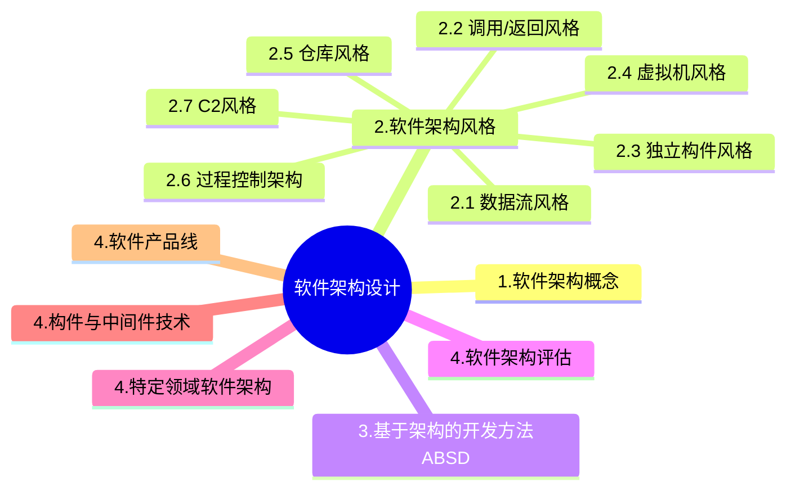

+++
title = '4.1 软件架构设计[Main]'
date = 2024-03-07T15:00:59+08:00
weight = 7
+++

### 软件架构概念
1. 架构的本质
2. 架构的作用
3. 架构所处的位置
    - 软件架构=软件体系结构
    - 架构设计就是需求分配，即将满足需求的职责分配到组件上。
4. 架构发展历程
    - 无架构阶段-汇编语言
    - 萌芽阶段-程序结构设计
    - 初级阶段-统一建模语言
    - 高级阶段-4+1视图
      > 
      1. 逻辑视图：关注系统的功能性需求；描述系统的功能如何呗软件的各个模块和组件实现，通常使用类图，包图表示；逻辑视图帮助开发者理解系统的业务功能和各部分之间的关系。
      2. 开发视图，也称实现视图，描述了软件模块的组织与管理
      3. 进程视图，描述系统的动态方面，如并发和同步机制，关注系统如何运行，使用活动图或者顺序图来表示。
      4. 物理视图，描述软件不尖如何映射到硬件上，常用部署图来表示。
      5. 场景，用来展示系统的具体用例或者用户故事，通过用例图和序列图来描述用户如何与系统交互。
5. 架构描述语言ADL
    - 是一种形式化语言
    - 有三个基本元素
      1. 构件： 计算或数据存储单元
      2. 连接件： 用于构件之间交互建模的体系结构构造块及其支配只写交互的规则
      3. 架构配置：描述体系结构的构件与连接件的连接图。

### 软件架构风格

1. 数据流风格
    * 1.1 批处理：大量整体数据、无需用户交互
    * 1.2 管道过滤器：流式数据、弱用户交互
2. 调用/返回风格
    * 2.1 主程序/子程序：面向过程
    * 2.2 面向对象：对象方法的调用
    * 2.3 分层架构：层与层之间的方法调用，可扩展性好，对层次结构抽象要求高
3. 独立构件风格
    * 3.1 进程通信：
    * 3.2 隐式调用：
    
4. 虚拟机风格
    * 4.1 解释器：
    * 4.2 规则系统
    > 
5. 仓库风格
    > 
6. 过程控制架构
    > 适合嵌入式系统，用于解决简单闭环控制问题
7. C2风格

### [基于架构的开发方法ABSD]()
参考 信息系统-信息系统开发方法-其他方法-基于架构的开发方法ABSD

---

### 前趋图

### PV操作
公共数据单元Tj是一个临界资源，最多允许1个终端进程使用，因此需要设置一个互斥信号量S，初值等于1。

### 面向构件编程COP
面向构件的编程需要下列基本的支持：
1. 多态性（可替代性）；
2. 模块封装性（高层次信息的隐藏）；
3. 后期的绑定和装载（部署独立性）；
4. 安全性（类型和模块安全性）。

### 构件
> 构件是一组通常需要同时部署的原子构件。 

构件和原子构件之间的区别在于，大多数原子构件永远都不会被单独部署，尽管它们可以被单独部署。相反，大多数原子构件都属于一个构件家族，一次部署往往涉及整个家族。一个原子构件是一个模块和一组资源。原子构件是部署、版本控制和替换的基本单位。原子构件通常成组地部署，但是它也能够被单独部署。一个模块是不带单独资源的原子构件（在这个严格定义下，Java 包不是模块--在 Java 中部署的原子单元是类文件。一个单独的包被编译成多个单独的类文件--每个公共类都有一个）。模块是一组类和可能的非面向对象的结构体，比如过程或者函数。

> 在构件组装过程中需要检测并解决架构失配问题。其中 **构件** 失配主要包括由于系统对构件基础设施、控制模型和数据模型的假设存在冲突引起的失配。 **连接子** 失配包括由于系统对构件交互协议、构件连接时数据格式的假设存在冲突引起的失配。

> 软件架构设计主要关注软件构件的结构、属性和交互作用，并通过多种视图全面描述特定系统的架构。

### [CORBA](https://blog.51cto.com/universsky/5650040)
1. CORBA构件模型中，对象适配器（Object Adapter）的主要作用是在底层传输平台与接收调用并返回结果的对象实现之间进行协调，目前采用的对象适配器规范是POA（可移植对象适配器），它替代了传统的BOA（基本对象适配器 Basic Object Adapter）。POA是对象实现与ORB其它组件之间的中介，它将客户请求传送到伺服对象，按需创建子POA，提供管理伺服对象的策略。
2. CORBA对象可看作是一个具有对象标识、对象接口及对象实现的抽象实体。之所以称为抽象的，是因为并没有硬性规定CORBA对象的实现机制。
3. 一个CORBA对象的引用又称可互操作的对象引用（Interoperable Object Reference）。从客户程序的角度看，IOR中包含了对象的标识、接口类型及其他信息以查找对象实现。
4. 伺服对象（servant）是指具体程序设计语言的对象或实体，通常存在于一个服务程序进程之中。客户程序通过对象引用发出的请求经过ORB担当中介角色，转换为对特定的伺服对象的调用。
5. 在一个CORBA对象的生命期中，它可能与多个伺服对象相关联，因而对该对象的请求可能被发送到不同的伺服对象。对象标识（Object ID）是一个用于在POA中标识一个CORBA对象的字符串。它既可由程序员指派，也可由对象适配器自动分配，这两种方式都要求对象标识在创建它的对象适配器中必须具有唯一性。
6. 对象请求代理（Object Request Broker）：解释调用并负责查找实现该请求的对象，将参数传给找到的对象，并调用方法返回结果。客户方不需要了解服务对象的位置、通信方式、实现、激活或存储机制。

