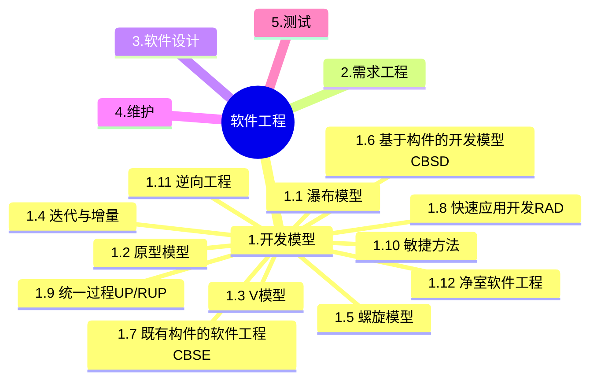
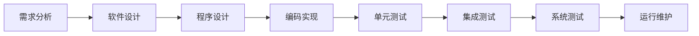
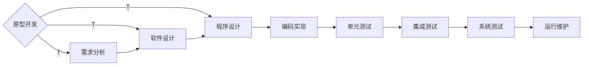
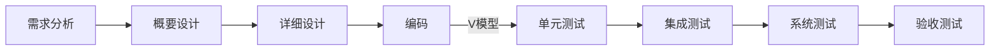
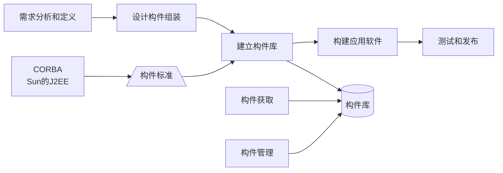
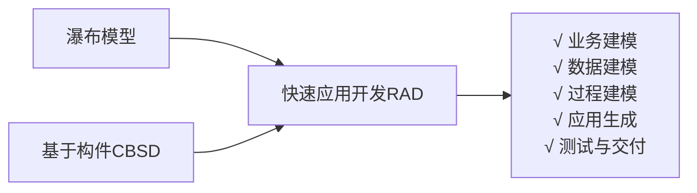
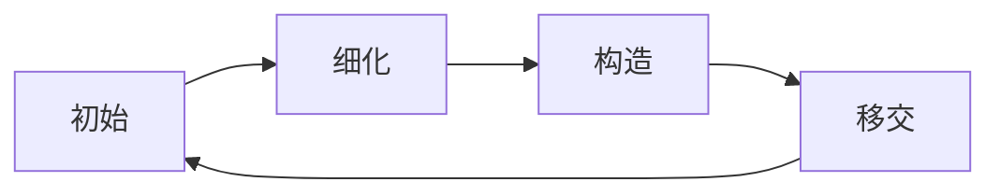

+++
title = '软件工程-开发模型'
date = 2024-03-07T15:00:59+08:00
weight = 5
+++

### 瀑布模型
- 严格区分各阶段，每个阶段因果关系紧密
- 只适合需求明确的项目

### 原型模型
- 适合需求不明确的项目
- 原型模型两个阶段：
  - 原型开发阶段
  - 目标软件开发阶段

### V模型
- 测试贯穿于始终
- 测试分阶段，测试计划提前
- 需求分析->验收测试与系统测试；概要设计对应集成测试，详细设计对应单元测试。

### 迭代与增量

### 螺旋模型
- 以快速原型为基础 +  瀑布模型
- 考虑了风险问题
> 螺旋模型将整个软件开发过程分为多个阶段，每个阶段都由目标设定、风险分析、开发和有效性验证以及评审4个部分组成。
螺旋模型是在快速原型的基础上扩展而成的一种生存周期模型。这种模型将整个软件开发流程分成多个阶段，每个阶段都由4部分组成，它们是：
  1. 目标设定。为该项目进行需求分析，定义和确定这一个阶段的专门目标，指定对过程和产品的约束，并且制定详细的管理计划。
  2. 风险分析。对可选方案进行风险识别和详细分析，制定解决办法，采取有效的措施避免这些风险。
  3. 开发和有效性验证。风险评估后，可以为系统选择开发模型，并且进行原型开发，即开发软件产品。
  4. 评审。对项目进行评审，以确定是否需要进入螺旋线的下一次回路，如果决定继续，就要制定下一阶段计划。

  螺旋模型的软件开发过程实际是上述4个部分的迭代过程，每迭代一次，螺旋线就增加一周，软件系统就生成一个新版本，这个新版本实际上是对目标系统的一个逼近。
  经过若干次的迭代后，系统应该尽快地收敛到用户允许或可以接受的目标范围内，否则也可能中途夭折。 

### 基于构件的开发模型
- 优点: 易扩展、易重用、降低成本、安排任务更灵活。
- 缺点：构件设计要求经验丰富的架构师、设计不好的构件难重用、强调重用可能牺牲其他指标、第三方构件质量难控制

### 基于构件的软件工程
- 体现了**购买而不是重新构造**的哲学

### 快速应用开发RAD

### 统一过程UP/RUP
统一软件开发过程是一种基于面向对象技术的软件开发过程，其特点是**用例驱动，以架构为核心，迭代并增量**。
统一软件开发过程定义了四种通用的开发阶段，它们按照过程顺序分别是：初始阶段、**细化阶段**、构建阶段和 **移交阶段**。
- 初始阶段：
  - 定义最终产品视图和业务模型
  - 确定系统范围
- 细化阶段：
  - 设计及确定系统架构
  - 制定工作计划及资源要求
- 构造阶段：
  - 开发剩余构件和应用程序功能，把这些构件集成为产品，并进行详细测试
- 移交阶段：
  - 确保软件对最终用户是可用的，进行β测试，制作产品发布版本

  > 9个核心工作流
    1. 业务建模
    2. 需求
    3. 分析与设计
    4. 实现
    5. 测试
    6. 部署
    7. 配置与变更管理
    8. 项目管理
    9. 环境

“4+1”视图是对逻辑架构进行描述，最早由Philippe Kruchten提出，他在1995年的IEEE Software上发表了题为The 4+1 View Model of Architecture的论文，引起了业界的极大关注，并最终被RUP采纳，现在已经成为架构设计的结构标准。“4+1”视图主要包括：①逻辑视图(Logical View)，设计的对象模型(使用面向对象的设计方法时)。②过程视图(Process View)，捕捉设计的并发和同步特征。③物理视图(Physical View)，描述了软件到硬件的映射，反映了分布式特性。④开发视图(Development View)，描述了在开发环境中软件的静态组织结构。⑤架构的描述，即所做的各种决定，可以围绕着这四个视图来组织，然后由一些用例(Use Cases)或场景(Scenarios)来说明，从而形成了第五个视图。当采用面向对象的设计方法描述对象模型时，通常使用类图表达类的内部属性和行为，以及类集合之间的交互关系；采用状态图定义对象的内部行为。

统一过程（UP）定义了初启阶段、精化阶段、构建阶段、移交阶段和产生阶段，每个阶段达到某个里程碑时结束。其中初启阶段的里程碑是生命周期目标，精化阶段的里程碑是生命周期架构，构建阶段的里程碑是初始运作功能，移交阶段的里程碑是产品发布。

统一过程适合于大、中型项目的开发，可以分为4个顺序的阶段，分别是初始阶段、细化阶段、构建阶段和移交阶段。

初始阶段的任务是为系统建立业务模型并确定项目的边界。在初始阶段，必须识别所有与系统交互的外部实体，定义系统与外部实体交互的特性。在这个阶段中所关注的是整个项目的业务和需求方面的主要风险。对于建立在原有系统基础上的开发项目来说，初始阶段可能很短。

细化阶段的任务是分析问题领域，建立健全的架构基础，淘汰项目中最高风险的元素。在细化阶段，必须在理解整个系统的基础上，对架构做出决策，包括其范围、主要功能和诸如性能等非功能需求，同时为项目建立支持环境。

在构建阶段，要开发所有剩余的构件和应用程序功能，把这些构件集成为产品，并进行详细测试。从某种意义上说，构建阶段是一个制造过程，其重点放在管理资源及控制操作，以优化成本、进度和质量。构建阶段的主要任务是通过优化资源和避免不必要的报废和返工，使开发成本降到最低；完成所有所需功能的分析、开发和测试，快速完成可用的版本；确定软件、场地和用户是否已经为部署软件做好准备。在构建阶段，开发团队的工作可以实现某种程度的并行。即使是较小的项目，也通常包括可以相互独立开发的构件，从而使各团队之间实现并行开发。

当基线已经足够完善，可以安装到最终用户实际环境中时，则进入交付阶段。交付阶段的重点是确保软件对最终用户是可用的。交付阶段的主要任务是进行β测试，制作产品发布版本；对最终用户支持文档定稿；按用户的需求确认新系统；培训用户和维护人员；获得用户对当前版本的反馈，基于反馈调整产品，如进行调试、性能或可用性的增强等。根据产品的种类，交付阶段可能非常简单，也可能非常复杂。例如，发布现有桌面产品的新发布版本可能十分简单，而替换一个国家的航空交通管制系统可能就非常复杂。交付阶段结束时也要进行技术评审，评审目标是否实现，是否应该开始演化过程，用户对交付的产品是否满意等。

分析人员和测试人员关心的是系统的行为，因此会侧重于用例视图；最终用户关心的是系统的功能，因此会侧重于逻辑视图；程序员关心的是系统的配置、装配等问题，因此会侧重于实现视图；系统集成人员关心的是系统的性能、可伸缩性、吞吐率等问题，因此会侧重于进程视图；系统工程师关心的是系统的发布、安装、拓扑结构等问题，因此会侧重于部署视图。

### 敏捷方法
- 强调个体和交互胜过过程和工具
- 以人为本
- 增量迭代，小步快跑
- 适合小型项目
#### 具体方法
  1. 极限编程XP：强调面对面沟通、不过度设计、及时反馈、接受变更
  2. 水晶方法：提倡机动性方法
  3. 迭代式增量软件开发过程SCRUM：侧重于项目管理
  4. 特征驱动开发方法FDD: 认为有效的软件开发需要三要素：【人、过程、技术】，定义了6中关键角色：项目经理、首席架构设计、开发经理、主程序员、程序员和领域专家

### 逆向工程
逆向工程是设计的回复过程，包括以下4个等级：
1. 实现级：包括程序的抽象语法树、符号表、过程的设计表示
2. 结构级：包括反应程序分量之间相互依赖部分的信息，例如调用图、结构图、程序和数据结构
3. 功能级：包括反应程序段功能及程序段之间关系的信息，例如数据和控制流模型
4. 领域级：包括反应程序分量或程序等实体与应用领域概念之间对应关系的信息，例如实体关系图

### 净室软件工程
