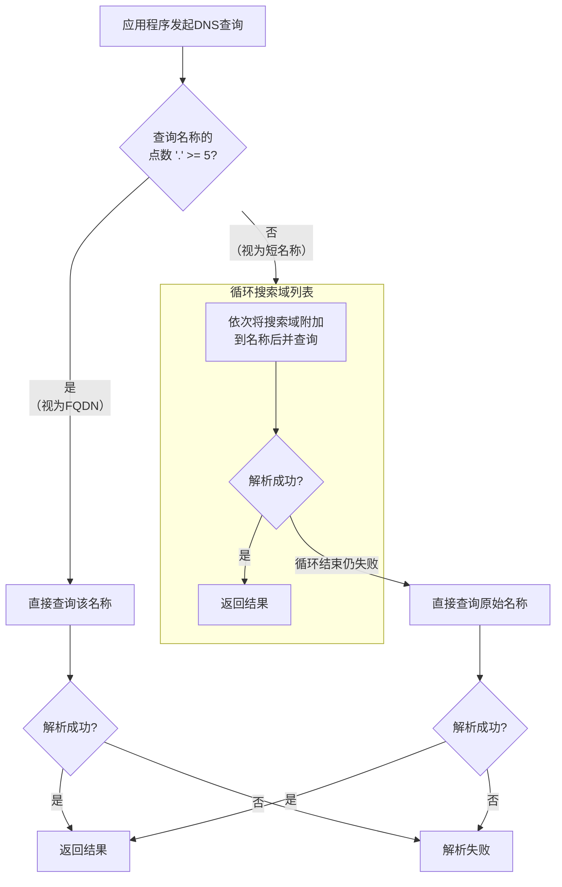

+++
title = 'Pod在K8S中DNS解析流程和顺序'
date = 2024-03-07T15:00:59+08:00
weight = 161
+++


### 核心概念

1.  **CoreDNS**： 从Kubernetes 1.11开始，CoreDNS是默认的DNS服务。它作为一个或多个Pod运行在kube-system命名空间下，并配有一个Kubernetes Service（通常叫`kube-dns`）。
2.  **resolv.conf 文件**： 每个Pod的`/etc/resolv.conf`文件是DNS解析的蓝图。Kubelet会自动生成这个文件并挂载到Pod中。
3.  **DNS策略**： 你可以通过Pod Spec中的`dnsPolicy`字段来配置DNS策略。

---

### Pod 的 `/etc/resolv.conf` 解析

这是一个典型的Pod内的`/etc/resolv.conf`文件内容：

```bash
nameserver 10.96.0.10
search <namespace>.svc.cluster.local svc.cluster.local cluster.local
options ndots:5
```

让我们逐行分析：

#### 1. `nameserver 10.96.0.10`
*   **这是CoreDNS Service的集群IP地址**。所有Pod的DNS查询默认都会发送到这个地址。
*   这个IP来自kubelet的`--cluster-dns`标志，在启动时确定。

#### 2. `search <namespace>.svc.cluster.local svc.cluster.local cluster.local`
*   **搜索域列表**。当你使用不完整的域名（即不是FQDN）时，系统会按照这个列表的顺序，依次将搜索域附加到主机名后面，直到找到匹配的记录。
*   `<namespace>`是你的Pod所在的命名空间，例如`default`。
*   **搜索顺序**：
    *   `<pod-namespace>.svc.cluster.local`
    *   `svc.cluster.local`
    *   `cluster.local`

#### 3. `options ndots:5`
*   这是一个关键的优化/控制选项。
*   **规则**： 如果一个域名中的点（`.`）数量**大于或等于**这个值（这里是5），系统会将其视为**绝对域名（FQDN）**，并**首先**尝试直接解析，**不会**走搜索域列表。
*   **反之**，如果点数**少于**5，系统会**先**依次尝试搜索域，如果都失败了，最后再尝试名称本身。

---

### DNS 解析流程与顺序（详解）

假设你的Pod在`default`命名空间，并且`resolv.conf`如上所示。

#### 场景1：解析Kubernetes Service（短名称）

你想解析同一个命名空间下的Service：`my-svc`。

1.  应用程序请求解析 `my-svc`。
2.  系统检查名称 `my-svc`，点数（0） < 5。
3.  **进入搜索流程**：
    *   第一次尝试： `my-svc.default.svc.cluster.local` -> **成功！** 返回ClusterIP。
    *   解析结束。

#### 场景2：解析不同命名空间的Service

你想解析另一个命名空间`prod`下的Service：`my-svc.prod`。

1.  应用程序请求解析 `my-svc.prod`。
2.  系统检查名称 `my-svc.prod`，点数（1） < 5。
3.  **进入搜索流程**：
    *   第一次尝试： `my-svc.prod.default.svc.cluster.local` -> **失败**（因为该Service不在default命名空间）。
    *   第二次尝试： `my-svc.prod.svc.cluster.local` -> **成功！** 返回ClusterIP。
    *   解析结束。

#### 场景3：解析外部域名（例如 `www.google.com`）

1.  应用程序请求解析 `www.google.com`。
2.  系统检查名称 `www.google.com`，点数（3） < 5。
3.  **进入搜索流程**：
    *   第一次尝试： `www.google.com.default.svc.cluster.local` -> **失败**。
    *   第二次尝试： `www.google.com.svc.cluster.local` -> **失败**。
    *   第三次尝试： `www.google.com.cluster.local` -> **失败**。
4.  所有搜索域都失败了，系统最后尝试名称本身：`www.google.com` -> **成功！** CoreDNS会将其转发给上游DNS服务器（例如宿主机上的DNS或网络中配置的DNS）。

#### 场景4：解析被认为是FQDN的域名（点数 >= 5）

假设你有一个StatefulSet，Pod的FQDN是`web-0.nginx.default.svc.cluster.local`。

1.  应用程序请求解析 `web-0.nginx.default.svc.cluster.local`。
2.  系统检查名称，点数（4） < 5？**注意：这里是4个点，仍然小于5！** 所以它仍然会走搜索流程。
    *   这会先尝试 `web-0.nginx.default.svc.cluster.local.default.svc.cluster.local`，显然是错误的。
    *   为了**避免这种低效行为**，最佳实践是在应用程序中配置或使用**绝对域名**（尾部带点）。

**绝对域名示例**：
应用程序请求解析 `web-0.nginx.default.svc.cluster.local.`（注意最后有一个点）。
*   系统识别其为FQDN，**直接查询**，不经过任何搜索域。这是最有效的方式。

---

### DNS 策略

Pod的`dnsPolicy`字段决定了如何生成`resolv.conf`。

*   **`ClusterFirst`（默认）**： DNS查询首先被发送到Kubernetes集群的CoreDNS。如果域名不在集群域内（例如`cluster.local`），查询会被转发到上游DNS。
*   **`ClusterFirstWithHostNet`**： 对于使用`hostNetwork: true`的Pod，如果你想让它使用集群DNS，就需要设置这个策略。
*   **`Default`**： Pod直接从宿主机继承DNS配置（即使用宿主的`/etc/resolv.conf`）。这意味着它**不会**使用CoreDNS。
*   **`None`**： 忽略所有默认的DNS设置。你必须使用`dnsConfig`字段来提供自定义的DNS配置。

---

### 总结与流程图

**解析顺序可以简化为以下决策流程：**



**关键要点：**

1.  **默认流向**： Pod -> CoreDNS Service -> CoreDNS Pod -> （根据域判断）返回K8s记录或转发到上游DNS。
2.  **搜索域顺序**： 命名空间 -> `svc` -> `cluster.local`。
3.  **`ndots:5`的影响**： 这是为了在便利性和性能之间取得平衡。对于需要频繁访问的外部域名，为了性能最好在应用程序中配置FQDN（尾部带点）或调整`ndots`选项。
4.  **调试技巧**： 进入Pod并执行`cat /etc/resolv.conf`和`nslookup`或`dig`命令是诊断DNS问题的第一步。