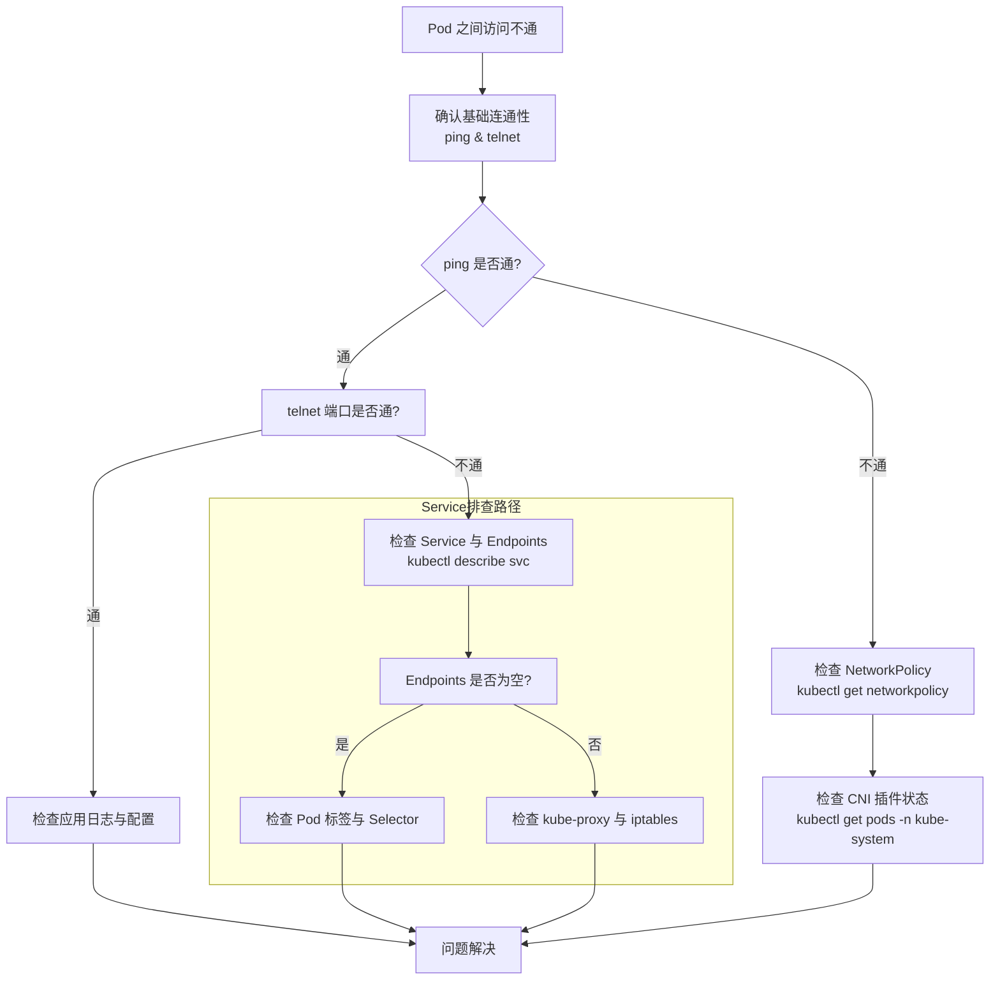

+++
title = '不同node上的Pod之间的通信过程'
date = 2024-03-07T15:00:59+08:00
weight = 30
+++


好的，这是一个非常核心的 Kubernetes 网络问题。不同 Node 上的 Pod 之间的通信过程，清晰地展示了 Kubernetes 网络模型的核心思想：**每个 Pod 都拥有一个独立的、扁平的 IP 地址空间，无论它运行在哪个节点上，Pod 之间都可以直接通过这个 IP 进行通信，而无需使用 NAT**。

这个过程的实现完全依赖于**容器网络接口（CNI）插件**，如 Calico、Flannel、Weave Net 等。下面我们以最经典的 **Flannel (VXLAN 模式)** 和 **Calico (BGP 模式)** 为例，来阐述这个通信过程。

---

### 核心原则

1.  **Pod IP 可达性**：Kubernetes 网络模型要求，任何 Pod 的 IP 地址都能被任何其他 Pod 直接访问，无论它们是否在同一个节点上。
2.  **无 NAT**：Pod 到 Pod 的通信不应该经过源地址转换（SNAT）或目的地址转换（DNAT）。Pod 看到的源 IP 和目标 IP 就是真实的 Pod IP。

---

### 通用通信流程（抽象模型）

假设有两个 Pod：
*   **Pod A**：在 `Node 1` 上，IP 为 `10.244.1.10`
*   **Pod B**：在 `Node 2` 上，IP 为 `10.244.2.20`

当 **Pod A** 试图 ping **Pod B** 的 IP (`10.244.2.20`) 时，过程如下：

#### 1. 出站：从 Pod A 到 Node 1

*   **Pod A** 根据其内部路由表，将数据包从自己的网络命名空间内的 `eth0` 接口发出。
*   目标 IP 是 `10.244.2.20`。
*   在 `Node 1` 上，有一个**网桥**（如 `cni0`）充当了所有本地 Pod 的虚拟交换机。Pod A 的 `eth0` 通过一对 veth pair 连接到这个网桥。
*   数据包到达网桥 `cni0`。

#### 2. 路由决策：在 Node 1 上

*   `Node 1` 的**内核路由表** 由 CNI 插件配置。它查看数据包的目标 IP `10.244.2.20`。
*   路由表规则大致如下：
    ```
    Destination     Gateway         Interface
    10.244.1.0/24   ...            cni0      # 本地 Pod 网段，走 cni0 网桥
    10.244.2.0/24   192.168.1.102  eth0      # 非本地 Pod 网段，通过网关（即 Node 2 的 IP）从物理网卡 eth0 发出
    ```
*   路由表告诉内核，去往 `10.244.2.0/24` 网段的数据包，下一跳是 `192.168.1.102`（即 `Node 2` 的物理 IP），并通过 `Node 1` 的物理网络接口 `eth0` 发出。

**从这里开始，不同 CNI 插件的工作机制产生了差异。**

---

### 场景一：使用 Flannel (VXLAN 模式)

Flannel 通过创建一个**覆盖网络** 来解决跨节点通信。

3.  **封装**：
    *   数据包（源 `10.244.1.10`，目标 `10.244.2.20`）到达 `Node 1` 的 `eth0` 之前，会被一个特殊的虚拟网络设备 **`flannel.1`** 截获。
    *   `flannel.1` 是一个 **VXLAN 隧道端点**。
    *   **封装**：`flannel.1` 会将整个原始数据包（作为 payload）封装在一个新的 **UDP 数据包** 中。
        *   **外层 IP 头**：源 IP 是 `Node 1` 的 IP (`192.168.1.101`)，目标 IP 是 `Node 2` 的 IP (`192.168.1.102`)。
        *   **外层 UDP 头**：目标端口通常是 8472 (VXLAN)。
        *   **VXLAN 头**：包含一个 VNI，用于标识不同的虚拟网络。
        *   **内层原始数据包**：原封不动。

4.  **物理网络传输**：
    *   这个封装后的 UDP 数据包通过 `Node 1` 的物理网络 `eth0` 发送出去。
    *   它经过底层物理网络（交换机、路由器）顺利到达 `Node 2`，因为外层 IP 是节点的真实 IP，底层网络是认识的。

5.  **解封装**：
    *   数据包到达 `Node 2` 的物理网卡 `eth0`。
    *   内核发现这是一个发往 VXLAN 端口 (8472) 的 UDP 包，于是将其交给 `Node 2` 上的 **`flannel.1`** 设备处理。
    *   `flannel.1` 设备**解封装**，剥掉外层 UDP 和 IP 头，露出原始的 IP 数据包（源 `10.244.1.10`，目标 `10.244.2.20`）。

6.  **入站：从 Node 2 到 Pod B**：
    *   解封后的原始数据包被送入 `Node 2` 的网络栈。
    *   `Node 2` 的路由表查看目标 IP `10.244.2.20`，发现它属于本地的 `cni0` 网桥管理的网段。
    *   数据包被转发到 `cni0` 网桥，网桥再通过 veth pair 将数据包送达 **Pod B** 的 `eth0` 接口。

**简单比喻**：Flannel 就像在两个节点之间建立了一条**邮政专线**。你的原始信件（Pod IP 数据包）被塞进一个标准快递信封（外层 UDP 包）里，通过公共邮政系统（物理网络）寄到对方邮局（`Node 2`），对方邮局再拆开快递信封，把原始信件交给收件人（Pod B）。

---

### 场景二：使用 Calico (BGP 模式)

Calico 通常不使用隧道，而是利用 **BGP 协议** 和 **纯三层路由**，效率更高。

3.  **路由通告**：
    *   `Node 1` 和 `Node 2` 上都运行着 Calico 的 BGP 客户端 **`Felix`** 和 BGP 路由反射器 **`BIRD`**。
    *   `Node 2` 会通过 BGP 协议向网络中的其他节点（包括 `Node 1`）通告一条路由信息：“**目标网段 `10.244.2.0/24` 的下一跳是我 `192.168.1.102`**”。
    *   `Node 1` 学习到了这条路由，并写入自己的内核路由表（就是我们之前在步骤2中看到的那条）。

4.  **直接路由**：
    *   数据包（源 `10.244.1.10`，目标 `10.244.2.20`）根据路由表，直接通过 `Node 1` 的物理网卡 `eth0` 发出。
    *   **没有封装！** 数据包保持原样，源 IP 是 `10.244.1.10`，目标 IP 是 `10.244.2.20`。
    *   这个数据包被发送到 `Node 2` 的物理 IP (`192.168.1.102`)。

5.  **物理网络传输**：
    *   数据包经过底层物理网络。**这就要求底层网络必须能够路由 Pod IP 的网段**。在云环境中，这通常通过配置 VPC 路由表来实现；在物理机房，需要核心交换机学习到这些 BGP 路由或配置静态路由。

6.  **入站：从 Node 2 到 Pod B**：
    *   数据包到达 `Node 2` 的物理网卡 `eth0`。
    *   `Node 2` 的内核查看目标 IP `10.244.2.20`，发现这个 IP 属于一个本地虚拟接口（如 `caliXXX`，这是 Calico 为每个 Pod 创建的），于是直接将数据包转发给该接口，最终送达 **Pod B**。

**简单比喻**：Calico 让每个节点都成为一个**智能路由器**。它们互相告知“哪个 Pod 网段在我这里”。当 `Node 1` 要发数据给 `Node 2` 上的 Pod 时，它就像路由器一样，根据已知的路由表，直接找到 `Node 2` 的地址并把数据包发过去，中间不拆包。

---

### 总结对比

| 特性 | Flannel (VXLAN) | Calico (BGP) |
| :--- | :--- | :--- |
| **网络模型** | **Overlay Network** | **Pure Layer 3** |
| **原理** | 隧道封装 | 路由通告 |
| **性能** | 有封装/解封装开销，性能稍低 | 无隧道开销，性能更高 |
| **依赖** | 对底层网络无要求，只要节点IP通即可 | 依赖底层网络支持路由（云平台VPC或物理网络配置） |
| **数据包** | 外层Node IP，内层Pod IP | 始终是Pod IP |

无论采用哪种方式，Kubernetes 和 CNI 插件共同协作，最终实现了一个对应用开发者**透明**的、扁平的 Pod 网络。开发者只需关心 Pod IP 和 Service，而无需理解底层复杂的跨节点通信机制。


### 如果pod之间访问不通怎么排查？

核心排查思路：从 Pod 内部到外部，从简单到复杂

整个排查过程可以遵循下图所示的路径，逐步深入：



### 第一阶段：基础信息收集与初步检查

1.  **获取双方 Pod 信息**
    ```bash
    kubectl get pods -o wide
    ```
    *   确认两个 Pod 都处于 `Running` 状态。
    *   记录下它们的 **IP 地址** 和 **所在节点**。
    *   确认它们不在同一个节点上（如果是，排查方法会略有不同）。

2.  **明确访问方式**
    *   **直接通过 Pod IP 访问**？ (`ping <pod-ip>` 或 `curl <pod-ip>:<port>`)
    *   **通过 Service 名称访问**？ (`ping <service-name>` 或 `curl <service-name>:<port>`)
    *   这个问题决定了后续的排查方向。

---

### 第二阶段：按访问路径深入排查

#### 场景一：直接通过 Pod IP 访问不通（跨节点）

这通常是**底层网络插件（CNI）** 的问题。

1.  **检查 Pod 内部网络**
    *   进入源 Pod，检查其网络配置：
    ```bash
    kubectl exec -it <source-pod> -- sh
    # 在 Pod 内部执行：
    ip addr show eth0 # 查看 IP 是否正确
    ip route # 查看路由表
    ping <destination-pod-ip> # 测试连通性
    ```
    *   如果 `ping` 不通，继续下一步。

2.  **检查目标 Pod 的端口监听**
    *   进入目标 Pod，确认应用在正确端口上监听：
    ```bash
    kubectl exec -it <destination-pod> -- netstat -tulpn | grep LISTEN
    # 或者用 ss 命令
    kubectl exec -it <destination-pod> -- ss -tulpn | grep LISTEN
    ```
    *   **如果这里没监听，是应用自身问题**，检查应用日志和配置。

3.  **检查 NetworkPolicy（网络策略）**
    *   这是 Kubernetes 的“防火墙”，很可能阻止了访问。
    ```bash
    kubectl get networkpolicies -A
    kubectl describe networkpolicy <policy-name> -n <namespace>
    ```
    *   查看是否有策略限制了源 Pod 或目标 Pod 的流量。**特别注意 `ingress` 规则**。

4.  **检查 CNI 插件状态**
    *   CNI 插件（如 Calico、Flannel）的异常会导致跨节点网络瘫痪。
    ```bash
    kubectl get pods -n kube-system | grep -e calico -e flannel -e weave
    ```
    *   确认所有 CNI 相关的 Pod 都在运行。如果有 CrashLoopBackOff 等状态，查看其日志。

5.  **节点层面排查**
    *   如果以上都正常，问题可能出现在节点网络层面。
    *   **登录到源 Pod 所在节点**，尝试 `ping` 目标 Pod IP。
    *   **检查节点路由表**：
        ```bash
        # 在节点上执行
        ip route
        ```
        *   对于 Flannel，你应该能看到到其他节点 Pod 网段的路由。
        *   对于 Calico，你应该能看到到每个其他节点 Pod 网段的精确路由。
    *   **检查节点防火墙**：在某些环境中（如安全组、iptables 规则）可能阻止了 VXLAN（8472端口）或节点间 Pod IP 的通信。
        ```bash
        # 检查 iptables 规则
        sudo iptables-save | grep <pod-ip>
        ```

#### 场景二：通过 Service 名称访问不通

这通常是 **Kubernetes 服务发现** 或 **kube-proxy** 的问题。

1.  **检查 Service 和 Endpoints**
    ```bash
    kubectl get svc <service-name>
    kubectl describe svc <service-name> # 查看 Selector 和 Port 映射
    kubectl get endpoints <service-name> # 这是关键！检查是否有健康的 Endpoints
    ```
    *   **如果 `ENDPOINTS` 列为空**：说明 Service 的 Label Selector 没有匹配到任何健康的 Pod。请检查：
        *   Pod 的 `labels` 是否与 Service 的 `selector` 匹配。
        *   Pod 的 `readinessProbe` 是否通过。

2.  **检查 DNS 解析**
    *   进入源 Pod，测试是否能解析 Service 名称：
    ```bash
    kubectl exec -it <source-pod> -- nslookup <service-name>
    # 或者
    kubectl exec -it <source-pod> -- cat /etc/resolv.conf
    ```
    *   如果解析失败，检查 `kube-dns` 或 `coredns` Pod 是否正常。
    ```bash
    kubectl get pods -n kube-system | grep -e coredns -e kube-dns
    ```

3.  **检查 kube-proxy**
    *   `kube-proxy` 负责实现 Service 的负载均衡规则（通常是 iptables 或 ipvs）。
    ```bash
    kubectl get pods -n kube-system | grep kube-proxy
    ```
    *   确认所有 `kube-proxy` Pod 都在运行。
    *   可以登录到节点，检查是否有对应的 iptables 规则：
        ```bash
        sudo iptables-save | grep <service-name>
        # 或者查看 ipvs 规则（如果使用 ipvs 模式）
        sudo ipvsadm -ln
        ```

---

### 第三阶段：高级调试技巧

如果上述步骤仍未解决问题，可以尝试以下方法：

1.  **使用网络调试镜像**
    *   部署一个包含网络工具的临时 Pod（如 `nicolaka/netshoot`）来进行高级调试。
    ```bash
    kubectl run -it --rm debug-pod --image=nicolaka/netshoot -- /bin/bash
    ```
    *   在这个 Pod 里，你可以使用 `tcpdump`, `tracepath`, `dig` 等强大工具。
    *   例如，在目标 Pod 的节点上抓包：
        ```bash
        # 在节点上执行，监听 Pod 网络对应的接口
        sudo tcpdump -i any -n host <source-pod-ip> and host <destination-pod-ip>
        ```

2.  **检查节点网络连接**
    *   确认两个节点之间网络是通的（通过节点 IP）。
    *   确认 CNI 所需的端口（如 Flannel 的 VXLAN 端口 8472）在节点间是开放的。

---

### 总结与排查命令清单

当 Pod 间访问不通时，按顺序执行以下命令：

```bash
# 1. 基本信息
kubectl get pods -o wide
kubectl get svc,ep -o wide

# 2. 检查 NetworkPolicy
kubectl get networkpolicies -A

# 3. 检查核心插件
kubectl get pods -n kube-system | grep -e coredns -e kube-proxy -e calico -e flannel

# 4. 进入 Pod 测试
kubectl exec -it <source-pod> -- ping <destination-pod-ip>
kubectl exec -it <source-pod> -- nslookup <service-name>

# 5. 检查目标 Pod 应用
kubectl exec -it <destination-pod> -- netstat -tulpn
kubectl logs <destination-pod>

# 6. 节点层面检查
# 在节点上执行
ip route
sudo iptables-save | grep <relevant-ip>
```

记住，**90% 的 Pod 网络不通问题源于 NetworkPolicy 配置、Service Endpoints 为空，或 CNI 插件故障**。按照这个路径排查，绝大多数问题都能被定位和解决。