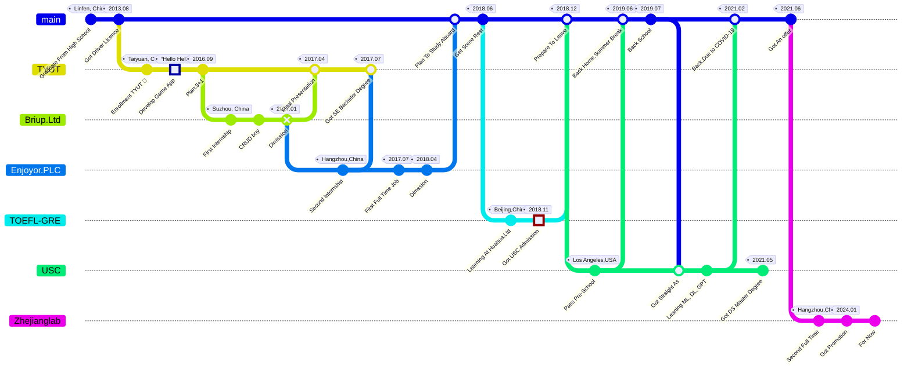

+++
title = 'Aaron`s Dev Path'
date = 2024-03-07T15:00:59+08:00
+++

### About Me


{}
- {} &ensp;[Github Repo](https://github.com/AaronYang0628)
- {} Found My Lovly Wife
- {} Live to **100** years old first
{}
{}
- OS: [Linux](Linux/_index.md)
- Language: Java, Python, Go
- CI/CD: Git, Argo, Action
- Operator: [Slurm](Slurm\install\install_from_k8s_operator.md), Warehouse
- Middleware: [Calcite](./Calcite/_index.md), Kafka, [Flink](./Flink/_index.md)
- MLOps: kubeflow, mlflow
- 推荐系统: 
- Agent:
- RAG:
- Prompt:
{}
{}
- CSST
- Slurm
- cnSRC
{}


### Dev Path

