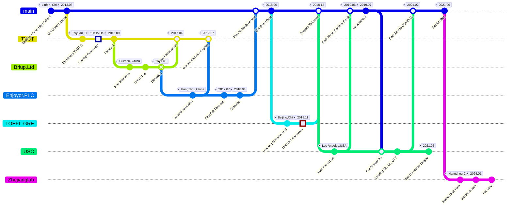

+++
title = 'Aaron`s Dev Path'
date = 2024-03-07T15:00:59+08:00
+++

### About Me


{}
- {} [Github Repo](https://github.com/AaronYang0628)
- {} [Gitee Mirror Repo](https://gitee.com/aaron2333)
- {} [Aliyun Console](https://home.console.aliyun.com/)
- {} [Cloudflare](https://gitee.com/aaron2333)
{}
{}
- OS: [Linux](Linux/_index.md), [WIn](Win/_index.md)
- Language: [Java](Language/Java/_index.md), [Python](Language/Python/_index.md), [Go](Language/Python/_index.md)
- CI/CD: [Git](Git/_index.md), [Argo](Argo/_index.md), [Action](Git/Action/_index.md)
- Operator: [Slurm](csp/zhejianglab/Slurm/install/install_from_k8s_operator.md), [Warehouse](csp/zhejianglab/data-warehouse/_index.md)
- Middleware: [Calcite](./Calcite/_index.md), [Kafka](), [Flink](./Flink/_index.md)
- MLOps: Kubeflow, MLflow
- Agent: Dali
- RAG: [Milvus](http://rag.demo.72602.online)， [N8N](https://n8n.72602.online)
- MCP: Dali
- Skills:
{}
{}
- CSST
- Slurm
- cnSRC
{}


### Dev Path

