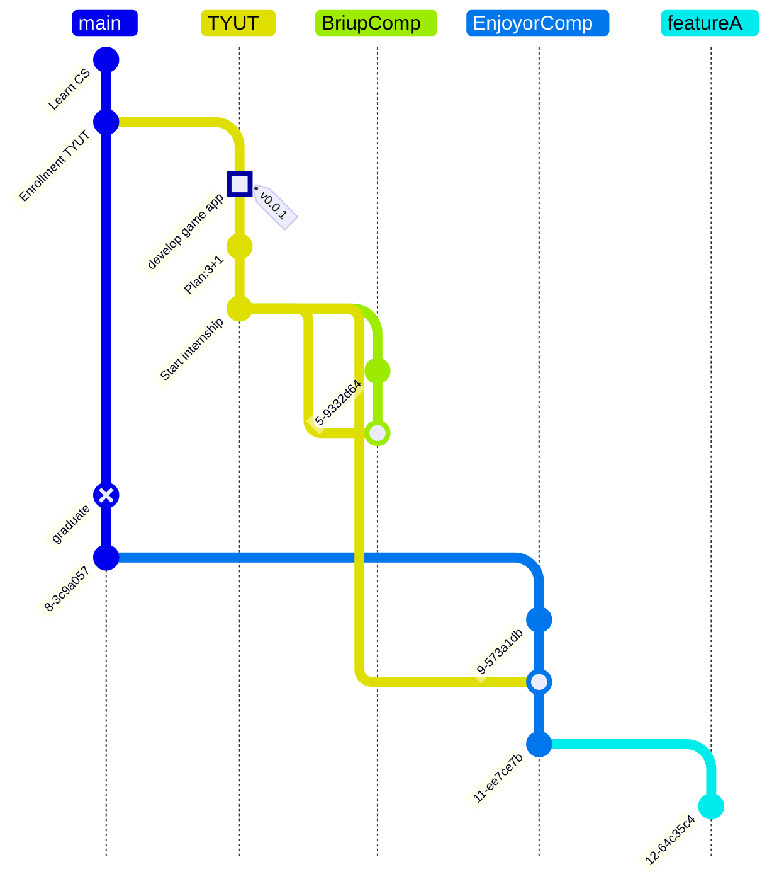

+++
title = 'Index'
date = 2024-03-07T15:00:59+08:00
+++

```mermaid
gitGraph TB:
  commit id:"Learn CS"
  commit id:"Enrollment TYUT"
  branch TYUT
  commit id:"develop game app" tag:"v0.0.1" type: HIGHLIGHT
  commit id:"Plan:3+1"
  commit id:"Start internship"
  branch BriupComp
  commit 
  merge TYUT
  checkout main
  commit id:"graduate" type: REVERSE
  commit 
  checkout main
  branch EnjoyorComp
  commit
  merge TYUT
  commit
  branch featureA
  commit

```

